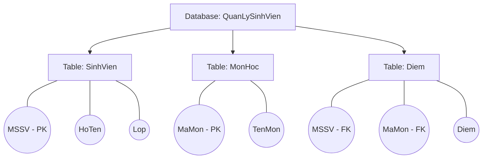
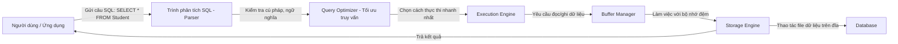
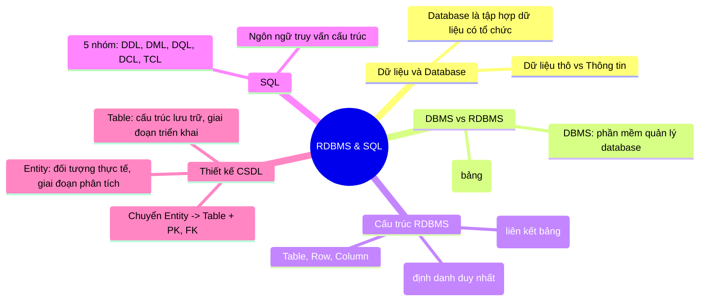

Chào các em sinh viên năm nhất, năm hai ngành Công nghệ Thông tin. Hôm nay thầy sẽ dẫn các em đi từ những câu hỏi tưởng chừng đơn giản nhất – như “Dữ liệu là gì?” – cho đến lúc các em thực sự hiểu cách một hệ quản trị cơ sở dữ liệu quan hệ vận hành, cách viết câu lệnh SQL và sự khác biệt sống còn giữa Entity (thực thể) và Table (bảng). Chúng ta sẽ không học thuộc lòng, mà sẽ học theo kiểu “vì sao” trước rồi mới đến định nghĩa. Sẵn sàng chưa nào?

---

## 1. Dữ liệu – Viên gạch nền móng của mọi hệ thống

### 1.1. Vì sao người ta cứ nói mãi về dữ liệu?

Hãy tưởng tượng một buổi sáng, em mở app Shopee lên. Em thấy lịch sử mua hàng, danh sách yêu thích, gợi ý sản phẩm “có vẻ hợp gu”. Tất cả những thứ đó không tự nhiên xuất hiện. Chúng được xây dựng từ những mẩu **dữ liệu thô** mà hệ thống ghi nhận mỗi khi em bấm nút, mỗi lần em thanh toán.

> [!TIP]  
> Dữ liệu là những mẩu sự kiện rời rạc, chưa được xử lý, chưa có ngữ cảnh – giống như những viên gạch riêng lẻ chưa xây thành nhà.

- Dữ liệu (Data): “Nguyễn Văn A”, “9.5”, “2026-06-21”, “101”.
- Thông tin (Information): Sau khi xử lý, em biết “Sinh viên Nguyễn Văn A đạt điểm 9.5 môn Cơ sở dữ liệu vào ngày 21/06/2026 ở lớp 101”. Lúc này dữ liệu đã có ngữ nghĩa – thành thông tin hữu ích.

### 1.2. Tại sao doanh nghiệp buộc phải lưu trữ dữ liệu?

Lấy ví dụ một ngân hàng. Mỗi giao dịch chuyển khoản là một dữ liệu thô: số tài khoản nguồn, số tài khoản đích, số tiền, thời gian. Nếu mất những dữ liệu đó, ngân hàng không thể đối chiếu, không thể bảo vệ quyền lợi của khách hàng, và có thể phá sản chỉ sau vài ngày.

> [!IMPORTANT]  
> Dữ liệu là tài sản. Nó giúp doanh nghiệp hiểu khách hàng, ra quyết định, tối ưu vận hành. Mất dữ liệu giống như mất trí nhớ.

### 1.3. Những vấn đề khi quản lý dữ liệu bằng giấy tờ hoặc Excel

- **Trường đại học**: Quản lý điểm bằng file Excel gửi qua email → trùng lặp, sai phiên bản, khó tổng hợp, dễ mất dữ liệu.
- **Ngân hàng**: Ghi sổ bằng giấy → tìm kiếm giao dịch 3 năm trước mất hàng giờ, dễ rách, cháy.
- **Facebook**: Nếu lưu trữ bài viết, ảnh của 3 tỷ người dùng vào file văn bản thì máy tính nào chịu nổi? Làm sao tìm đúng bạn bè trong một nửa giây?
- **Shopee**: Hàng triệu sản phẩm, đơn hàng mỗi phút – Excel giới hạn khoảng 1 triệu dòng, không thể chia sẻ đồng thời cho hàng ngàn nhân viên.

→ Excel chỉ dùng cho quy mô nhỏ, thiếu khả năng kiểm soát đồng thời, bảo mật, khôi phục. Chính vì thế chúng ta cần **Cơ sở dữ liệu**.

---

## 2. Cơ sở dữ liệu (Database) – “Kho chứa có tổ chức”

### 2.1. Database là gì và dùng để làm gì?

> [!NOTE]  
> Database là một tập hợp dữ liệu được tổ chức có cấu trúc, lưu trữ tập trung và có thể được truy xuất, cập nhật, quản lý một cách hiệu quả.

Nó không chỉ là một đống dữ liệu, mà là dữ liệu có mối quan hệ với nhau. Ví dụ:

- **Hệ thống quản lý sinh viên**: Dữ liệu sinh viên (MSSV, tên, lớp) có liên kết với dữ liệu môn học (mã môn, tên môn) qua bảng điểm (MSSV, mã môn, điểm).
- **Hệ thống bán hàng**: Dữ liệu khách hàng liên kết với đơn hàng, đơn hàng liên kết với sản phẩm.

### 2.2. Các thành phần cơ bản trong một Database

Sơ đồ dưới đây minh họa một database đơn giản:



Trong một Database ta có các **Table (bảng)**, trong bảng có các **Column (cột – thuộc tính)** và **Row (dòng – bản ghi)**. Chúng ta sẽ nói kỹ hơn ở phần sau.

---

## 3. Hệ quản trị cơ sở dữ liệu (DBMS) – “Người thủ thư quyền năng”

### 3.1. Vì sao cần DBMS mà không dùng trực tiếp Database?

Database tự nó chỉ là các file dữ liệu được lưu trên ổ cứng. Nếu không có công cụ quản lý, bạn phải tự viết chương trình đọc/ghi từng byte, xử lý tranh chấp khi 2 người cùng sửa một dữ liệu, sao lưu, phân quyền... Điều đó cực kỳ phức tạp.

> [!TIP]  
> Hãy hình dung **Database giống như một thư viện khổng lồ**, với hàng triệu cuốn sách. **DBMS chính là người thủ thư** – người biết chính xác mỗi cuốn sách nằm ở đâu, giúp bạn mượn/trả, ngăn không cho hai người cùng lấy một cuốn, và đảm bảo sách không bị mất.

Vậy:

- **DBMS (Database Management System)** là phần mềm giúp tạo, quản lý và thao tác với database. Nó cung cấp giao diện để người dùng và ứng dụng tương tác với dữ liệu mà không cần quan tâm đến cách lưu trữ vật lý.
- **Database** là tập hợp dữ liệu. DBMS là công cụ để làm việc với tập hợp đó.

> [!WARNING]  
> Đừng nhầm lẫn: MySQL không phải là Database. MySQL là một DBMS. Database là cái bạn tạo ra bên trong MySQL, ví dụ `QuanLySinhVien`.

---

## 4. Hệ quản trị cơ sở dữ liệu quan hệ (RDBMS) – “Quan hệ là chìa khóa”

### 4.1. RDBMS là gì? Vì sao gọi là “Relational”?

Trong những năm 1970, Edgar F. Codd đề xuất mô hình dữ liệu quan hệ, trong đó mọi dữ liệu được biểu diễn dưới dạng các **bảng (relations)** và mối liên kết giữa chúng dựa trên giá trị khóa.

> [!NOTE]  
> Một **RDBMS** là DBMS được xây dựng trên mô hình quan hệ. “Quan hệ” ở đây chính là các bảng, và các bảng liên kết với nhau thông qua khóa chính - khóa ngoại.

Tại sao lại là “Relational”?

- Bạn có bảng `SinhVien` và bảng `Lop`. Mỗi sinh viên thuộc một lớp. Mối **quan hệ** đó được thể hiện bằng cách đặt khóa chính của `Lop` làm khóa ngoại trong `SinhVien`. Như vậy hai bảng có quan hệ logic chặt chẽ, tránh trùng lặp dữ liệu.

### 4.2. Các RDBMS phổ biến hiện nay

| RDBMS      | Đặc điểm nổi bật                                     | Hạn chế thường gặp                         |
| ---------- | ---------------------------------------------------- | ------------------------------------------ |
| **MySQL**  | Miễn phí, phổ biến nhất cho web, dễ học              | Hỗ trợ tính năng nâng cao (window function) hạn chế ở phiên bản cũ |
| **PostgreSQL** | Miễn phí, tuân thủ chuẩn SQL nhất, mạnh về phân tích dữ liệu, JSON | Cấu hình ban đầu phức tạp hơn MySQL      |
| **SQL Server** | Sản phẩm Microsoft, tích hợp tốt với .NET, giao diện đồ họa đẹp | Chi phí bản quyền cao, giới hạn nền tảng |
| **Oracle** | Hiệu năng cực cao, bảo mật hàng đầu, dùng cho ngân hàng, ERP | Đắt, nặng, yêu cầu DBA chuyên nghiệp      |

> [!TIP]  
> Trong khóa học này chúng ta sẽ dùng MySQL hoặc PostgreSQL để thực hành vì miễn phí và phổ biến nhất.

---

## 5. Cấu trúc của một RDBMS – Từ tổng quan đến chi tiết

Hãy lấy hệ thống quản lý sinh viên làm ví dụ xuyên suốt.

### 5.1. Các khái niệm cốt lõi

- **Database**: Một tập hợp các bảng và các đối tượng khác (view, procedure). Ví dụ: `QuanLyTruongHoc`.
- **Table (Bảng)**: Một tập hợp dữ liệu về một chủ đề. Ví dụ: bảng `Student` lưu tất cả sinh viên.
- **Row (Record, Bản ghi)**: Một dòng trong bảng, đại diện cho một đối tượng cụ thể. Ví dụ: dòng chứa thông tin của sinh viên Nguyễn Văn A.
- **Column (Attribute, Thuộc tính)**: Một cột, biểu diễn một đặc điểm của đối tượng. Ví dụ: `StudentName`, `DateOfBirth`.
- **Primary Key (Khóa chính)**: Một hoặc nhiều cột dùng để nhận diện **duy nhất** mỗi dòng. Ví dụ: `StudentID` (mã sinh viên). Mỗi bảng bắt buộc phải có khóa chính.
- **Foreign Key (Khóa ngoại)**: Cột trong bảng này tham chiếu đến khóa chính của bảng khác để tạo liên kết. Ví dụ: bảng `Enrollment` có `StudentID` tham chiếu đến `Student`.

### 5.2. Minh họa bằng ERD (Entity Relationship Diagram)

```mermaid
erDiagram
    STUDENT {
        string StudentID PK "Mã SV"
        string FullName "Họ tên"
        date DoB "Ngày sinh"
        string ClassID FK "Mã lớp"
    }
    CLASS {
        string ClassID PK "Mã lớp"
        string ClassName "Tên lớp"
        string DepartmentID FK "Mã khoa"
    }
    DEPARTMENT {
        string DepartmentID PK "Mã khoa"
        string DeptName "Tên khoa"
    }
    COURSE {
        string CourseID PK "Mã môn"
        string CourseName "Tên môn"
        int Credits "Số tín chỉ"
    }
    ENROLLMENT {
        string StudentID FK
        string CourseID FK
        float Grade "Điểm"
    }
    STUDENT ||--o{ ENROLLMENT : "đăng ký"
    COURSE ||--o{ ENROLLMENT : "được đăng ký"
    STUDENT }o--|| CLASS : "thuộc"
    CLASS }o--|| DEPARTMENT : "thuộc"
```

Các em thấy rằng các bảng không đứng riêng lẻ mà liên kết qua các đường mũi tên nhờ khóa chính – khóa ngoại. Đó chính là sức mạnh của “quan hệ”.

---

## 6. SQL – Ngôn ngữ “nói chuyện” với RDBMS

### 6.1. SQL là gì? Có phải ngôn ngữ lập trình không?

> [!NOTE]  
> SQL (Structured Query Language) là ngôn ngữ chuẩn được thiết kế để giao tiếp với RDBMS. Nó không phải là ngôn ngữ lập trình đa năng như Python hay Java, mà là **ngôn ngữ truy vấn có cấu trúc** chuyên cho thao tác dữ liệu.

SQL cho phép bạn: hỏi dữ liệu (`SELECT`), thêm mới (`INSERT`), sửa (`UPDATE`), xóa (`DELETE`), tạo bảng (`CREATE TABLE`), phân quyền (`GRANT`)...

### 6.2. Luồng hoạt động khi bạn gửi một câu SQL



Như vậy, câu SQL của bạn không “chạy thẳng” vào ổ cứng, mà trải qua nhiều bước phân tích, tối ưu để đạt hiệu năng cao nhất. Phần 8 sẽ mổ xẻ kỹ hơn.

---

## 7. Các nhóm lệnh SQL – “Ngũ hổ tướng” của RDBMS

Người ta chia SQL thành 5 nhóm chính. Hãy học bằng ví dụ trên cơ sở dữ liệu `QuanLySinhVien`.

### 7.1. DDL – Data Definition Language (Định nghĩa dữ liệu)
Dùng để tạo, sửa, xóa cấu trúc bảng.

| Lệnh    | Mục đích             | Cú pháp ví dụ                                   |
| ------- | -------------------- | ----------------------------------------------- |
| CREATE  | Tạo bảng mới         | `CREATE TABLE SinhVien (MaSV CHAR(10) PRIMARY KEY, HoTen VARCHAR(100), NgaySinh DATE);` |
| ALTER   | Sửa cấu trúc bảng    | `ALTER TABLE SinhVien ADD Email VARCHAR(100);`   |
| DROP    | Xóa toàn bộ bảng     | `DROP TABLE SinhVien;` (cẩn thận, mất hết dữ liệu) |

Ví dụ thực tế:

```sql
CREATE TABLE MonHoc (
    MaMon CHAR(10) PRIMARY KEY,
    TenMon VARCHAR(200) NOT NULL,
    SoTinChi INT CHECK (SoTinChi > 0)
);
```

Kết quả: Bảng `MonHoc` được tạo ra, sẵn sàng chứa dữ liệu.

### 7.2. DML – Data Manipulation Language (Thao tác dữ liệu)
Thêm, sửa, xóa dữ liệu *bên trong* bảng.

| Lệnh    | Mục đích           | Cú pháp ví dụ |
| ------- | ------------------ | ------------- |
| INSERT  | Thêm bản ghi mới   | `INSERT INTO SinhVien VALUES ('SV001', 'Nguyen Van A', '2005-01-01');` |
| UPDATE  | Cập nhật dữ liệu   | `UPDATE SinhVien SET HoTen = 'Nguyen Van B' WHERE MaSV = 'SV001';` |
| DELETE  | Xóa bản ghi        | `DELETE FROM SinhVien WHERE MaSV = 'SV001';` |

> [!WARNING]  
> Nếu quên mệnh đề `WHERE` trong `UPDATE` hoặc `DELETE`, toàn bộ dữ liệu trong bảng sẽ bị ảnh hưởng. Hãy luôn kiểm tra kỹ.

### 7.3. DQL – Data Query Language (Truy vấn dữ liệu)
Đây là “trái tim” của SQL, chủ yếu là lệnh `SELECT`.

```sql
SELECT S.MaSV, S.HoTen, M.TenMon, D.Diem
FROM SinhVien S
JOIN Diem D ON S.MaSV = D.MaSV
JOIN MonHoc M ON D.MaMon = M.MaMon
WHERE D.Diem >= 5
ORDER BY S.HoTen;
```

Mục đích: Lấy ra danh sách sinh viên kèm môn học và điểm, chỉ lấy điểm >=5, sắp xếp theo tên.

### 7.4. DCL – Data Control Language (Kiểm soát dữ liệu)
Phân quyền cho người dùng.

```sql
GRANT SELECT, INSERT ON SinhVien TO 'trogiang'@'localhost';
REVOKE DELETE ON SinhVien FROM 'trogiang'@'localhost';
```

### 7.5. TCL – Transaction Control Language (Kiểm soát giao dịch)
Đảm bảo tính toàn vẹn khi thực hiện nhiều lệnh cùng lúc.

- `COMMIT`: Lưu chính thức mọi thay đổi.
- `ROLLBACK`: Hủy bỏ thay đổi kể từ lần `COMMIT` gần nhất.

Ví dụ: Chuyển tiền từ tài khoản A sang B gồm 2 lệnh `UPDATE`. Nếu lệnh thứ 2 lỗi, ta `ROLLBACK` để tiền không bị mất khỏi A mà chưa vào B.

---

## 8. Hành trình một câu SQL bên trong RDBMS

Quay lại câu lệnh đơn giản:

```sql
SELECT * FROM Student;
```

Chuyện gì xảy ra sau khi bạn nhấn Enter?

1. **SQL Parser (Trình phân tích cú pháp)**  
   - Kiểm tra cú pháp đúng không? Từ khóa `SELECT` có sai chính tả không? Bảng `Student` có tồn tại không?  
   - Nếu sai, trả lỗi ngay. Giống như giáo viên kiểm tra chính tả bài văn trước khi đọc.

2. **Query Optimizer (Bộ tối ưu truy vấn)**  
   - Đây là “bộ não”. Nó xem xét: có bao nhiêu cách để lấy hết dữ liệu bảng Student? Có index nào không? Có thể đọc trực tiếp từ bộ nhớ đệm không?  
   - Nó chọn ra kế hoạch thực thi “rẻ” nhất (về thời gian, I/O). Giống như bạn muốn đi từ nhà đến trường, Google Maps tìm đường ngắn nhất, tránh kẹt xe.

3. **Execution Engine (Bộ thực thi)**  
   - Thực hiện kế hoạch từng bước: yêu cầu đọc dữ liệu từ storage engine.

4. **Buffer Manager (Quản lý bộ đệm)**  
   - Kiểm tra xem dữ liệu cần đã có trong RAM chưa. Nếu có thì trả về luôn (cache hit) → nhanh. Nếu chưa, yêu cầu Storage Engine đọc từ đĩa.

5. **Storage Engine**  
   - Làm việc vật lý với file dữ liệu, trả kết quả ngược lên, qua các tầng, rồi hiển thị cho bạn.

> [!TIP]  
> Nhờ kiến trúc phân tầng này, RDBMS có thể tối ưu hóa, bảo mật, và hỗ trợ nhiều loại storage engine (MySQL có InnoDB, MyISAM…) mà không ảnh hưởng đến cách bạn viết SQL.

---

## 9. Entity (Thực thể) – “Nhân vật” trong thế giới thực

### 9.1. Vì sao phải xác định Entity trước khi đụng đến máy tính?

Trước khi xây nhà, kiến trúc sư phải hiểu gia đình có bao nhiêu người, cần phòng khách, phòng ngủ, bếp ra sao. Tương tự, trong thiết kế cơ sở dữ liệu, chúng ta cần **phân tích thế giới thực** để tìm ra các đối tượng độc lập, quan trọng – đó chính là Entity.

> [!IMPORTANT]  
> Entity là một **đối tượng hoặc khái niệm trong thế giới thực** mà ta muốn lưu trữ thông tin. Nó độc lập, có thể phân biệt được với các đối tượng khác.

### 9.2. Ví dụ trong trường đại học

- **Student** (Sinh viên): mỗi bạn là một cá thể, có mã số riêng.
- **Teacher** (Giảng viên): có thông tin riêng.
- **Course** (Môn học): môn Cơ sở dữ liệu, Toán cao cấp...
- **Department** (Khoa): Công nghệ thông tin, Điện tử...
- **Class** (Lớp học): DBI2024...

> [!NOTE]  
> Entity không chỉ là “vật thể sống”. Hóa đơn, đơn hàng, chuyến bay, bình luận trên Facebook đều là Entity. Bất cứ thứ gì bạn cần theo dõi riêng biệt đều có thể là Entity.

Chúng ta thường biểu diễn Entity trong sơ đồ ER (Entity-Relationship) bằng hình chữ nhật. Ở giai đoạn này chưa có bảng, chưa có kiểu dữ liệu.

---

## 10. Table (Bảng) – Hiện thân vật lý của Entity

### 10.1. Table là gì và xuất hiện khi nào?

Sau khi phân tích xong, chúng ta bắt tay vào triển khai trên RDBMS. Lúc này, mỗi Entity thường (nhưng không phải luôn luôn) được chuyển thành một **Table**. Table là cấu trúc lưu trữ dữ liệu thực sự trong database, gồm các cột đã được định kiểu, ràng buộc.

> [!NOTE]  
> Table là một đối tượng trong RDBMS, lưu trữ dữ liệu thành các dòng và cột. Nó có tên, các cột với kiểu dữ liệu cụ thể, các ràng buộc (NOT NULL, UNIQUE, CHECK, PRIMARY KEY...). Table là hiện thực của Entity ở mức logic/vật lý.

Ví dụ, Entity `Student` có thể trở thành:

```sql
CREATE TABLE Student (
    StudentID CHAR(10) PRIMARY KEY,
    FullName VARCHAR(100) NOT NULL,
    DoB DATE,
    Email VARCHAR(100) UNIQUE
);
```

---

## 11. Entity và Table khác nhau như thế nào? (Phần quan trọng nhất)

Đây là câu hỏi khiến nhiều bạn nhầm lẫn. Hãy nhìn thật kỹ.

| Tiêu chí                | Entity (Thực thể)                            | Table (Bảng)                                    |
| ----------------------- | -------------------------------------------- | ----------------------------------------------- |
| **Giai đoạn xuất hiện** | Giai đoạn phân tích & thiết kế khái niệm     | Giai đoạn triển khai vật lý / logic             |
| **Bản chất**            | Khái niệm, đối tượng trong thế giới thực    | Cấu trúc lưu trữ dữ liệu trong RDBMS            |
| **Biểu diễn**           | Bằng hình chữ nhật trong sơ đồ ER            | Bằng lệnh CREATE TABLE, hiển thị dạng lưới      |
| **Thuộc tính**          | Chỉ có tên thuộc tính, mô tả ý nghĩa        | Cột có kiểu dữ liệu, ràng buộc, giá trị mặc định|
| **Mối quan hệ**         | Thể hiện qua đường nối (relationship)        | Hiện thực bằng khóa ngoại (Foreign Key)         |
| **Ví dụ trong thực tế** | “Sinh viên”, “Môn học”, “Hóa đơn”            | Bảng `Student`, `Course`, `Invoice`             |

> [!WARNING]  
> Entity không phải là Table! Một Entity có thể chia thành nhiều Table (chuẩn hóa), hoặc nhiều Entity có thể gộp thành một Table (hiếm, nhưng có thể). Entity thuộc về bài toán, Table thuộc về giải pháp.

Ví dụ thực tế:
- **Entity “Đơn hàng”** có các thuộc tính: mã đơn, ngày đặt, tổng tiền. Khi chuyển thành Table `Order`, ta thêm kiểu dữ liệu: `OrderID CHAR(10) PRIMARY KEY`, `OrderDate DATETIME`, `Total DECIMAL(10,2)`.
- **Entity “Bình luận”** trên Facebook: thuộc tính nội dung, ngày giờ, người viết. Trong database, table `Comment` sẽ có cột `Content TEXT`, `CreatedAt TIMESTAMP`, `UserID` là khóa ngoại.

Nhớ rằng: **Entity = “What we need to store about”**; **Table = “How we store it in RDBMS”**.

---

## 12. Quy trình chuyển từ Entity sang Table – Cầm tay chỉ việc

Quay lại hệ thống quản lý sinh viên.

### Bước 1: Xác định yêu cầu
Quản lý sinh viên, môn học, giảng viên. Sinh viên đăng ký môn học, giảng viên dạy môn học.

### Bước 2: Tìm Entity và thuộc tính
- **SinhVien**: Mã SV, Họ tên, Ngày sinh, Lớp.
- **MonHoc**: Mã môn, Tên môn, Số tín chỉ.
- **GiangVien**: Mã GV, Họ tên, Khoa.
- **Lop**: Mã lớp, Tên lớp, Khoa.

### Bước 3: Xác định mối quan hệ
- Một Sinh viên thuộc một Lớp (N:1).
- Một Sinh viên đăng ký nhiều Môn học, một Môn học có nhiều Sinh viên (N:N) → cần bảng trung gian `DangKy`.
- Một Giảng viên dạy nhiều Môn học (1:N) → thêm cột MaGV vào MonHoc.

### Bước 4: Chuyển thành Table và khóa

```sql
CREATE TABLE Lop (
    MaLop CHAR(10) PRIMARY KEY,
    TenLop VARCHAR(50) NOT NULL,
    Khoa VARCHAR(100)
);

CREATE TABLE SinhVien (
    MaSV CHAR(10) PRIMARY KEY,
    HoTen VARCHAR(100) NOT NULL,
    NgaySinh DATE,
    MaLop CHAR(10),
    FOREIGN KEY (MaLop) REFERENCES Lop(MaLop)
);

CREATE TABLE MonHoc (
    MaMon CHAR(10) PRIMARY KEY,
    TenMon VARCHAR(200) NOT NULL,
    SoTinChi INT,
    MaGV CHAR(10),
    FOREIGN KEY (MaGV) REFERENCES GiangVien(MaGV)
);

CREATE TABLE GiangVien (
    MaGV CHAR(10) PRIMARY KEY,
    HoTenGV VARCHAR(100) NOT NULL,
    Khoa VARCHAR(100)
);

CREATE TABLE DangKy (
    MaSV CHAR(10),
    MaMon CHAR(10),
    Diem FLOAT,
    PRIMARY KEY (MaSV, MaMon),
    FOREIGN KEY (MaSV) REFERENCES SinhVien(MaSV),
    FOREIGN KEY (MaMon) REFERENCES MonHoc(MaMon)
);
```

Sơ đồ ERD hoàn chỉnh (đã vẽ ở phần 5) chính là minh chứng cho quá trình này.

---

## 13. Case Study Hoàn Chỉnh: Hệ thống quản lý thư viện

### 13.1. Phân tích yêu cầu
Thư viện cần quản lý sách, độc giả, việc mượn trả. Mỗi độc giả có thẻ thư viện, mỗi cuốn sách có ISBN, tiêu đề, tác giả, thể loại. Độc giả có thể mượn nhiều sách, mỗi lần mượn ghi lại ngày mượn, ngày trả dự kiến, ngày trả thực tế.

### 13.2. Tìm Entity và Attribute
- **DocGia** (Độc giả): MaDG, HoTen, NgaySinh, SoDT, Email.
- **Sach** (Sách): ISBN, TuaSach, TacGia, NamXB, TheLoai.
- **MuonTra** (Phiếu mượn – đây vừa là Entity mượn, nhưng trong CSDL thường là bảng thể hiện quan hệ mượn nhiều-nhiều giữa Độc giả và Sách): MaDG, ISBN, NgayMuon, HanTra, NgayTraThucTe.

### 13.3. Tìm Relationship
- Độc giả – Sách: N:N, thông qua MuonTra (Mỗi độc giả mượn nhiều sách, mỗi sách được nhiều độc giả mượn).

### 13.4. Chuyển thành Table & SQL

```sql
CREATE TABLE DocGia (
    MaDG CHAR(10) PRIMARY KEY,
    HoTen VARCHAR(100) NOT NULL,
    NgaySinh DATE,
    SoDT VARCHAR(15),
    Email VARCHAR(100) UNIQUE
);

CREATE TABLE Sach (
    ISBN CHAR(13) PRIMARY KEY,
    TuaSach VARCHAR(200) NOT NULL,
    TacGia VARCHAR(100),
    NamXB INT,
    TheLoai VARCHAR(50)
);

CREATE TABLE MuonTra (
    MaDG CHAR(10),
    ISBN CHAR(13),
    NgayMuon DATE NOT NULL,
    HanTra DATE NOT NULL,
    NgayTraThucTe DATE,
    PRIMARY KEY (MaDG, ISBN, NgayMuon),  -- Một độc giả có thể mượn cùng một cuốn vào nhiều ngày khác nhau
    FOREIGN KEY (MaDG) REFERENCES DocGia(MaDG),
    FOREIGN KEY (ISBN) REFERENCES Sach(ISBN)
);
```

Giải thích:
- Mỗi bảng có khóa chính phù hợp.
- `MuonTra` dùng khóa chính kết hợp để đảm bảo một độc giả không mượn cùng một cuốn sách trong cùng một lần mượn (nếu cần mượn lại thì ngày mượn khác).
- Khóa ngoại ràng buộc toàn vẹn tham chiếu: không thể mượn sách không tồn tại hoặc độc giả không tồn tại.

---

## 14. Những hiểu lầm phổ biến của sinh viên (và cách “giải ngố”)

> [!WARNING]  
> 1. **“Entity chính là Table”** → Sai. Entity là khái niệm phân tích, Table là hiện thực. Cùng một Entity có thể thành nhiều Table (ví dụ Entity `NhanVien` có thể tách thành `NhanVien`, `BangLuong`, `ChucVu` để đáp ứng chuẩn hóa).  
> 2. **“Database là DBMS”** → Sai. Database là tập dữ liệu; MySQL, PostgreSQL là DBMS dùng để quản lý Database đó. Cũng giống như “bức tranh” khác “phần mềm vẽ tranh”.  
> 3. **“SQL là MySQL”** → Sai. SQL là ngôn ngữ chuẩn. MySQL là một sản phẩm RDBMS sử dụng ngôn ngữ SQL (với một số mở rộng riêng). Giống như “Tiếng Anh” là ngôn ngữ, còn “Cambridge” là một trung tâm dạy tiếng Anh.  
> 4. **“Primary Key và Foreign Key giống nhau”** → Sai hoàn toàn.  
>    - Primary Key: xác định duy nhất một dòng trong chính bảng đó, không được NULL, mỗi bảng chỉ có một PK.  
>    - Foreign Key: là cột (hoặc tập cột) trong một bảng, tham chiếu đến PK của bảng khác, có thể NULL (nếu quan hệ không bắt buộc), một bảng có thể có nhiều FK.

---

## 15. Tóm tắt kiến thức – “Bỏ túi” để ôn thi

### 15.1. Mindmap tổng quan



### 15.2. Cheat Sheet ôn thi (1 trang)

**1. Database** = Tập hợp dữ liệu có tổ chức, liên quan logic, lưu trữ lâu dài.  
**2. DBMS** = Phần mềm trung gian quản lý database, cung cấp giao diện thao tác dữ liệu.  
**3. RDBMS** = DBMS theo mô hình quan hệ, dữ liệu biểu diễn dạng bảng, liên kết qua khóa. Ví dụ: MySQL, PostgreSQL.  
**4. SQL** = Structured Query Language, dùng để giao tiếp với RDBMS, không phải ngôn ngữ lập trình đa năng.  
**5. Entity** = Đối tượng trong thế giới thực cần lưu thông tin, thuộc giai đoạn phân tích.  
**6. Table** = Cấu trúc lưu trữ vật lý trong database, có cột, kiểu dữ liệu, ràng buộc.  
**7. Primary Key (PK)** = Cột/ nhóm cột duy nhất, không NULL, xác định mỗi dòng. Mỗi bảng một PK.  
**8. Foreign Key (FK)** = Cột tham chiếu PK bảng khác, thiết lập quan hệ, đảm bảo toàn vẹn tham chiếu.

---

> [!NOTE]  
> Chúc các em học tốt! Hãy nhớ: Hiểu bản chất “vì sao” trước, rồi code SQL sau. Đừng bao giờ đánh đồng Entity với Table, vì như thế các em sẽ gặp khó khi thiết kế những hệ thống lớn, phức tạp. Thầy tin các em sẽ trở thành những kỹ sư dữ liệu vững vàng.