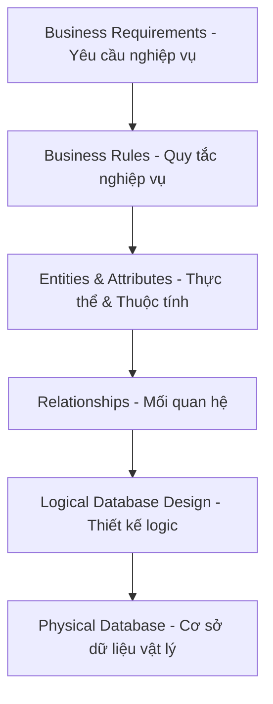
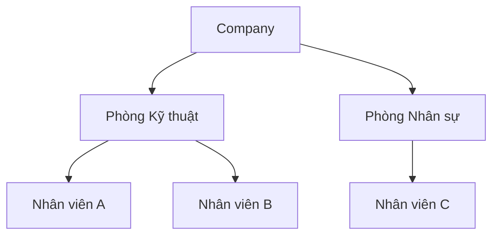
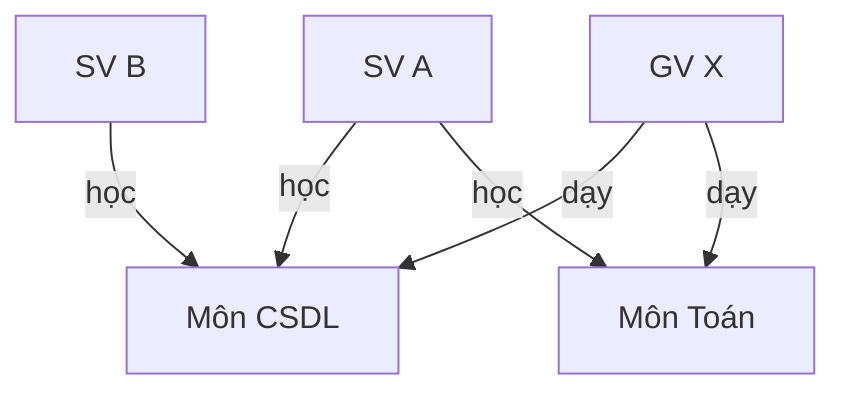
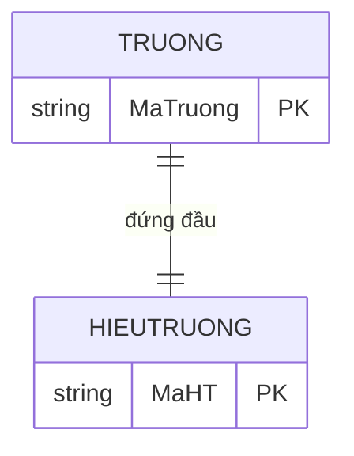
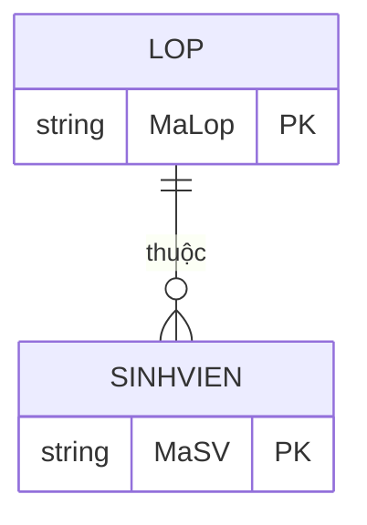
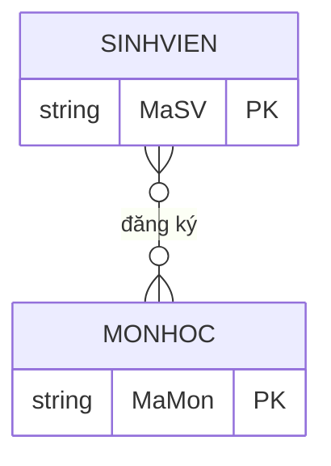
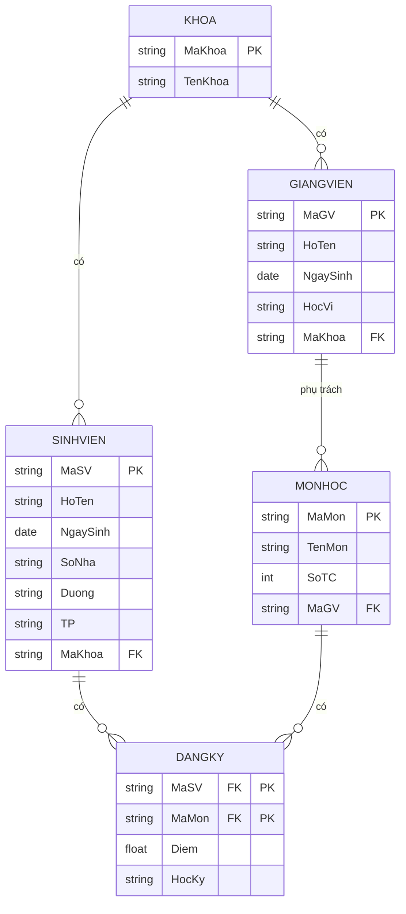
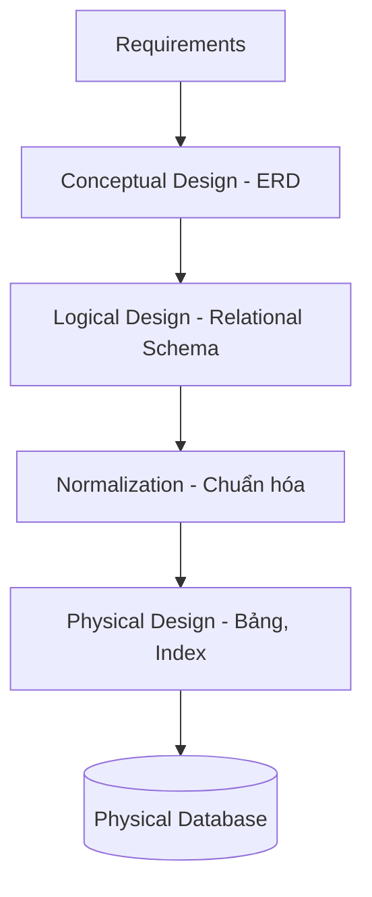
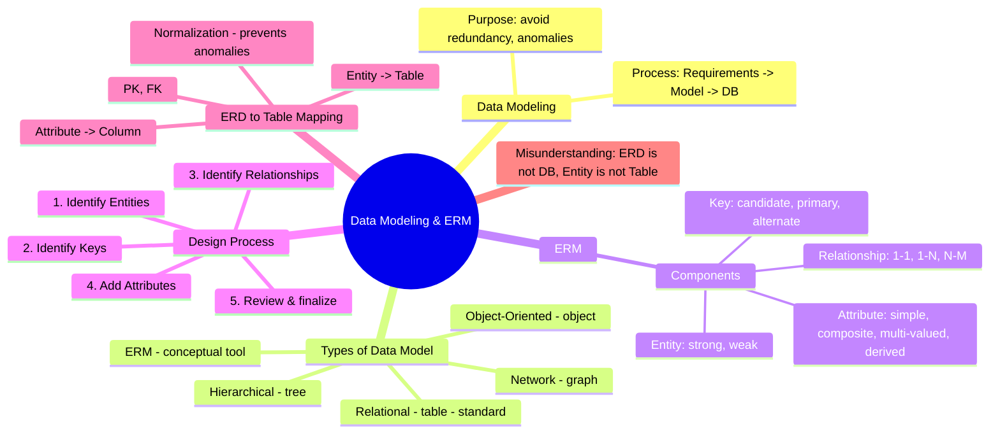

Chào các em, ở chương trước chúng ta đã hiểu RDBMS, SQL, Entity, Table. Nhưng có bao giờ các em tự hỏi: **Làm sao từ một mớ yêu cầu lộn xộn của khách hàng mà ta có được một cơ sở dữ liệu tinh gọn, hiệu quả?** Đó chính là chủ đề của chương này: **Mô hình hóa dữ liệu (Data Modeling) và Mô hình Thực thể - Liên kết (ERM)**.

Thầy sẽ dẫn các em đi từng bước, bằng ví dụ thực tế và sơ đồ trực quan, để thấy được bức tranh toàn cảnh của thiết kế cơ sở dữ liệu.

---

## 1. Tại sao cần Data Modeling?

### 1.1. Chuyện gì xảy ra nếu lập trình viên tạo database ngay mà không thiết kế?

Hãy tưởng tượng nhóm phát triển phần mềm quản lý sinh viên nhận yêu cầu: “Lưu sinh viên, lớp, môn học, điểm”. Một bạn lập trình viên “nhảy ngay vào code”:

```sql
CREATE TABLE SinhVien (
    MaSV CHAR(10),
    Ten VARCHAR(100),
    Lop VARCHAR(50),
    MonHoc VARCHAR(100),
    Diem FLOAT
);
```

Dữ liệu nhập vào:
- Nguyễn Văn A, lớp CT1, môn CSDL, điểm 9
- Nguyễn Văn A, lớp CT1, môn Toán, điểm 8
- Trần Thị B, lớp CT2, môn CSDL, điểm 7

Ngay lập tức phát sinh vấn đề:

> [!WARNING]  
> **Dữ liệu trùng lặp**: Tên sinh viên, lớp bị lặp lại ở mỗi dòng đăng ký môn học.  
> **Thiếu dữ liệu**: Muốn thêm một môn học mới nhưng chưa có sinh viên nào học thì không thể lưu vì bảng trên yêu cầu phải có MaSV.  
> **Khó bảo trì**: Nếu đổi tên môn “CSDL” thành “Cơ sở dữ liệu” thì phải sửa ở tất cả dòng liên quan.  
> **Khó mở rộng**: Sau này cần thêm thông tin giảng viên dạy môn đó, hay thêm địa chỉ sinh viên, cấu trúc cũ sẽ rất lộn xộn.

Các hệ thống lớn như Shopee hay Facebook còn đau đầu hơn: hàng trăm bảng, hàng tỷ dòng, nếu không có thiết kế tốt thì truy vấn chậm, dữ liệu hỏng, chi phí bảo trì khổng lồ.

### 1.2. Vai trò của Data Modeling trong SDLC

Trong vòng đời phát triển phần mềm (Software Development Life Cycle), Data Modeling nằm ở giai đoạn Phân tích & Thiết kế. Nó chính là **bản vẽ kiến trúc** cho “ngôi nhà dữ liệu”.

> [!TIP]  
> **Data Modeling** là quá trình tạo ra một mô hình trừu tượng để tổ chức các yếu tố dữ liệu, mối quan hệ và ràng buộc của chúng, nhằm đáp ứng nhu cầu thông tin của tổ chức. Nó giống như kiến trúc sư vẽ bản thiết kế trước khi thợ xây xây nhà.

Nếu không có mô hình, các lập trình viên sẽ “xây nhà trên cát”. Database sẽ phát sinh dị thường (anomaly), dư thừa, thiếu nhất quán.

---

## 2. Data Modeling là gì?

### 2.1. “Chiếc phễu” chuyển đổi từ yêu cầu thành Database

Hãy hình dung quá trình sau:



Mỗi bước là một mức trừu tượng giảm dần. Ban đầu, khách hàng nói: “Tôi muốn quản lý sinh viên và môn học”. Người thiết kế sẽ phân tích để tìm ra:
- Quy tắc: “Mỗi sinh viên chỉ thuộc một lớp”, “Mỗi môn học có thể có nhiều sinh viên đăng ký”.
- Thực thể: Sinh viên, Lớp, Môn học.
- Mối quan hệ: “thuộc” (Sinh viên – Lớp), “đăng ký” (Sinh viên – Môn học).

Cuối cùng ta có các bảng với khóa chính, khóa ngoại.

> [!NOTE]  
> **Data Modeling** trả lời ba câu hỏi lớn:  
> 1. **Cái gì** (dữ liệu gì được lưu)?  
> 2. **Liên quan ra sao** (các dữ liệu kết nối với nhau như thế nào)?  
> 3. **Ràng buộc gì** (quy tắc toàn vẹn)?

---

## 3. Các loại Data Model – Lịch sử tiến hóa

Để hiểu vì sao Relational Model ngày nay thống trị, chúng ta cùng nhìn lại hành trình phát triển các mô hình dữ liệu.

### 3.1. Hierarchical Model (Mô hình phân cấp)

> [!NOTE]  
> Ra đời những năm 1960, tiêu biểu là hệ quản trị IMS của IBM. Dữ liệu được tổ chức thành cây, mỗi node cha có thể có nhiều con, nhưng một con chỉ có một cha.

Ví dụ: Tổ chức công ty



- **Ưu điểm**: Truy xuất nhanh nếu hỏi theo cấu trúc cây (ví dụ: tất cả nhân viên phòng Kỹ thuật).
- **Nhược điểm**: Quan hệ nhiều-nhiều (ví dụ một nhân viên làm ở hai phòng) rất khó biểu diễn, phải lặp dữ liệu. Không linh hoạt.
- **Hiện nay**: Ít dùng trong RDBMS, nhưng ý tưởng cây thư mục trong hệ điều hành hay XML/JSON vẫn mang tính phân cấp.

### 3.2. Network Model (Mô hình mạng)

> [!NOTE]  
> Phát triển sau mô hình phân cấp, chuẩn CODASYL. Cho phép một node con có nhiều node cha, tạo thành đồ thị có hướng.



- **Ưu điểm**: Biểu diễn được quan hệ nhiều-nhiều tự nhiên hơn.
- **Nhược điểm**: Phức tạp, truy vấn phải duyệt theo con trỏ, người lập trình cần biết cấu trúc vật lý.
- **Hiện nay**: Gần như không dùng, nhưng tư duy đồ thị đã quay lại với cơ sở dữ liệu đồ thị (Neo4j).

### 3.3. Relational Model (Mô hình quan hệ)

> [!IMPORTANT]  
> Do E.F. Codd đề xuất năm 1970. Dữ liệu được biểu diễn thành các bảng (relations) với hàng, cột. Mối liên kết thể hiện qua giá trị khóa (khóa chính – khóa ngoại), không phải con trỏ vật lý.

Ví dụ đơn giản:

**Bảng SinhVien**

| MaSV | HoTen | Lop |
|------|-------|-----|
| SV01 | An    | CT1 |
| SV02 | Bình  | CT2 |

**Bảng MonHoc**

| MaMon | TenMon | SoTC |
|-------|--------|------|
| MH01  | CSDL   | 3    |
| MH02  | Toán   | 4    |

**Bảng DangKy**

| MaSV | MaMon | Diem |
|------|-------|------|
| SV01 | MH01  | 9.0  |
| SV01 | MH02  | 8.0  |
| SV02 | MH01  | 7.5  |

Liên kết giữa SinhVien và MonHoc qua DangKy là hoàn toàn logic, không phụ thuộc vào cách lưu trữ vật lý.

- **Ưu điểm**: Đơn giản, linh hoạt, ngôn ngữ truy vấn chuẩn SQL, dễ mở rộng.
- **Nhược điểm**: Với dữ liệu phân cấp phức tạp, cần nhiều phép JOIN, đôi khi không tự nhiên.
- **Hiện nay**: Là mô hình phổ biến nhất, nền tảng của MySQL, PostgreSQL, Oracle, SQL Server.

### 3.4. Object-Oriented Model (Mô hình hướng đối tượng)

> [!NOTE]  
> Xuất hiện cuối thập niên 1980 – 1990, kết hợp CSDL với lập trình hướng đối tượng. Dữ liệu và thao tác được đóng gói trong class.

Ví dụ: Trong Java, class `Student` có thuộc tính `maSV`, `hoTen` và phương thức `tinhDiemTB()`. CSDL hướng đối tượng lưu trực tiếp đối tượng đó.

- **Ưu điểm**: Mô hình sát với code, không cần chuyển đổi object-relational (ORM).
- **Nhược điểm**: Không có chuẩn truy vấn mạnh như SQL, ít hãng hỗ trợ.
- **Hiện nay**: Phần lớn bị thay thế bởi RDBMS kết hợp ORM (Hibernate, Entity Framework). Một số CSDL NoSQL (document store) mượn ý tưởng.

### 3.5. Entity Relationship Model (ERM)

> [!TIP]  
> ERM được Peter Chen đề xuất năm 1976. Nó không phải là mô hình dữ liệu vật lý, mà là **công cụ mô hình hóa khái niệm** để thiết kế CSDL quan hệ. ERM cho phép biểu diễn trực quan thế giới thực bằng các thực thể, thuộc tính và mối quan hệ.

Chúng ta sẽ dành phần lớn chương này để tìm hiểu ERM.

### 3.6. Semantic Data Model

> [!NOTE]  
> Mở rộng từ ERM, thêm ngữ nghĩa phong phú hơn (kế thừa, phân loại). Tiêu biểu là mô hình EER (Enhanced ER). Semantic Layer giúp ẩn đi chi tiết kỹ thuật, người dùng cuối có thể tương tác với dữ liệu bằng thuật ngữ nghiệp vụ. Ví dụ: Table `KH` và `HD` được ánh xạ thành “Khách hàng” và “Hóa đơn” trong công cụ báo cáo.

---

## 4. So sánh các Data Model

| Model         | Cấu trúc                  | Ưu điểm                                   | Nhược điểm                               | Phổ biến hiện nay |
|---------------|---------------------------|-------------------------------------------|------------------------------------------|-------------------|
| Hierarchical  | Cây (cha-con)             | Nhanh cho truy vấn tĩnh                  | Cứng nhắc, khó mở rộng, nhiều-nhiều phức tạp | Rất thấp          |
| Network       | Đồ thị (nhiều cha)        | Biểu diễn được nhiều-nhiều               | Phức tạp, phụ thuộc vật lý              | Thấp (NoSQL đồ thị kế thừa) |
| Relational    | Bảng (quan hệ)            | Đơn giản, linh hoạt, chuẩn SQL           | Cần JOIN cho dữ liệu phân cấp phức tạp  | **Cao nhất**      |
| Object-Oriented| Đối tượng                 | Tự nhiên với lập trình OOP               | Thiếu chuẩn, thị trường nhỏ             | Thấp              |
| ERM           | Sơ đồ khái niệm           | Giao tiếp tốt với người dùng, không phụ thuộc DBMS | Chỉ là bản vẽ, chưa phải CSDL thật | Rất cao (làm công cụ thiết kế) |
| Semantic      | Lớp ngữ nghĩa             | Ẩn phức tạp, thân thiện người dùng       | Cần công cụ hỗ trợ riêng                | Trung bình (BI)   |

> [!IMPORTANT]  
> **Vì sao Relational Model thành chuẩn công nghiệp?**  
> - Nền tảng toán học vững chắc (đại số quan hệ).  
> - Độc lập dữ liệu: thay đổi cấu trúc vật lý không ảnh hưởng ứng dụng.  
> - Ngôn ngữ truy vấn SQL mạnh mẽ, phi thủ tục.  
> - Hệ sinh thái phong phú, cộng đồng lớn, công cụ hỗ trợ đầy đủ.

---

## 5. Entity Relationship Modeling (ERM) – “Ngôn ngữ chung” của nhà thiết kế

### 5.1. ERM là gì?

> [!NOTE]  
> ERM (Entity Relationship Model) là mô hình dữ liệu bậc cao dùng để mô tả các đối tượng trong thế giới thực và mối quan hệ giữa chúng một cách độc lập với bất kỳ DBMS nào. Nó được thể hiện bằng sơ đồ ER (ERD – Entity Relationship Diagram).

### 5.2. Mục tiêu của ERM
- Giao tiếp với người dùng/khách hàng không chuyên kỹ thuật.
- Phát hiện sớm các thiếu sót về dữ liệu.
- Làm đầu vào cho thiết kế logic (bảng, khóa).

> [!TIP]  
> Mọi Database Designer đều phải thành thạo ERM trước khi tạo Table, vì ERM chính là “bản đồ kho báu” chỉ đường đến một database không dư thừa, không dị thường.

---

## 6. Thành phần của ERM

Chúng ta sẽ đi sâu vào từng “viên gạch” xây nên ERD.

### 6.1. Entity (Thực thể) – “Nhân vật chính”

Entity là một đối tượng trong thế giới thực mà ta cần lưu dữ liệu.

- **Strong Entity (Thực thể mạnh)**: Có thể tồn tại độc lập, có khóa chính riêng.  
  Ví dụ: `SinhVien` (MaSV là khóa), `Khoa` (MaKhoa), `MonHoc` (MaMon).
- **Weak Entity (Thực thể yếu)**: Không thể tồn tại nếu không có thực thể mạnh liên quan. Khóa của nó phải kết hợp khóa của thực thể mạnh sở hữu.  
  Ví dụ: `ThanNhan` (Người thân của sinh viên). Nó chỉ có ý nghĩa khi gắn với một `SinhVien` cụ thể. Khóa của nó thường là (MaSV, TenThanNhan). Trong ERD, weak entity được vẽ bằng hình chữ nhật nét đôi.

### 6.2. Attribute (Thuộc tính) – “Đặc điểm của Entity”

Mỗi Entity được mô tả bởi các thuộc tính. Có nhiều loại:

- **Simple Attribute (Thuộc tính đơn)**: Không thể chia nhỏ hơn trong ngữ cảnh.  
  Ví dụ: `HoTen`, `NgaySinh` (nếu ta coi ngày sinh là nguyên vẹn), `Diem`.
- **Composite Attribute (Thuộc tính phức hợp)**: Có thể chia thành các thành phần con.  
  Ví dụ: `DiaChi` gồm `SoNha`, `Duong`, `Quan`, `ThanhPho`. Trên ERD vẽ hình elip con.
- **Multivalued Attribute (Thuộc tính đa trị)**: Một entity có thể có nhiều giá trị cho thuộc tính đó.  
  Ví dụ: `SoDienThoai` (một sinh viên có thể có nhiều số), `KyNang` (một giảng viên biết nhiều ngôn ngữ lập trình). Trên ERD vẽ bằng elip nét đôi.
- **Derived Attribute (Thuộc tính suy diễn)**: Giá trị tính được từ các thuộc tính khác.  
  Ví dụ: `Tuoi` suy từ `NgaySinh`, `DiemTrungBinh` suy từ các `Diem`. Vẽ bằng elip nét đứt.

### 6.3. Key Attribute (Thuộc tính khóa)

Dùng để phân biệt các thực thể với nhau.

- **Candidate Key**: Một hoặc tập thuộc tính có thể làm khóa chính.
- **Primary Key**: Ứng viên được chọn làm đại diện chính thức. (Vẽ gạch dưới tên thuộc tính trong ERD)
- **Alternate Key**: Các ứng viên còn lại.

Ví dụ: Sinh viên có `MaSV`, `SoCMND` đều là candidate key. Ta chọn `MaSV` làm primary key, còn `SoCMND` là alternate key.

### 6.4. Relationship (Mối quan hệ) – “Sợi dây liên kết”

Relationship thể hiện sự kết hợp giữa các entity.

#### Bậc của quan hệ (Cardinality)

- **One-to-One (1:1)**: Một thực thể A liên kết tối đa một thực thể B và ngược lại.  
  Ví dụ: `Truong` – `HieuTruong` (một trường có một hiệu trưởng, một hiệu trưởng quản lý một trường).



- **One-to-Many (1:N)**: Một A liên kết nhiều B, mỗi B chỉ thuộc một A.  
  Ví dụ: `Lop` – `SinhVien` (một lớp có nhiều sinh viên, mỗi sinh viên thuộc một lớp).



- **Many-to-Many (N:M)**: Một A liên kết nhiều B, mỗi B cũng liên kết nhiều A.  
  Ví dụ: `SinhVien` – `MonHoc` (một sinh viên học nhiều môn, một môn có nhiều sinh viên học).



Trong triển khai, quan hệ N:M cần một bảng trung gian (`DangKy`).

---

## 7. Quy trình thiết kế ERM – Từng bước một

### Step 1: Identify Entities
Đọc mô tả yêu cầu, gạch chân các danh từ chỉ đối tượng cần quản lý. Ví dụ với yêu cầu “Hệ thống cần lưu thông tin sinh viên, giảng viên, khoa, môn học và kết quả đăng ký”, ta có Entity: `SinhVien`, `GiangVien`, `Khoa`, `MonHoc`. (`KetQuaDangKy` có thể là Entity yếu hoặc Relationship).

### Step 2: Identify Keys
Với mỗi Entity mạnh, chọn thuộc tính (hoặc tập) nhận dạng duy nhất. Nếu chưa có tự nhiên, có thể thêm mã nhân tạo (ID).  
Ví dụ: `SinhVien` chọn `MaSV`, `MonHoc` chọn `MaMon`.

### Step 3: Identify Relationships
Xác định mối quan hệ ngữ nghĩa giữa các Entity:  
- Sinh viên “thuộc” Khoa? Hay “thuộc” Lớp? (Tuỳ mô hình nghiệp vụ).  
- Giảng viên “thuộc” Khoa.  
- Sinh viên “đăng ký” Môn học.  
Gán cardinality: 1:1, 1:N, N:M.

### Step 4: Add Attributes
Gắn các thuộc tính vào Entity và Relationship. Lưu ý:
- Đối với Composite Attribute, có thể tách sau này.
- Với Multivalued Attribute, khi chuyển thành bảng sẽ cần bảng riêng hoặc xử lý (trong RDBMS thường tách thành bảng phụ hoặc lưu kiểu mảng nếu DB hỗ trợ JSON).
- Với Derived Attribute, thường không lưu trữ vật lý.

Làm sao phân biệt Entity và Attribute? Nếu đối tượng có các thuộc tính riêng, có khóa riêng và cần quản lý độc lập → Entity. Nếu chỉ là một đặc điểm đơn giản gắn chặt vào Entity → Attribute. Ví dụ: `DiaChi` thường là composite attribute của `SinhVien`; nhưng nếu công ty giao hàng cần lưu thêm tọa độ, ghi chú cho mỗi địa chỉ, thì `DiaChi` có thể tách thành Entity.

### Step 5: Review and Refine
Checklist dành cho Database Designer:
- Mọi thực thể có khóa chính không?
- Các mối quan hệ N:M đã được tách thành bảng trung gian chưa?
- Có thuộc tính nào lặp lại bất thường giữa các thực thể không?
- Các ràng buộc nghiệp vụ có được thể hiện đúng không?

---

## 8. Case Study Hoàn Chỉnh: University Management System

Yêu cầu: Quản lý sinh viên, giảng viên, khoa, môn học và đăng ký tín chỉ.

### Phân tích yêu cầu
- Một khoa có nhiều giảng viên, một giảng viên chỉ thuộc một khoa (1:N).
- Một khoa có nhiều sinh viên, sinh viên thuộc một khoa (1:N). (Giả sử không có lớp nhỏ hơn).
- Mỗi giảng viên có thể dạy nhiều môn, mỗi môn chỉ do một giảng viên phụ trách (1:N).
- Sinh viên đăng ký nhiều môn, mỗi môn có nhiều sinh viên → N:M, kèm điểm.

### Tìm Entity & Attribute
1. `Khoa`: MaKhoa (PK), TenKhoa.
2. `GiangVien`: MaGV (PK), HoTen, NgaySinh, HocVi.
3. `SinhVien`: MaSV (PK), HoTen, NgaySinh, DiaChi (composite: SoNha, Duong, TP).
4. `MonHoc`: MaMon (PK), TenMon, SoTC.
5. `DangKy`: (MaSV, MaMon) làm PK, Diem, HocKy.

### Tìm Relationship
- Khoa – SinhVien: 1:N (FK MaKhoa trong SinhVien)
- Khoa – GiangVien: 1:N (FK MaKhoa trong GiangVien)
- GiangVien – MonHoc: 1:N (FK MaGV trong MonHoc)
- SinhVien – MonHoc: N:M qua DangKy.

### Sơ đồ ERD



---

## 9. Từ ERD sang Table – Hiện thực hóa bản vẽ

> [!IMPORTANT]  
> ERD chỉ là bản thiết kế khái niệm. Để có database thật, chúng ta phải chuyển đổi nó thành các lệnh `CREATE TABLE`. Quy trình tổng thể:



**Quy tắc chuyển đổi cơ bản:**
- Mỗi Entity mạnh → một Table, với PK giữ nguyên.
- Weak Entity → một Table, PK gồm PK của Entity sở hữu + discriminator của chính nó.
- Composite Attribute → tách thành các cột con.
- Multivalued Attribute → tạo một bảng riêng gồm PK của Entity + cột giá trị, PK kết hợp.
- Relationship 1:1 hoặc 1:N → thêm FK vào bảng phía “nhiều” hoặc phía tùy chọn.
- Relationship N:M → tạo bảng trung gian (gọi là Intersection Table), gồm PK của hai Entity làm FK và PK kết hợp.

Với Case Study trên, các bảng đã được thiết kế sẵn sàng cho lệnh SQL.

---

## 10. Giới thiệu Normalization (Chuẩn hóa) – Vì sao cần?

> [!NOTE]  
> Khi chuyển từ ERD sang bảng, nhiều lúc chúng ta vẫn còn dư thừa dữ liệu hoặc tiềm ẩn dị thường. **Normalization** là kỹ thuật phân rã bảng thành các bảng nhỏ hơn, hạn chế dư thừa và đảm bảo toàn vẹn dữ liệu.

### Các vấn đề nếu không chuẩn hóa

**Ví dụ bảng KHÔNG chuẩn hóa:** `SinhVien_MonHoc` gộp:

| MaSV | TenSV | Lop | MaMon | TenMon | Diem |
|------|-------|-----|-------|--------|------|
| SV01 | An    | CT1 | MH01  | CSDL   | 9    |
| SV01 | An    | CT1 | MH02  | Toán   | 8    |
| SV02 | Bình  | CT2 | MH01  | CSDL   | 7    |

- **Data Redundancy**: Tên sinh viên, lớp, tên môn lặp.
- **Update Anomaly**: Đổi tên môn `CSDL` thành `Cơ sở dữ liệu` phải sửa nhiều dòng, nếu sót → không nhất quán.
- **Insert Anomaly**: Muốn thêm môn mới `MH03 – Lý` nhưng chưa có SV nào học → không thêm được vì thiếu MaSV (PK).
- **Delete Anomaly**: Xóa sinh viên cuối cùng học môn `Toán` → mất luôn thông tin môn Toán.

Quá trình chuẩn hóa (1NF, 2NF, 3NF, BCNF…) sẽ tách bảng trên thành 3 bảng `SinhVien`, `MonHoc`, `Diem` như thiết kế ERD chuẩn.

> [!TIP]  
> Ở chương sau chúng ta sẽ học sâu về Normalization. Còn bây giờ chỉ cần nhớ: một ERD tốt thường cho ra các bảng đã ở dạng chuẩn 3NF. Đó là lý do tại sao ERM cực kỳ quan trọng.

---

## 11. Những hiểu lầm phổ biến của sinh viên

> [!WARNING]  
> 1. **“ERD chính là Database”** – Sai. ERD là sơ đồ khái niệm, không phải CSDL vật lý. Từ ERD ta mới tạo ra các bảng.  
> 2. **“Entity chính là Table”** – Như chương trước: Entity là khái niệm phân tích, Table là hiện thực. Một Entity có thể tách thành nhiều Table, nhiều Entity có thể gộp thành một Table (dù không nên).  
> 3. **“Relationship chính là Foreign Key”** – Chưa đủ. Relationship là ngữ nghĩa, Foreign Key là cơ chế thực thi ràng buộc trong RDBMS. Có những relationship không cần FK (ví dụ nếu không ràng buộc cứng), hoặc FK có thể tham gia vào nhiều mối quan hệ.  
> 4. **“Chỉ cần biết SQL là đủ, không cần vẽ ERD”** – Với hệ thống nhỏ có thể, nhưng khi làm việc nhóm, bảo trì lâu dài, thiếu ERD giống như xây nhà không bản vẽ: lúc sửa sẽ rất tốn kém. Các công ty chuyên nghiệp luôn bắt đầu từ mô hình dữ liệu.

---

## 12. Summary & Cheat Sheet

### 12.1. Mindmap Tổng kết



### 12.2. Cheat Sheet – Một trang ôn thi

**Data Modeling**: Quá trình xây dựng mô hình trừu tượng cho dữ liệu.  
**Các mô hình dữ liệu chính**: Hierarchical (cây), Network (đồ thị), Relational (bảng), Object-Oriented (đối tượng), ERM (thực thể - liên kết).  
**Relational Model**: Dữ liệu dạng bảng, liên kết qua khóa, dùng SQL. Chuẩn công nghiệp.  
**ERM (Entity Relationship Model)**: Công cụ mô hình hóa khái niệm, dùng sơ đồ ERD.  
**Entity**: Đối tượng cần quản lý (Strong: có PK độc lập; Weak: phụ thuộc).  
**Attribute**: Đặc điểm (Simple, Composite, Multivalued, Derived).  
**Key**: Candidate Key (ứng viên), Primary Key (chọn chính), Alternate Key (còn lại).  
**Relationship**: 1:1 (một-một), 1:N (một-nhiều), N:M (nhiều-nhiều – cần bảng trung gian).  
**ERD**: Sơ đồ khái niệm, chưa phải CSDL.  
**Chuyển đổi ERD → Table**: Entity → bảng; Attribute → cột; PK giữ nguyên; 1:N thêm FK; N:M tạo bảng giao.  
**Normalization**: Kỹ thuật loại bỏ dư thừa, tránh dị thường (Update, Insert, Delete).  
**Nguyên tắc vàng**: Thiết kế trước khi code – “Think before you code”.

---

Chúc các em học tốt! Chương sau chúng ta sẽ đào sâu vào **Normalization** và cách tối ưu hóa cơ sở dữ liệu thực tế. Hãy nhớ, một ERD sạch sẽ là nền móng cho mọi hệ thống thành công.