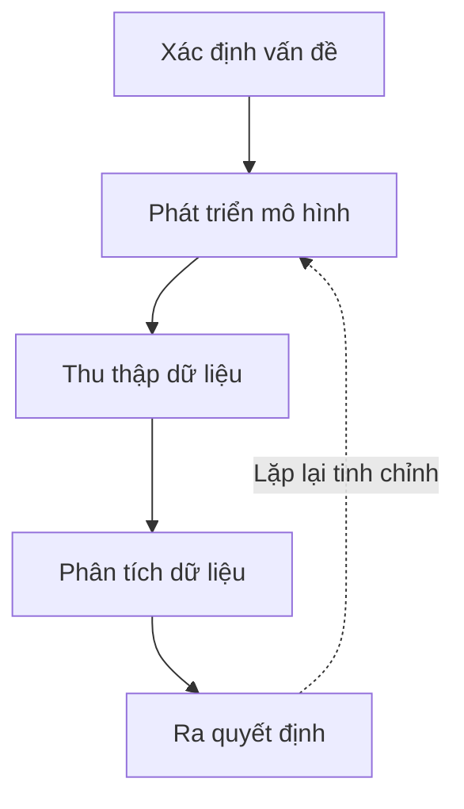
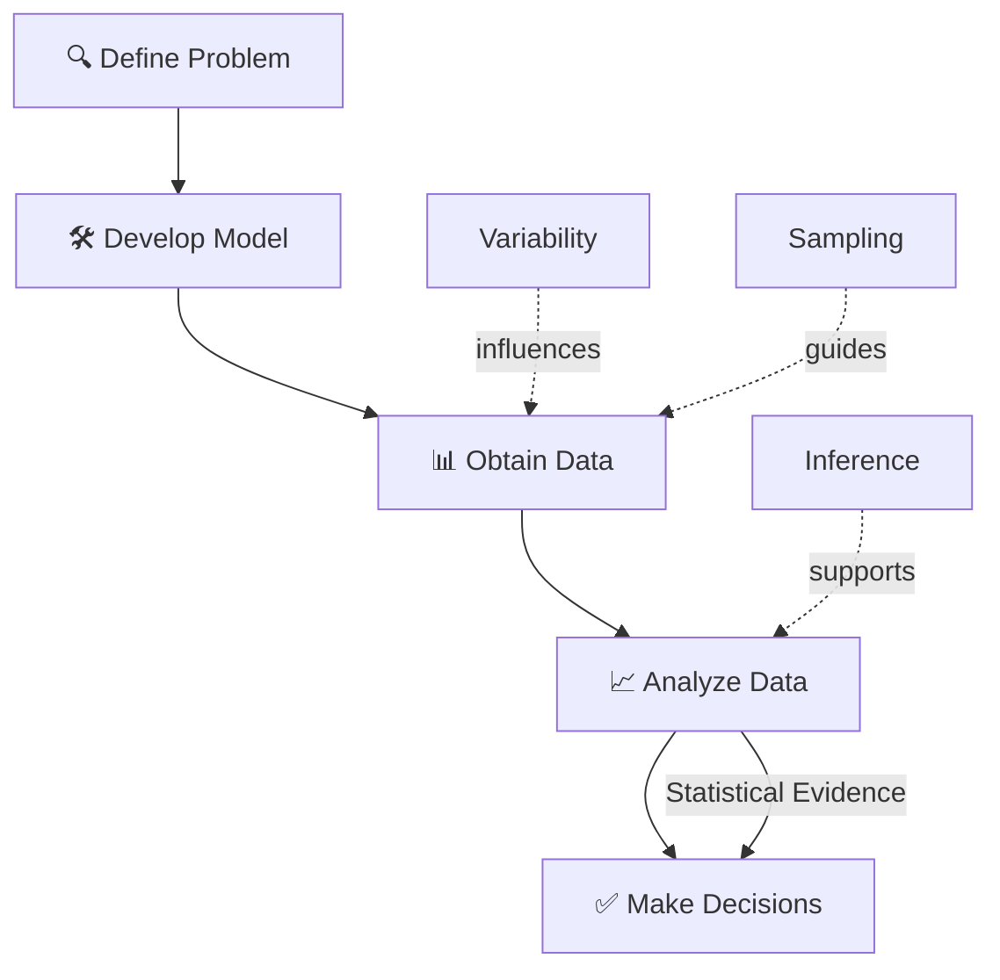
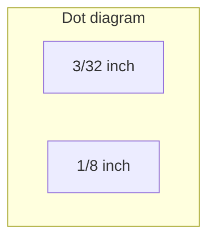

# The Engineering Method and Statistical Thinking

> Chào các em sinh viên. Chào mừng các em đến với môn học Thống kê Ứng dụng trong Kỹ thuật. Hôm nay, chúng ta sẽ không vội lao vào các công thức toán học phức tạp. Thay vào đó, thầy muốn trang bị cho các em một *"lăng kính"* để nhìn nhận thế giới kỹ thuật: **"The Engineering Method and Statistical Thinking" (Phương pháp Kỹ thuật và Tư duy Thống kê).**
>
> Là một kỹ sư tương lai – dù là kỹ sư phần mềm, điện tử hay cơ khí – các em phải hiểu rằng thế giới thực không vận hành chính xác 100% như những phương trình vật lý hay những dòng code lý tưởng.
>
> Chúng ta hãy bắt đầu bài giảng hôm nay.

---

## 1. Engineering Method là gì?

> [!info] Định nghĩa trực quan
> **Bình dân mà nói:** Đây là cách mà một kỹ sư *"giải phẫu"* một vấn đề khó nhằn thành các bước nhỏ để tìm ra giải pháp, thay vì đoán mò.

> [!note] Định nghĩa học thuật
> Kỹ sư là người giải quyết các vấn đề mang lại lợi ích cho xã hội bằng cách ứng dụng hiệu quả các nguyên lý khoa học. Phương pháp Kỹ thuật (Engineering hay Scientific Method) chính là một cách tiếp cận có hệ thống để hình thành và giải quyết các vấn đề này.

> [!danger] Lỗi tư duy thường gặp: Hội chứng "Jump to Code/Jump to Design"
> Sinh viên thường thấy một vấn đề là lập tức viết code hoặc vẽ bản vẽ CAD 3D ngay lập tức. Đây là một sai lầm! Các em bỏ qua bước quan trọng nhất: Thu thập dữ liệu và xây dựng mô hình để hiểu rõ bản chất vấn đề.

---

## 2. Các bước của Engineering Method

Trong thực tế, quy trình này là một vòng lặp liên tục, nhưng cơ bản có 5 bước chính:

| Bước | Mô tả | Ví dụ |
| :--- | :--- | :--- |
| **1. Define the problem** | Mô tả vấn đề một cách rõ ràng, súc tích và nhận diện các yếu tố có thể ảnh hưởng đến nó. | Làm sao để tăng cường độ kéo đứt của một đầu nối (connector) nylon trong động cơ ô tô? |
| **2. Develop a model** | Đề xuất một mô hình giải thích hiện tượng dựa trên kiến thức kỹ thuật (có thể là mô hình vật lý/cơ học hoặc mô hình thực nghiệm). | |
| **3. Obtain data** | Tiến hành các thí nghiệm hoặc quan sát thực tế để thu thập dữ liệu nhằm kiểm tra mô hình. | |
| **4. Analyze data** | Tinh chỉnh mô hình dựa trên dữ liệu thu được. Bước này đòi hỏi sự lặp đi lặp lại giữa việc thử nghiệm và điều chỉnh. | |
| **5. Make decisions** | Rút ra kết luận hoặc đưa ra các khuyến nghị về giải pháp. | |

---

## 3. Statistical Thinking (Tư duy thống kê) là gì?

> [!info] Định nghĩa trực quan
> **Bình dân:** Tư duy thống kê là việc bạn thừa nhận rằng *"Không có cái gì trên đời này giống nhau 100%, kể cả khi được tạo ra từ cùng một cái khuôn"*.

> [!note] Định nghĩa học thuật
> Thống kê là khoa học về dữ liệu (science of data). Tư duy thống kê là một lăng kính tư duy giúp chúng ta mô tả, hiểu và kết hợp **sự biến thiên (variability)** vào trong quá trình ra quyết định.

---

## 4. Tại sao Variability (Sự biến thiên) lại xuất hiện trong hệ thống kỹ thuật?

> [!example] Trực giác: Chiếc xe máy của em
> Hãy nghĩ đến mức tiêu hao nhiên liệu trên chiếc xe máy của các em. Có bao giờ hai bình xăng đổ đầy lại đi được chính xác số km y hệt nhau không? Không bao giờ! Vì nó phụ thuộc vào cách em chạy xe, áp suất lốp, hao mòn động cơ, và cả thời tiết. Đó chính là sự biến thiên.

> [!note] Định nghĩa cốt lõi
> Các quan sát liên tiếp trên cùng một hệ thống không bao giờ tạo ra kết quả giống hệt nhau.

**Nguồn gốc của sự biến thiên trong kỹ thuật:**

- Vật liệu đầu vào không đồng nhất
- Sự rung lắc của máy móc
- Sai số của thiết bị đo
- Điều kiện môi trường (nhiệt độ, độ ẩm)
- Tay nghề của công nhân

### Mô hình toán học: $X = \mu + \epsilon$

| Thành phần | Ý nghĩa |
| :--- | :--- |
| **$X$** | Giá trị thực tế em đo được |
| **$\mu$** | Giá trị trung bình (hằng số lý thuyết) |
| **$\epsilon$** | Nhiễu ngẫu nhiên (random disturbance) |

> [!warning] Lưu ý
> Nếu không có nhiễu, $\epsilon = 0$ và mọi sản phẩm đều hoàn hảo. Nhưng điều này **không bao giờ** xảy ra trong thế giới thực.

> [!danger] Lỗi tư duy thường gặp
> Sinh viên kỹ thuật thường bị ám ảnh bởi các định luật Vật lý (ví dụ: Định luật Ohm $I = E/R$). Các em mặc định mọi mạch điện sẽ cho dòng điện chính xác như công thức. Nhưng trong thực tế đo đạc, công thức phải là $I = E/R + \epsilon$ do tạp chất trong dây đồng hoặc sự trôi dạt của nguồn điện. Bỏ qua $\epsilon$ là em đang làm toán, không phải làm kỹ thuật!

---

## 5. Tại sao kỹ sư phải ra quyết định dưới điều kiện "Không chắc chắn" (Uncertainty)?

Là kỹ sư, em không bao giờ có đủ thời gian và tiền bạc để kiểm tra 100% sản phẩm. Kỹ sư luôn phải suy luận từ một **Mẫu (Sample)** nhỏ để đưa ra kết luận cho toàn bộ **Tổng thể (Population)**.

| Khái niệm | Định nghĩa | Ví dụ |
| :--- | :--- | :--- |
| **Population** | Toàn bộ tập hợp các đối tượng/đo lường mà ta quan tâm. | Toàn bộ 10,000 tấm wafer silicon trong một lô hàng. |
| **Sample** | Một tập con của Population được chọn để khảo sát. | 3 tấm wafer được lấy ra để kiểm tra. |
| **Statistical Inference** | Dùng dữ liệu từ Sample để khái quát hóa lên Population. | Từ 3 tấm wafer, kết luận chất lượng của cả 10,000 tấm. |

> [!warning] Hệ quả
> Do em không thấy được bức tranh toàn cảnh, mọi quyết định em đưa ra đều mang một **rủi ro nhất định** (sampling errors). Xác suất và Thống kê giúp chúng ta định lượng được rủi ro này.

---

## 6. Vai trò của Dữ liệu trong kỹ thuật hiện đại

> [!info] Dữ liệu (Data) là máu của kỹ thuật hiện đại.

Thống kê xử lý việc:
- **Thu thập** dữ liệu
- **Trình bày** dữ liệu
- **Phân tích** dữ liệu
- **Sử dụng** dữ liệu để ra quyết định, giải quyết vấn đề và thiết kế quy trình sản xuất.

**Mô hình thực nghiệm (Empirical Models):** Khi chúng ta không có một mô hình vật lý rõ ràng (ví dụ: không biết chính xác cơ chế vật lý nào nối chiều dài dây dẫn và chiều cao khuôn đúc với lực kéo đứt của một mối hàn mạch điện tử), chúng ta phải dùng dữ liệu để xây dựng các mô hình.

---

## 7. Mối liên hệ giữa Engineering Method và Statistical Thinking

Hai khái niệm này không tách rời mà lồng ghép vào nhau. Tư duy thống kê đóng vai trò chủ đạo ở bước *"Thu thập dữ liệu"* và *"Phân tích dữ liệu"* trong Phương pháp Kỹ thuật.

Kỹ sư phải dùng thống kê để:
- **Thiết kế thí nghiệm (Design of Experiments)** sao cho lấy được dữ liệu hữu ích nhất với chi phí rẻ nhất.
- **Tách tín hiệu thật sự ra khỏi nhiễu** $\epsilon$ để đưa ra giải pháp đúng đắn.

---

## 8. Ví dụ thực tế: Kỹ thuật Cơ khí/Sản xuất

Hãy xem xét việc một kỹ sư thiết kế một **đầu nối (connector)** nylon dùng trong động cơ ô tô.

### Bước 1: Define the problem
> [!example] Vấn đề
> Lực kéo đứt (pull-off force) của đầu nối hiện tại bị phàn nàn là quá thấp (trung bình 13.0 lbs), nó có thể bị tuột khi động cơ rung lắc.

### Bước 2: Develop a model
> [!example] Giả thuyết
> Nếu tăng độ dày thành (wall thickness) từ $3/32$ inch lên $1/8$ inch thì lực kéo đứt sẽ tăng lên.

### Bước 3: Obtain data
> [!example] Thiết kế thí nghiệm
> Kỹ sư chế tạo 8 mẫu thử (prototypes) với độ dày $3/32$ inch và 8 mẫu thử độ dày $1/8$ inch.

### Bước 4: Analyze data
> [!example] Kết quả đo
> Lực kéo đứt trung bình của loại dày hơn là 13.4 lbs. Tuy nhiên, các giá trị bị phân tán (có $\epsilon$). Có những mẫu dày nhưng lực kéo vẫn yếu hơn một số mẫu mỏng.

### Bước 5: Make decisions
> [!example] Áp dụng Statistical Thinking
> Liệu mức tăng từ 13.0 lên 13.4 lbs là do độ dày thực sự mang lại hiệu quả, hay chỉ là do *"sự biến thiên ngẫu nhiên"* của 8 mẫu vô tình chọn được?

> [!success] Giải pháp
> Kỹ sư sẽ dùng các công cụ thống kê (Hypothesis Testing) để định lượng rủi ro trước khi ra quyết định đầu tư hàng triệu đô thay đổi khuôn đúc.

---

## 9. TÓM TẮT KIẾN THỨC

| Khái niệm | Nội dung cốt lõi |
| :--- | :--- |
| **Engineering Method** | Quy trình lặp đi lặp lại: Vấn đề $\rightarrow$ Mô hình $\rightarrow$ Dữ liệu $\rightarrow$ Phân tích $\rightarrow$ Quyết định. |
| **Statistical Thinking** | Nhận thức rằng mọi hệ thống đều có sự biến thiên ($X = \mu + \epsilon$). |
| **Uncertainty** | Kỹ sư đưa ra quyết định dựa trên dữ liệu mẫu (Sample), do đó luôn tồn tại sự không chắc chắn. Cần dùng Thống kê để quản trị và định lượng rủi ro này. |

---

## 10. CÂU HỎI LÝ THUYẾT (Để ôn tập)

1. Hãy phân biệt giữa một Mô hình cơ học (Mechanistic model) và một Mô hình thực nghiệm (Empirical model). Cho ví dụ.

2. Tại sao phương trình $X = \mu + \epsilon$ lại mô tả chính xác thế giới kỹ thuật hơn là chỉ viết $X = \mu$? Ý nghĩa của $\epsilon$ là gì?

3. Tại sao trong Engineering Method, các bước *"Xác định yếu tố"*, *"Xây dựng mô hình"* và *"Thực nghiệm"* thường phải lặp lại nhiều vòng (iteration) trước khi ra quyết định cuối cùng?

4. Statistical inference (Suy diễn thống kê) là gì? Tại sao quá trình này luôn đi kèm với rủi ro?

5. Trình bày sự khác biệt giữa Population (Tổng thể) và Sample (Mẫu). Tại sao kỹ sư hiếm khi có được dữ liệu của Tổng thể?

---

## 11. TÌNH HUỐNG THỰC TẾ (Để sinh viên phân tích và đưa ra giải pháp)

### Tình huống 1: Software Engineering

> [!example] Bối cảnh
> Đội QA của bạn báo cáo rằng sau khi áp dụng quy trình Code Review mới, số lượng bug trung bình trong 5 sprint gần nhất giảm từ 15 xuống 12 bug/sprint. Tuy nhiên sếp bạn cho rằng đây chỉ là sự dao động ngẫu nhiên bình thường.

> [!question] Yêu cầu phân tích
> Bám vào tư duy thống kê, bạn sẽ thu thập dữ liệu và phân tích như thế nào để chứng minh (định lượng rủi ro) cho sếp rằng mức giảm này là do quy trình chứ không phải nhiễu $\epsilon$?

---

### Tình huống 2: Electronics Engineering

> [!example] Bối cảnh
> Bạn đang sản xuất một mạch in tử (PCB). Bạn đo điện trở của 100 vi mạch từ một dây chuyền và thấy điện trở trung bình đúng bằng mức chuẩn 80 ohms. Tuy nhiên, khi ráp vào sản phẩm, tỷ lệ lỗi vẫn rất cao.

> [!question] Yêu cầu phân tích
> Bỏ qua $\mu$, bạn đã quên mất yếu tố nào trong Statistical Thinking? Bạn sẽ giải quyết sự cố này theo Engineering Method ra sao?

---

### Tình huống 3: Mechanical Engineering

> [!example] Bối cảnh
> Bạn đang thiết kế một trục khuỷu động cơ (crankshaft). Theo mô hình CAD và định luật vật lý (Mechanistic model), tuổi thọ của nó là 100.000 giờ. Nhưng thực tế chạy thử 3 mẫu đầu tiên, chúng gãy ở 85.000 giờ.

> [!question] Yêu cầu phân tích
> Áp dụng Engineering Method, bước tiếp theo của bạn là gì? Làm thế nào để điều chỉnh lại model?

---

### Tình huống 4: Manufacturing Engineering

> [!example] Bối cảnh
> Nhiệt độ của lò nung thiếc luôn được cài đặt chính xác ở 250 độ C. Một kỹ sư mới ra trường thấy bảng hiển thị nhiệt độ đang dao động ở 251 độ C nên ngay lập tức vặn nút giảm nhiệt độ. Lát sau nó rớt xuống 248 độ, cậu ta lại vặn tăng nhiệt độ.

> [!question] Yêu cầu phân tích
> Theo bài thí nghiệm *"phễu và viên bi"* (funnel experiment của Deming), người kỹ sư đang mắc lỗi gì đối với sự biến thiên? Hậu quả của hành động này là gì? Giải pháp?

---

### Tình huống 5: Data/System Engineering

> [!example] Bối cảnh
> Bạn có một máy chủ web phản hồi lệnh trong trung bình 100ms. Bạn vừa update firmware mới và đo thử 10 requests, thấy tốc độ là 95ms. Bạn lập tức push bản update này lên toàn bộ hệ thống toàn cầu.

> [!question] Yêu cầu phân tích
> Chỉ ra lỗi tư duy *"nhảy vọt đến kết luận"* (Jumping to conclusion) trong việc dùng Sample đại diện cho Population. Đề xuất quy trình Engineering Method an toàn hơn.

---

> [!tip] Lời kết
> Hãy nhớ rằng, một kỹ sư giỏi không phải là người không bao giờ có sai số, mà là người biết định lượng và quản lý sai số đó. Chính tư duy thống kê sẽ giúp các em làm được điều này!
