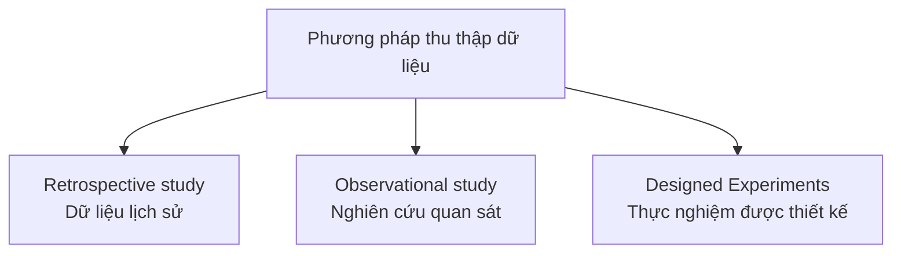
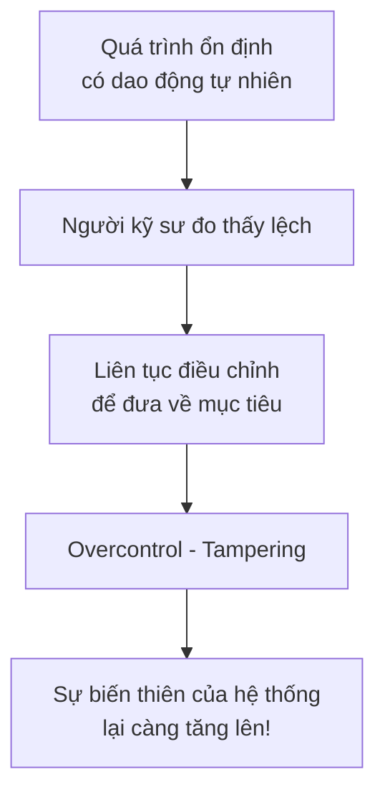
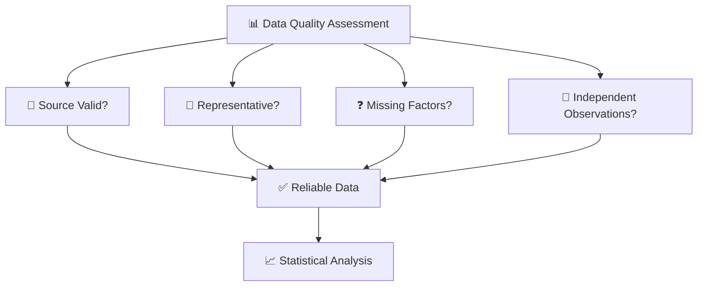

# Basic Principles of Collecting Engineering Data

> Chào các em. Trong bài học trước, chúng ta đã có cái nhìn tổng quan về Phương pháp Kỹ thuật và Tư duy Thống kê. Hôm nay, chúng ta sẽ đi sâu vào bước cực kỳ quan trọng làm nền tảng cho mọi quyết định: **"Basic Principles of Collecting Engineering Data" (Các Nguyên tắc Cơ bản trong Thu thập Dữ liệu Kỹ thuật).**
>
> Hãy nhớ rằng, phân tích toán học dù có xuất sắc đến đâu cũng vô nghĩa nếu dữ liệu đầu vào là *"rác"* (Garbage in, garbage out). Chúng ta sẽ cùng giải phẫu các khái niệm từ gốc rễ.

---

## 1. Tại sao Dữ liệu là nền tảng của Thống kê?

> [!info] Thống kê thực chất chính là **khoa học về dữ liệu (science of data)**.

Công việc của thống kê xoay quanh việc:
- Thu thập dữ liệu
- Trình bày dữ liệu
- Phân tích dữ liệu
- Sử dụng dữ liệu để giải quyết vấn đề và thiết kế quy trình sản phẩm

> [!warning] Không có dữ liệu, chúng ta không thể định lượng được **sự biến thiên (variability)** – bản chất cốt lõi của mọi hệ thống vật lý.

---

## 2. Mục tiêu của việc thu thập dữ liệu

> [!note] Kỹ sư thu thập dữ liệu nhằm đưa ra quyết định hoặc rút ra kết luận trong điều kiện có sự biến thiên.

Mục tiêu chính là để:
- **Kiểm chứng các mô hình**
- **So sánh các giải pháp thiết kế**
- **Kiểm soát quy trình sản xuất**

> [!example] Ví dụ thực tế
> Khi kỹ sư muốn tăng lực kéo đứt của một đầu nối nylon trong động cơ, họ phải thu thập dữ liệu từ các nguyên mẫu (prototypes) để biết liệu sự thay đổi độ dày thành (từ 3/32 inch lên 1/8 inch) có thực sự mang lại hiệu quả hay không.

---

## 3. Population (Tổng thể) và Sample (Mẫu)

| Khái niệm | Định nghĩa | Đặc điểm |
| :--- | :--- | :--- |
| **Population (Tổng thể)** | Toàn bộ các đối tượng mà chúng ta quan tâm. | Trong kỹ thuật, thường mang tính **"khái niệm"** hoặc **"giả định"**: ví dụ *tất cả các đầu nối nylon sẽ được sản xuất và bán cho khách hàng trong tương lai*. Đôi khi là tổng thể vật lý thực sự (một lô đĩa silicon). |
| **Sample (Mẫu)** | Một nhóm nhỏ đại diện được lấy ra từ Population. | Kỹ sư hiếm khi thu thập được toàn bộ dữ liệu của Tổng thể vì rào cản **chi phí** và **thời gian**. |

> [!note] Suy diễn thống kê (Statistical inference)
> Quá trình đi từ dữ liệu Mẫu để rút ra kết luận khái quát cho Tổng thể. Quá trình này luôn tiềm ẩn rủi ro (sampling errors), do đó **kích thước và cách chọn mẫu đóng vai trò quyết định**.

---

## 4. Sources of Variation (Nguồn gốc của sự biến thiên)

> [!info] Sự biến thiên có nghĩa là các lần quan sát liên tiếp trên cùng một hệ thống sẽ không bao giờ cho ra kết quả y hệt nhau.

### Mô hình tổng quát: $X = \mu + \epsilon$

| Thành phần | Ý nghĩa |
| :--- | :--- |
| **$X$** | Giá trị thực tế đo được |
| **$\mu$** | Giá trị trung bình lý thuyết |
| **$\epsilon$** | Nhiễu ngẫu nhiên (random disturbance) |

### Nguồn gốc của sự biến thiên

- Sự thay đổi của môi trường xung quanh
- Sự dao động của thiết bị kiểm tra
- Sự khác biệt bản tại giữa các linh kiện
- Độ mài mòn của máy móc theo thời gian

---

## 5. Measurement Error (Sai số đo lường)

> [!danger] Lỗi tư duy thường gặp
> Nhiều sinh viên kỹ thuật chỉ dựa vào các mô hình cơ học (Mechanistic models) lý tưởng.

**Ví dụ:** Theo định luật Ohm, dòng điện $I = E/R$. Tuy nhiên, nếu em đo dòng điện nhiều lần, kết quả sẽ hơi khác nhau do:
- Nhiệt độ môi trường thay đổi
- Đồng hồ đo dao động
- Tạp chất trong dây đồng

> [!important] Do đó, sai số đo lường buộc mô hình thực tế phải được viết lại thành:
> $$I = \frac{E}{R} + \epsilon$$
> với $\epsilon$ bao gồm tất cả các nguồn biến thiên không được đưa vào phương trình.

---

## 6. Bias (Thiên lệch) trong quá trình thu thập dữ liệu

> [!warning] Bias là sự sai lệch **có hệ thống** của dữ liệu.

Điều này rất dễ xảy ra khi sử dụng phương pháp **Nghiên cứu hồi cứu (Retrospective study)** – tức là dùng dữ liệu lịch sử đã được lưu trữ.

> [!example] Ví dụ về Bias
> Một nhà máy chưng cất hóa chất có rất nhiều dữ liệu về nhiệt độ và nồng độ Acetone. Tuy nhiên, các kỹ sư thường gặp rắc rối vì:
> - Dữ liệu có thể bị **thiếu**
> - Lỗi sao chép dẫn đến giá trị **ngoại lai (outliers)**
> - Đặc biệt: **bỏ sót các yếu tố cực kỳ quan trọng** (chẳng hạn nồng độ các chất trong dòng đầu vào không được ghi nhận vì quá khó đo lường hàng ngày)

> [!danger] Hệ quả
> Dữ liệu bị bias sẽ che khuất bản chất thật sự của vấn đề.

---

## 7. Representative Sample (Mẫu đại diện) là gì?

> [!note] Để các quyết định từ Mẫu có thể suy diễn chính xác lên Tổng thể, mẫu phải mang tính **đại diện**.

**Tiêu chí của một mẫu đại diện:**

- Được lấy thông qua các cơ chế **ngẫu nhiên (randomization)**
- Đảm bảo rằng mọi thành phần của tổng thể đều có cơ hội xuất hiện trong mẫu

> [!success] Lợi ích
> Chỉ khi có mẫu đại diện, chúng ta mới có thể dùng các mô hình xác suất để định lượng rủi ro (xác suất sai lầm) cho quyết định của mình.

---

## 8. Các nguyên tắc để thu thập dữ liệu đáng tin cậy

Có 3 cách để kỹ sư thu thập dữ liệu:

| Phương pháp | Mô tả | Ưu điểm | Nhược điểm |
| :--- | :--- | :--- | :--- |
| **Retrospective study** | Dùng dữ liệu lịch sử đã có sẵn. | Dễ lấy, tốn ít chi phí. | Chứa nhiều nhiễu, thiếu sót và dễ bị bias. |
| **Observational study** | Chủ động quan sát hệ thống trong một khoảng thời gian ngắn và ghi nhận cẩn thận, can thiệp càng ít càng tốt. | Giải quyết được bài toán thiếu dữ liệu. | Vẫn khó để tách biệt nguyên nhân - kết quả. |
| **Designed Experiments** | **Thay đổi có chủ đích** các biến có thể kiểm soát được và quan sát sự thay đổi ở đầu ra. | **Cách tốt nhất**. Thiết lập được **mối quan hệ nhân quả**. | Tốn thời gian và chi phí hơn. |

> [!important] Thiết kế thực nghiệm đúng quy tắc thống kê (như Randomization) là cách duy nhất để thiết lập **mối quan hệ nhân quả (cause-and-effect relationships)**.

---

## 9. Hậu quả của việc thu thập và sử dụng dữ liệu sai: Lỗi "Overcontrol" (Can thiệp thái quá)

> [!danger] Một lỗi rất phổ biến trong thực tế kỹ thuật là việc phản ứng lại với các *"nhiễu ngẫu nhiên"* mà tưởng nhầm đó là lỗi hệ thống.

### Thí nghiệm thả bi qua phễu (Funnel experiment) của Deming

> [!warning] Bài học
> - Điều chỉnh chỉ nên được thực hiện khi dữ liệu thực sự chỉ ra một sự **dịch chuyển phi ngẫu nhiên (nonrandom shift)**.
> - Việc thu thập dữ liệu ngẫu nhiên nhưng lại hiểu sai bản chất sẽ dẫn đến các hành động điều chỉnh khiến **sự biến thiên của toàn hệ thống lại càng tăng lên**.

---

## 10. TÓM TẮT

| Khái niệm | Nội dung cốt lõi |
| :--- | :--- |
| **Dữ liệu** | Cơ sở để xử lý sự biến thiên ($X = \mu + \epsilon$). |
| **Population vs Sample** | Kỹ sư không bao giờ quan sát được **Tổng thể** mà phải thông qua **Mẫu đại diện** để thực hiện **Suy diễn thống kê**. |
| **Measurement Error** | Các mô hình vật lý lý thuyết luôn đi kèm sai số. |
| **Bias** | Thu thập dữ liệu từ lịch sử tiềm ẩn thiên lệch có hệ thống. |
| **Designed Experiments** | Mang lại độ tin cậy cao nhất so với các phương pháp khác. |
| **Overcontrol** | Sai lầm trong đọc hiểu dữ liệu dẫn đến can thiệp thái quá, làm quy trình tồi tệ hơn. |

---

## 11. CHECKLIST ĐÁNH GIÁ CHẤT LƯỢNG DỮ LIỆU CỦA KỸ SƯ

- [ ] **Nguồn dữ liệu:** Dữ liệu này là lấy từ kho lưu trữ (Retrospective), quan sát thụ động (Observational), hay qua thực nghiệm có thiết kế (Designed Experiment)?
- [ ] **Tính đại diện:** Mẫu này có được lấy ngẫu nhiên không? Có đại diện cho điều kiện vận hành thực tế của "Population" không?
- [ ] **Biến bị thiếu:** Liệu có yếu tố môi trường (nhiệt độ, độ ẩm) hay đầu vào nào có tác động nhưng chưa được đo đạc không?
- [ ] **Tính độc lập:** Các lần đo có bị ảnh hưởng bởi nhau không? (Measurement Errors có bị gộp chung không?)
- [ ] **Hành động:** Biến thiên này là ngẫu nhiên ($\epsilon$) hay có nguyên nhân cụ thể (assignable cause)? Có rủi ro bị "Overcontrol" nếu điều chỉnh máy móc ngay lập tức không?

---

## 12. BÀI TẬP TÌNH HUỐNG (Case Studies)

### Tình huống 1: Keo dán công nghiệp

> [!example] Bối cảnh
> Một nhóm kỹ sư phát triển một loại keo dán công nghiệp mới. Họ lấy kết quả kiểm tra lực dính của 10 mẫu làm ở phòng lab trong điều kiện độ ẩm $50\%$ để chứng minh rằng loại keo này sẽ dính tốt hơn khi sản xuất đại trà.

> [!question] Câu hỏi
> Dựa vào khái niệm Population và Sample, hãy phân tích tại sao việc lấy dữ liệu này có thể dẫn đến thất bại khi áp dụng vào sản xuất đại trà ở một nhà máy có độ ẩm thay đổi từ $40\%-80\%$?

> [!success] Gợi ý phân tích
> - **Sample** (10 mẫu lab) không đại diện cho **Population** (tất cả sản phẩm sản xuất đại trà).
> - Điều kiện độ ẩm phòng lab cố định ($50\%$) không bao phủ được phạm vi biến thiên của môi trường sản xuất thực tế ($40\%-80\%$).
> - Cần thực hiện **Designed Experiment** với các mức độ ẩm khác nhau để có mẫu đại diện.

---

### Tình huống 2: Lập trình viên và thời gian phản hồi

> [!example] Bối cảnh
> Một lập trình viên ghi lại thời gian phản hồi (response time) của một máy chủ web. Anh ta nhận thấy trong 5 phút vừa qua, thời gian phản hồi tăng từ 100ms lên 105ms. Anh lập tức khởi động lại (restart) một số dịch vụ mạng. Nhưng 5 phút sau, thời gian phản hồi vọt lên 115ms.

> [!question] Câu hỏi
> Theo lý thuyết về sự biến thiên và bài học từ *"phễu Deming"*, anh lập trình viên đang mắc phải lỗi tư duy gì trong việc sử dụng dữ liệu? Giải pháp thống kê nào nên được áp dụng ở đây?

> [!success] Gợi ý phân tích
> - Anh lập trình viên đang mắc lỗi **Overcontrol (Tampering)**.
> - Sự tăng từ 100ms lên 105ms có thể chỉ là nhiễu ngẫu nhiên ($\epsilon$), không phải dấu hiệu của sự cố hệ thống.
> - Việc khởi động lại dịch vụ đã gây thêm nhiễu, làm tăng biến thiên lên 115ms.
> - **Giải pháp:** Thu thập dữ liệu đủ lớn, xây dựng biểu đồ kiểm soát (Control Chart) để phân biệt biến thiên ngẫu nhiên và biến thiên có nguyên nhân đặc biệt.

---

### Tình huống 3: Máy in và nhật ký bảo hành

> [!example] Bối cảnh
> Để tìm hiểu nguyên nhân gây kẹt giấy trong một loại máy in mới, kỹ sư thiết kế quyết định thu thập dữ liệu (Retrospective study) từ nhật ký bảo hành của các kỹ thuật viên ngoài hiện trường.

> [!question] Câu hỏi
> Nêu ít nhất 3 rủi ro về *"Bias"* và chất lượng dữ liệu mà người kỹ sư này có thể gặp phải khi chỉ sử dụng nguồn dữ liệu lịch sử này? Làm thế nào để giải quyết (chuyển sang loại hình thu thập dữ liệu nào)?

> [!success] Gợi ý phân tích

**3 rủi ro về Bias:**

1. **Bias ghi chép:** Kỹ thuật viên có thể bỏ qua hoặc ghi sai thông tin do áp lực công việc.
2. **Bias chọn lọc:** Chỉ những máy có vấn đề nghiêm trọng mới được ghi nhận đầy đủ.
3. **Bias người dùng:** Cách sử dụng máy in của khách hàng khác nhau (loại giấy, tần suất) nhưng không được ghi lại.

**Giải pháp:**
- Chuyển sang **Designed Experiment**: Thiết kế thí nghiệm có kiểm soát, thay đổi các yếu tố như loại giấy, nhiệt độ, độ ẩm, tần suất in để quan sát ảnh hưởng đến tỷ lệ kẹt giấy.
- Kết hợp với **Observational study**: Quan sát có hệ thống tại hiện trường với bảng kiểm tra (checklist) chuẩn hóa.

---

> [!tip] Lời kết
> Hãy nhớ rằng, một kỹ sư giỏi không chỉ biết phân tích dữ liệu mà còn phải biết **thu thập dữ liệu đúng cách**. Dữ liệu tốt là nền tảng của mọi quyết định kỹ thuật chính xác!
