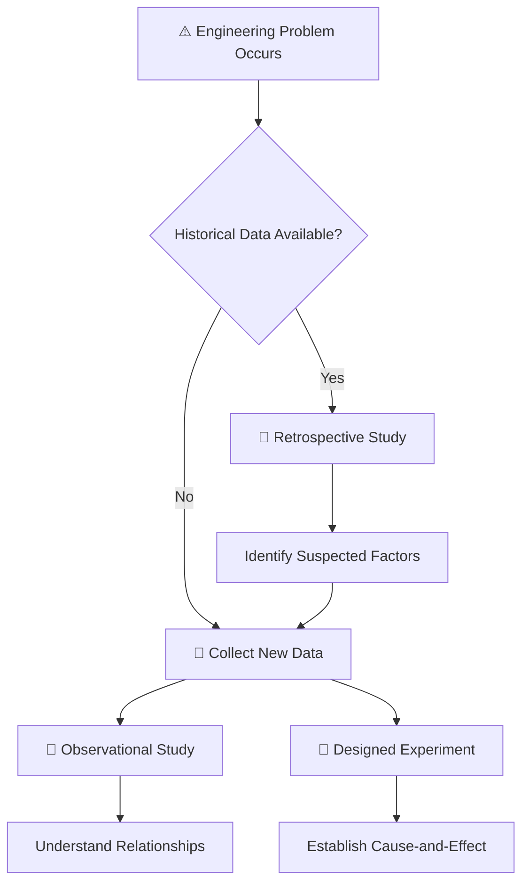
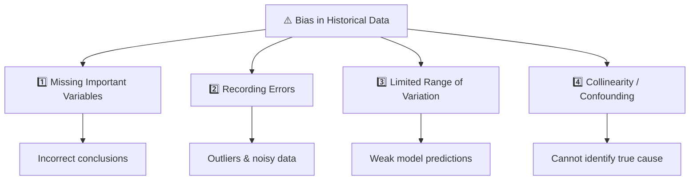

# Retrospective Study (Nghiên cứu hồi cứu)

> Chào các em. Trong những bài học trước, chúng ta đã nhắc đến tầm quan trọng của việc thu thập dữ liệu kỹ thuật. Hôm nay, chúng ta sẽ đi sâu vào một trong ba phương pháp thu thập dữ liệu cơ bản nhất: **Retrospective Study (Nghiên cứu hồi cứu)**.
>
> Khi các em đi làm thực tế, việc đầu tiên các em thường làm khi gặp sự cố là *"lục lọi"* lại các file log, các bảng tính Excel ghi chép thông số cũ để tìm nguyên nhân. Đó chính là cốt lõi của bài học hôm nay.

---

## 1. Retrospective Study (Nghiên cứu hồi cứu) là gì?

> [!info] Giải thích trực giác
> Đây là quá trình *"nhìn lại quá khứ"*. Các em sử dụng những dữ liệu đã được thu thập và lưu trữ từ trước đó để phân tích và tìm ra câu trả lời cho một vấn đề hiện tại.

> [!note] Định nghĩa học thuật
> Nghiên cứu hồi cứu sử dụng toàn bộ hoặc một mẫu dữ liệu lịch sử của quá trình đã được lưu trữ qua một khoảng thời gian. Mục tiêu là khám phá ra mối quan hệ giữa các biến số với nhau.

---

## 2. Dữ liệu lịch sử (Historical data) là gì?

Dữ liệu lịch sử là những ghi chép, log file, hoặc cơ sở dữ liệu được sinh ra trong quá trình vận hành bình thường của một hệ thống, nhà máy hoặc phần mềm.

| Đặc điểm | Mô tả |
| :--- | :--- |
| **Nguồn gốc** | Được thu thập một cách tự động hoặc thủ công để phục vụ mục đích lưu trữ và theo dõi (archive). |
| **Mục đích ban đầu** | **Không** được thiết kế riêng cho mục đích phân tích thống kê cụ thể nào. |

---

## 3. Khi nào nên sử dụng dữ liệu lịch sử?

> [!important] Vai trò của Retrospective Study
> Dữ liệu lịch sử nên được sử dụng ở giai đoạn đầu của phương pháp kỹ thuật (Engineering Method) khi các em cần một điểm bắt đầu để hiểu vấn đề.

**Ưu điểm trong thực tế:**
- Nếu công ty có sẵn một kho dữ liệu khổng lồ (Big Data) thu thập qua nhiều năm, việc phân tích chúng sẽ giúp các em định hình được các yếu tố nào có vẻ liên quan đến sự cố.
- Từ đó, các em có thể tiết kiệm chi phí bằng cách chỉ tập trung thí nghiệm vào những yếu tố quan trọng nhất.

---

## 4. Ưu điểm của Retrospective Study

| Ưu điểm | Giải thích |
| :--- | :--- |
| **Có sẵn và tốn ít chi phí** | Không tốn tiền và thời gian để thiết lập thí nghiệm, vì dữ liệu đã nằm sẵn trong máy chủ. |
| **Số lượng lớn** | Thường bao gồm một lượng dữ liệu (dung lượng/kích thước) rất đáng kể, cho phép phân tích nhiều khoảng thời gian vận hành khác nhau. |

---

## 5. Nhược điểm của Retrospective Study

> [!warning] Dù lượng dữ liệu có thể rất lớn, nhưng nó có thể chứa tương đối ít thông tin thực sự hữu ích.

| Nhược điểm | Giải thích |
| :--- | :--- |
| **Thiếu thông tin quan trọng** | Những dữ liệu thực sự cần thiết đôi khi lại bị thiếu. |
| **Khó giải thích** | Một phân tích thống kê trên dữ liệu lịch sử đôi khi chỉ ra những hiện tượng thú vị, nhưng lại rất khó để đưa ra những lời giải thích vững chắc và đáng tin cậy cho hiện tượng đó. |

---

## 6. Các nguồn sai lệch (Bias) thường gặp trong Dữ liệu lịch sử

Khi phân tích dữ liệu lịch sử, kỹ sư thường gặp phải **4 vấn đề** làm mờ đi bản chất của hệ thống:

| Vấn đề | Mô tả | Hậu quả |
| :--- | :--- | :--- |
| **1. Thiếu vắng dữ liệu của các biến quan trọng** | Những thông số cực kỳ quan trọng thường bị bỏ sót không được lưu trữ do chúng quá khó để đo đạc hàng ngày. | Không thể kiểm tra tác động của yếu tố này lên kết quả. |
| **2. Lỗi ghi chép sinh ra ngoại lai (Outliers)** | Dữ liệu có thể bị thiếu hoặc có lỗi sao chép, dẫn đến các giá trị ngoại lai. | Làm méo mó kết quả phân tích, dẫn đến kết luận sai. |
| **3. Dải thay đổi quá hẹp** | Trong vận hành thực tế, người ta luôn cố gắng giữ hệ thống ổn định. Do đó, một số biến số hiếm khi bị thay đổi. | Khi dải thay đổi quá hẹp, ta không thể thấy được tác động thực sự của biến đó lên kết quả. |
| **4. Các biến thay đổi cùng nhau (Collinearity)** | Các biến số thường có xu hướng thay đổi cùng nhau một cách tự nhiên. | Rất khó để tách biệt và xác định xem biến nào mới là nguyên nhân thực sự gây ra lỗi. |

---

## 7. Phân tích các ví dụ thực tế

### Ví dụ 1: Dữ liệu sản xuất (Tháp chưng cất hóa chất)

> [!example] Bối cảnh
> Các em đang phân tích một tháp chưng cất để tìm ảnh hưởng của nhiệt độ đun (reboil temp), nhiệt độ ngưng tụ (condenser temp) và tốc độ hồi lưu (reflux rate) đến nồng độ acetone ở đầu ra. Các em lấy dữ liệu lịch sử ra phân tích.

> [!bug] Các vấn đề gặp phải
> - Người vận hành luôn giữ tốc độ hồi lưu cố định (không thay đổi) $\rightarrow$ Không thể phân tích tác động của nó.
> - Nồng độ các chất đầu vào rất quan trọng nhưng lại không được ghi chép vì khó đo đạc $\rightarrow$ Bỏ sót biến quan trọng.
> - Nhiệt độ đun và nhiệt độ ngưng tụ luôn tăng giảm cùng nhau $\rightarrow$ Không biết biến nào làm nồng độ acetone thay đổi.

---

### Ví dụ 2: Dữ liệu lỗi phần mềm (Software Engineering)

> [!example] Bối cảnh
> Các em được giao phân tích lý do tại sao một server hay bị crash bằng cách xem xét log file của server trong 1 năm qua.

> [!bug] Vấn đề
> - Các em thấy cứ mỗi lần lượng RAM sử dụng đạt 90%, server sẽ crash.
> - Tuy nhiên, log file không hề ghi lại *"loại truy vấn (query) nào đang được chạy lúc đó"* vì nó quá nặng để log lại.
> - Lượng RAM 90% chỉ là **kết quả** của một truy vấn nặng, chứ không phải **nguyên nhân gốc rễ**.

> [!danger] Kết luận sai lầm có thể xảy ra
> Dữ liệu lịch sử đã che giấu nguyên nhân thật sự!

---

### Ví dụ 3: Dữ liệu Y tế (Phân tích hồ sơ bệnh án)

> [!example] Bối cảnh
> Các bác sĩ muốn phân tích tác dụng phụ của một loại thuốc dựa trên hồ sơ y tế cũ của 1000 bệnh nhân.

> [!bug] Vấn đề
> - Họ thấy những người uống thuốc này thường bị đau dạ dày.
> - Nhưng hồ sơ lịch sử không ghi lại việc *"bệnh nhân có hút thuốc lá hay uống rượu bia không"*.

> [!danger] Hệ quả
> Việc thiếu sót dữ liệu thói quen sinh hoạt khiến việc đổ lỗi cho thuốc trở nên thiếu cơ sở khoa học vững chắc.

---

## 8. So sánh ba phương pháp thu thập dữ liệu

| Tiêu chí | Retrospective Study | Observational Study | Designed Experiment |
| :--- | :--- | :--- | :--- |
| **Nguồn dữ liệu** | Dữ liệu lịch sử đã có sẵn | Quan sát hệ thống hiện tại | Chủ động thay đổi hệ thống |
| **Can thiệp** | Không can thiệp | Can thiệp tối thiểu | Chủ động thay đổi có kiểm soát |
| **Ưu điểm** | Rẻ, có sẵn, khối lượng lớn | Khắc phục được thiếu dữ liệu | Thiết lập được quan hệ nhân-quả |
| **Nhược điểm** | Nhiễu cao, dễ thiếu biến, khó tách nguyên nhân | Khó tách biệt ảnh hưởng của các biến đi cùng nhau | Tốn kém, mất thời gian |
| **Khả năng kết luận** | **Thấp** (chỉ gợi ý) | **Trung bình** | **Cao nhất** (duy nhất xác định được nguyên nhân) |

> [!important] Nguyên tắc vàng
> - Không nên dựa hoàn toàn vào dữ liệu lịch sử để ra quyết định thiết kế.
> - Hãy dùng Retrospective Study như bước **định hướng**, sau đó chuyển sang **Observational Study** hoặc lý tưởng nhất là **Designed Experiment** để tìm ra quan hệ nhân-quả chắc chắn.

---

## 9. TÓM TẮT KIẾN THỨC

| Khái niệm | Nội dung cốt lõi |
| :--- | :--- |
| **Retrospective Study** | Sử dụng dữ liệu lưu trữ lịch sử để phân tích sự cố. |
| **Ưu điểm** | Rẻ và có lượng dữ liệu lớn. |
| **Nhược điểm** | Tiềm ẩn rủi ro lớn: thiếu dữ liệu, sai số, khó tách biệt ảnh hưởng của các biến đi kèm nhau, dẫn đến kết luận sai lệch. |
| **Vai trò** | Dùng ở giai đoạn đầu để định hướng, không dùng làm cơ sở duy nhất để ra quyết định. |

---

## 10. BÀI TẬP (Nhận dạng phương pháp nghiên cứu)

> [!question] Yêu cầu
> Hãy đọc các tình huống sau và cho biết kỹ sư đang sử dụng phương pháp nào: *Retrospective Study, Observational Study, hay Designed Experiment?* Giải thích tại sao.

---

### Tình huống A

> [!example] Mô tả
> Kỹ sư vật liệu lấy báo cáo kiểm tra lực kéo đứt của các lô hàng dây đồng được sản xuất từ năm 2023 đến 2025 để tìm hiểu xem liệu nhiệt độ môi trường các tháng mùa hè có làm giảm độ bền của dây hay không.

> [!success] Đáp án: **Retrospective Study**
> - **Giải thích:** Kỹ sư đang sử dụng dữ liệu **lịch sử** (báo cáo kiểm tra từ 2023-2025) đã được thu thập từ trước.
> - Không có sự can thiệp nào vào quá trình sản xuất hiện tại.

---

### Tình huống B

> [!example] Mô tả
> Để tối ưu hóa thuật toán nén ảnh, một kỹ sư phần mềm cố tình cho chạy phần mềm với 3 mức độ phân giải đầu vào khác nhau (thấp, trung bình, cao) và 2 mức cấu hình dung lượng RAM khác nhau (2GB, 4GB), sau đó ghi nhận thời gian nén ảnh của từng trường hợp.

> [!success] Đáp án: **Designed Experiment**
> - **Giải thích:** Kỹ sư chủ động **thay đổi có kiểm soát** các biến đầu vào (độ phân giải, dung lượng RAM) và quan sát ảnh hưởng đến đầu ra (thời gian nén).
> - Đây là cách duy nhất để thiết lập mối quan hệ nhân-quả giữa các yếu tố.

---

### Tình huống C

> [!example] Mô tả
> Kỹ sư giao thông đứng tại một ngã tư trong vòng 1 tuần. Anh ta lắp đặt thêm camera và cảm biến độ ồn để ghi nhận cụ thể tốc độ xe và mức độ tiếng ồn mỗi khi có xe buýt đi qua, điều mà hệ thống camera giao thông cũ của thành phố trước đây không hề ghi nhận.

> [!success] Đáp án: **Observational Study**
> - **Giải thích:** Kỹ sư chủ động quan sát và **ghi nhận thêm dữ liệu mới** mà hệ thống cũ không có, nhưng **không can thiệp** vào hệ thống giao thông (không thay đổi tín hiệu đèn hay tốc độ xe).
> - Đây là phương pháp giữa Retrospective Study (dùng dữ liệu cũ) và Designed Experiment (chủ động thay đổi).

---

> [!tip] Lời kết
> Hãy nhớ rằng, dữ liệu lịch sử là một công cụ mạnh mẽ nhưng cũng đầy cạm bẫy. Các em đừng vội vàng kết luận từ nó. Hãy luôn coi Retrospective Study là bước **đặt giả thuyết**, và dùng Designed Experiment để **kiểm chứng giả thuyết** đó!
