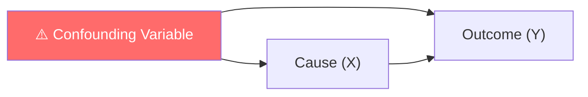
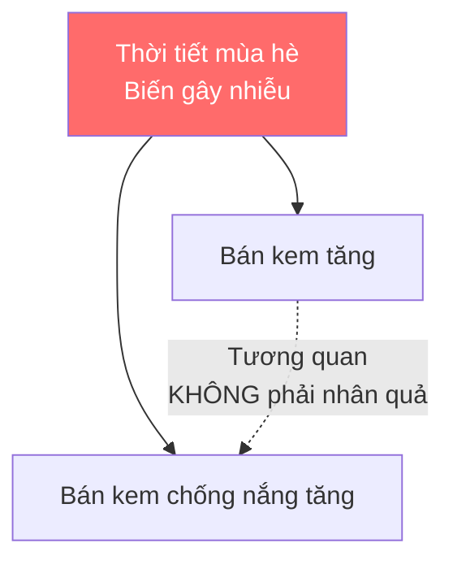

> Chào các em. Hôm nay chúng ta sẽ tiếp tục tìm hiểu về một phương pháp thu thập dữ liệu rất quan trọng trong thống kê kỹ thuật: **Observational Study (Nghiên cứu quan sát)**.
> 
> *(Lưu ý với các em: Những khái niệm cốt lõi và ví dụ về kỹ thuật trong bài giảng này được trích xuất từ giáo trình gốc. Tuy nhiên, các định nghĩa chuyên sâu về biến gây nhiễu, lỗi suy luận tương quan - nhân quả, cùng với các ví dụ thuộc lĩnh vực y tế và kinh doanh được thầy bổ sung từ kiến thức thống kê thực tế để giúp các em có cái nhìn đa chiều và dễ hiểu hơn).*

---

## 1. Observational Study là gì?

> [!info] Định nghĩa
> Trong một nghiên cứu quan sát (Observational Study), người kỹ sư chủ động quan sát quá trình hoặc một tổng thể, cố gắng **can thiệp ít nhất có thể (disturbing it as little as possible)** vào hệ thống và ghi nhận lại các đại lượng quan tâm.

---

## 2. Sự khác biệt giữa Quan sát và Can thiệp

Sự khác biệt cốt lõi nằm ở mức độ kiểm soát của các em đối với hệ thống:

| Tiêu chí | Quan sát (Observation) | Can thiệp (Intervention) |
| :--- | :--- | :--- |
| **Vai trò** | "Người quan sát" | "Đạo diễn" |
| **Hành động** | Hệ thống tự vận hành, chỉ ghi chép lại trạng thái. | Thực hiện những **thay đổi có chủ đích (deliberate changes)** lên các biến số có thể kiểm soát được. |
| **Phương pháp tương ứng** | Observational Study | Designed Experiment |

---

## 3. Ưu điểm của Observational Study

> [!success] **Ưu điểm chính**
> Nghiên cứu quan sát thường được tiến hành trong một khoảng thời gian tương đối ngắn. Các em có thể chủ động theo dõi và thu thập những biến số vốn không được lưu trữ thường xuyên trong quá khứ.

**Do đó, Observational Study giải quyết được bài toán "thiếu hụt dữ liệu quan trọng" của phương pháp Nghiên cứu hồi cứu (Retrospective Study).**

---

## 4. Nhược điểm của Observational Study

> [!warning] Hạn chế cốt lõi
> Dù các em có thu thập được nhiều dữ liệu hơn, phương pháp này vẫn **không giải quyết được vấn đề các biến số vận hành thường thay đổi cùng nhau**.

Khi các yếu tố dính liền vào nhau trong thực tế, các em sẽ gần như **không thể tách bạch** được xem biến nào mới thực sự là nguyên nhân cốt lõi gây ra kết quả.

---

## 5. Confounding Variables (Biến gây nhiễu) là gì?

> [!note] Định nghĩa
> Trong thống kê, biến gây nhiễu là một yếu tố ẩn, không được kiểm soát nhưng lại có tác động đồng thời lên cả nguyên nhân và kết quả, làm sai lệch góc nhìn của chúng ta.

> [!example] Ví dụ trong Kỹ thuật Hóa chất
> Trong quá trình vận hành một tháp chưng cất hóa chất, **nhiệt độ ngưng tụ (condensate temperature) có xu hướng tăng cùng lúc với nhiệt độ đun (reboil temperature)**.
> 
> Do hai biến này luôn *"đi cặp"* với nhau một cách tự nhiên, các em sẽ cực kỳ khó để biết được yếu tố nào mới là thứ thực sự làm thay đổi nồng độ acetone ở đầu ra.

---

## 6. Correlation (Tương quan) vs. Causation (Nhân quả)

| Khái niệm | Định nghĩa | Khả năng xác định |
| :--- | :--- | :--- |
| **Tương quan (Correlation)** | Hai sự việc xuất hiện cùng nhau. (Khi X tăng thì Y tăng, hoặc ngược lại). | Observational Study giúp chúng ta **nhìn thấy** được tương quan này. |
| **Nhân quả (Causation)** | Sự việc này **tạo ra** sự việc kia. | Để thiết lập được một mối quan hệ nhân-quả một cách chắc chắn khoa học, chúng ta **bắt buộc phải sử dụng Thực nghiệm được thiết kế (Designed Experiments)**. |

> [!danger] Nguyên tắc vàng
> **Correlation does not imply causation!**
> (Tương quan không đồng nghĩa với Nhân quả)

---

## 7. Các ví dụ thực tế

### Ví dụ 1: Kỹ thuật Hóa chất

> [!example] Bối cảnh
> Để nghiên cứu nồng độ acetone ở đầu ra của tháp chưng cất, thay vì dùng dữ liệu lịch sử bị thiếu sót, kỹ sư tự thiết kế một biểu mẫu và trực tiếp ghi lại các thông số nhiệt độ đun, nhiệt độ ngưng tụ và tốc độ hồi lưu ngay tại thời điểm máy đang chạy để kiểm tra.

> [!success] Đây là **Observational Study**

---

### Ví dụ 2: Kinh doanh (Ngoài giáo trình)

> [!example] Bối cảnh
> Một siêu thị quan sát thấy: Cứ tháng nào doanh số bán kem tăng vọt thì doanh số bán kem chống nắng cũng tăng cao.

| Sai lầm thường gặp | Sự thật |
| :--- | :--- |
| "Người ta ăn kem nên mới mua kem chống nắng." | **Correlation ≠ Causation** |
| | Nguyên nhân chung (biến gây nhiễu) chính là **"Thời tiết mùa hè"**. |

---

### Ví dụ 3: Y tế (Ngoài giáo trình)

> [!example] Bối cảnh
> Quan sát thấy những người thường xuyên mang bật lửa trong túi có tỷ lệ ung thư phổi cao hơn hẳn.

| Sai lầm thường gặp | Sự thật |
| :--- | :--- |
| "Bật lửa gây ung thư phổi." | **Correlation ≠ Causation** |
| | Biến gây nhiễu chính là **"hút thuốc lá"**. |

---

## 8. Lỗi suy luận phổ biến

> [!danger] Lỗi kinh điển của sinh viên và kỹ sư mới ra trường
> **Nhầm lẫn giữa Tương quan và Nhân quả.**

Khi dùng Observational Study, các em thấy hai biến A và B cùng biến thiên, và vội vàng đi đến kết luận *"A làm thay đổi B"* rồi thay đổi thiết kế của toàn bộ hệ thống.

Đó là một sự can thiệp thái quá và **thiếu cơ sở thống kê**.

---

## 9. TÓM TẮT

| Khía cạnh | Nội dung |
| :--- | :--- |
| **Định nghĩa** | Chủ động quan sát và ghi nhận dữ liệu từ hệ thống trong hiện tại với sự can thiệp tối thiểu. |
| **Ưu điểm** | Lấy được dữ liệu của các biến bị thiếu trong quá khứ. |
| **Nhược điểm** | Không giải quyết được hiện tượng **Confounding** (các biến thay đổi cùng nhau). |
| **Khả năng kết luận** | Chỉ chỉ ra **Tương quan (Correlation)**. |
| **Không thể** | Dùng để kết luận **Nhân quả (Causation)**. |

---

## 10. 5 TÌNH HUỐNG PHÂN TÍCH

### Tình huống 1: Kỹ thuật Phần mềm

> [!example] Bối cảnh
> Đội ngũ QA quan sát và ghi nhận số giờ code của từng lập trình viên so với số lượng bug sinh ra. Dữ liệu cho thấy ai code nhiều giờ hơn thì sinh ra số lượng bug lớn hơn. Sếp vội vàng ra quy định: *"Cấm code quá 4 tiếng/ngày để giảm bug"*.

> [!question] Yêu cầu phân tích
> Đây là lỗi suy luận gì? Theo em, biến gây nhiễu (confounding variable) dẫn đến mối tương quan này có thể là gì (ví dụ: độ khó của dự án)?

> [!faq]- 💡 Gợi ý
> 
> - Hãy xem xét mối quan hệ giữa **số giờ code** và **độ phức tạp của dự án**.
> - Dự án phức tạp thường cần nhiều giờ code hơn và cũng tiềm ẩn nhiều bug hơn.
> - Sếp đã nhầm lẫn giữa tương quan và nhân quả.

> [!faq]- 📌 Đáp án
> 
> - **Lỗi suy luận:** Nhầm lẫn giữa Tương quan và Nhân quả (Correlation ≠ Causation).
> - **Biến gây nhiễu có thể là:** **Độ phức tạp của dự án**.
>   - Dự án càng phức tạp → đòi hỏi càng nhiều giờ code → càng nhiều bug.
>   - Việc cấm code quá 4 tiếng/ngày sẽ không giải quyết được vấn đề mà còn có thể làm chậm tiến độ dự án.
> - **Giải pháp đúng:** Cần phân tích sâu hơn, có thể thực hiện Designed Experiment để kiểm tra các yếu tố khác như quy trình code review, chất lượng requirement, v.v.

---

### Tình huống 2: Kỹ thuật Sản xuất

> [!example] Bối cảnh
> Trong một nhà máy đúc nhôm, một kỹ sư thực hiện nghiên cứu quan sát và thấy cứ hôm nào áp suất máy ép ngẫu nhiên tăng cao thì tỷ lệ phế phẩm giảm. Anh ta báo cáo khẳng định: *"Áp suất cao làm giảm phế phẩm"*.

> [!question] Yêu cầu phân tích
> Dựa vào sự khác biệt giữa quan sát và can thiệp, báo cáo này thiếu cơ sở khoa học ở đâu? Anh ta cần thực hiện phương pháp nào tiếp theo để thực sự chứng minh được quan hệ nhân quả?

> [!faq]- 💡 Gợi ý
> 
> - Anh ta mới chỉ **quan sát** hiện tượng khi áp suất tự nhiên tăng cao.
> - Anh ta chưa **chủ động thay đổi** áp suất để kiểm tra.
> - Cần phân biệt giữa "áp suất cao đi kèm với ít phế phẩm" và "áp suất cao tạo ra ít phế phẩm".

> [!faq]- 📌 Đáp án
> 
> - **Thiếu cơ sở khoa học:** Báo cáo thiếu cơ sở vì anh ta mới chỉ **quan sát** chứ chưa **can thiệp**. 
> - **Lý do:** Trong nghiên cứu quan sát, có thể có biến gây nhiễu. Ví dụ: Những hôm áp suất cao thường là những hôm máy móc vận hành ổn định, nhiệt độ nguyên liệu tốt hơn, công nhân lành nghề hơn, v.v. Chính các yếu tố này mới làm giảm phế phẩm, chứ không phải áp suất.
> - **Phương pháp tiếp theo:** Anh ta cần thực hiện **Designed Experiment**:
>   - Chủ động cài đặt áp suất ở các mức khác nhau (thấp, trung bình, cao).
>   - Giữ các yếu tố khác ổn định.
>   - Đo tỷ lệ phế phẩm tương ứng.
> - Chỉ khi đó mới có thể khẳng định được mối quan hệ nhân quả.

---

### Tình huống 3: Y tế/Sức khỏe

> [!example] Bối cảnh
> Một bệnh viện theo dõi bệnh nhân và thấy những người hay tập thể dục có nhịp tim ổn định hơn những người không tập. Họ khẳng định tập thể dục trực tiếp làm ổn định nhịp tim.

> [!question] Yêu cầu phân tích
> Liệu có biến gây nhiễu nào về lối sống (như chế độ ăn uống, không hút thuốc, ít uống rượu) đang tạo ra sự khác biệt này không? Làm sao để chứng minh?

> [!faq]- 💡 Gợi ý
> 
> - Những người tập thể dục thường có **lối sống lành mạnh tổng thể**.
> - Họ có thể ăn uống điều độ, ít hút thuốc, ít uống rượu.
> - Cần tách biệt ảnh hưởng của tập thể dục khỏi các yếu tố lối sống khác.

> [!faq]- 📌 Đáp án
> 
> - **Biến gây nhiễu:** Những người tập thể dục thường có **lối sống lành mạnh tổng thể**, bao gồm:
>   - Chế độ ăn uống khoa học
>   - Không hút thuốc
>   - Hạn chế rượu bia
>   - Quản lý stress tốt hơn
> - Tất cả các yếu tố này đều có thể ảnh hưởng đến nhịp tim.
> - **Cách chứng minh:** Thực hiện một **Designed Experiment**:
>   - Chia bệnh nhân thành 2 nhóm ngẫu nhiên.
>   - Nhóm 1: Tập thể dục theo chương trình.
>   - Nhóm 2: Không tập (hoặc tập giả).
>   - Giữ các yếu tố khác (chế độ ăn, thuốc men) giống nhau giữa 2 nhóm.
>   - So sánh nhịp tim sau một thời gian.

---

### Tình huống 4: Kinh doanh/Hệ thống

> [!example] Bối cảnh
> Một trang thương mại điện tử quan sát thấy cứ khi nào khách hàng truy cập bằng điện thoại di động thì Tỷ lệ bỏ giỏ hàng (Abandonment Rate) lại cao hơn so với khi dùng máy tính (PC). Giám đốc marketing kết luận *"Người dùng di động không có ý định mua hàng thực sự, không cần ưu tiên thiết kế cho mobile"*.

> [!question] Yêu cầu phân tích
> Chỉ ra lỗi nhầm lẫn Tương quan và Nhân quả. Hãy liệt kê các yếu tố gây nhiễu có thể xảy ra (ví dụ: giao diện mobile tải chậm, nút bấm bị lỗi) và đề xuất cách giải quyết.

> [!faq]- 💡 Gợi ý
> 
> - Giám đốc đã nhầm lẫn: tỷ lệ bỏ giỏ hàng cao ≠ người dùng không muốn mua.
> - Nguyên nhân có thể đến từ trải nghiệm người dùng trên mobile.
> - Hãy nghĩ về các yếu tố kỹ thuật ảnh hưởng đến quá trình thanh toán trên di động.

> [!faq]- 📌 Đáp án
> 
> - **Lỗi suy luận:** Nhầm lẫn Tương quan và Nhân quả. Việc người dùng mobile bỏ giỏ hàng nhiều hơn không có nghĩa là họ *"không có ý định mua hàng"*.
> - **Các yếu tố gây nhiễu có thể có:**
>   - **Giao diện di động tải chậm** (do kết nối mạng hoặc tối ưu kém).
>   - **Nút bấm thanh toán bị lỗi hoặc quá nhỏ** trên màn hình cảm ứng.
>   - **Form nhập thông tin dài dòng**, khó thao tác trên di động.
>   - **Phương thức thanh toán không hỗ trợ di động**.
>   - **Khách hàng đang di chuyển** nên bị gián đoạn.
> - **Giải pháp:**
>   - Đầu tiên, cần cải thiện trải nghiệm người dùng trên mobile.
>   - Sau đó, thực hiện **Designed Experiment**: Cải thiện giao diện mobile (tốc độ, UI, UX) và đo lại tỷ lệ bỏ giỏ hàng để kiểm tra xem nguyên nhân có đến từ yếu tố kỹ thuật không.

---

### Tình huống 5: Kỹ thuật Điện tử

> [!example] Bối cảnh
> Khi đo cường độ dòng điện trong một mạch điện, kỹ sư phát hiện cứ lúc nào nhiệt độ phòng xưởng tăng, điện trở đo được cũng tăng theo.

> [!question] Yêu cầu phân tích
> Người kỹ sư này đang thực hiện Observational Study hay Designed Experiment? Tại sao? Dữ liệu này có đủ để viết lại công thức định luật vật lý không?

> [!faq]- 💡 Gợi ý
> 
> - Kỹ sư đang làm gì với nhiệt độ phòng?
> - Anh ta có đang thay đổi nhiệt độ hay chỉ quan sát?
> - Định luật vật lý yêu cầu bằng chứng nhân quả, không chỉ tương quan.

> [!faq]- 📌 Đáp án
> 
> - **Loại nghiên cứu:** Đây là **Observational Study**.
> - **Giải thích:** Kỹ sư đang chỉ **quan sát** và ghi nhận mối quan hệ giữa nhiệt độ phòng (thay đổi tự nhiên) và điện trở đo được. Anh ta **không chủ động thay đổi** nhiệt độ phòng để kiểm tra ảnh hưởng của nó lên điện trở.
> - **Có đủ để viết lại định luật vật lý không?** **Không.**
>   - Dữ liệu này chỉ cho thấy **tương quan**, không phải **nhân quả**.
>   - Điện trở tăng có thể do nhiều nguyên nhân khác đi kèm với nhiệt độ tăng (ví dụ: độ ẩm, tuổi thọ linh kiện).
>   - Muốn viết lại công thức vật lý, cần phải **Designed Experiment**: chủ động thay đổi nhiệt độ trong điều kiện các yếu tố khác được kiểm soát, đo điện trở và kiểm tra mối quan hệ.

---

> [!tip] Lời kết
> Hãy luôn nhớ: **Quan sát giúp em đặt ra câu hỏi, nhưng chỉ có Thực nghiệm mới giúp em trả lời câu hỏi đó một cách khoa học!**
> 
> Trong các tình huống trên, các em thấy rằng Observational Study rất hữu ích để phát hiện ra các mối quan hệ tiềm năng, nhưng luôn cần được xác nhận bằng Designed Experiment trước khi đưa ra quyết định thay đổi hệ thống.
