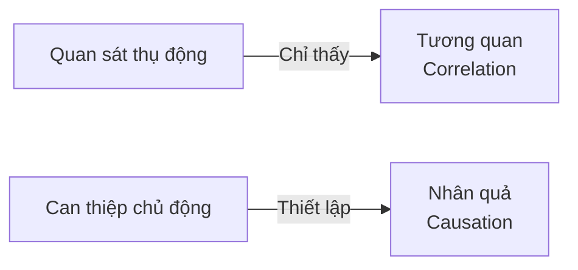
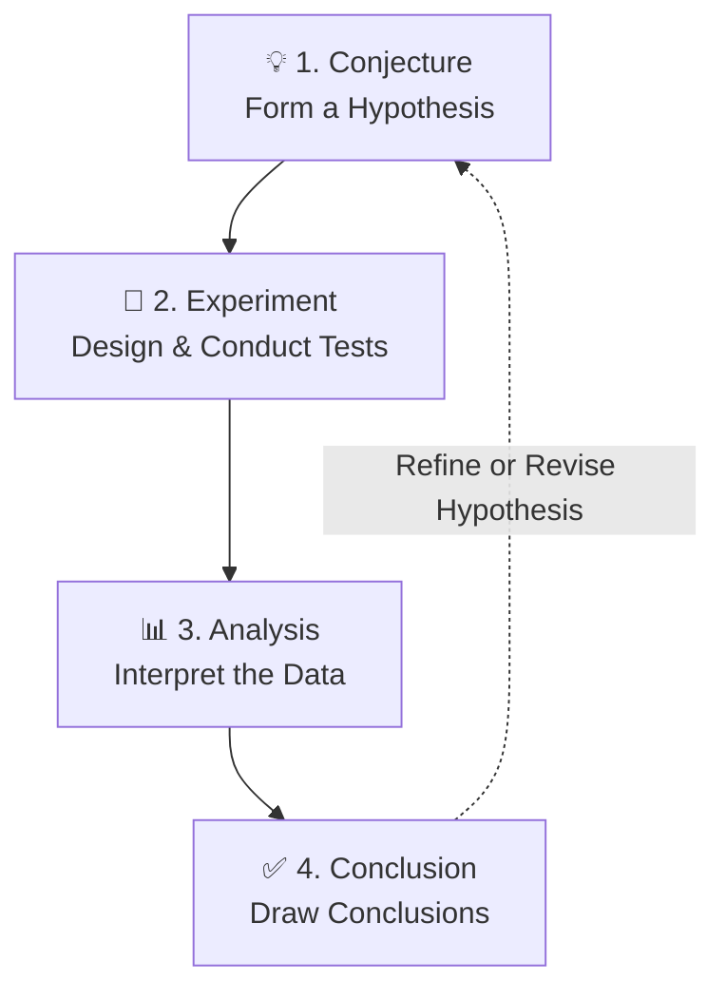

# Designed Experiments (Thực nghiệm được thiết kế)

> Chào các em. Trong các bài học trước, chúng ta đã thảo luận về Dữ liệu lịch sử (Retrospective Study) và Nghiên cứu quan sát (Observational Study). Tuy nhiên, để thực sự chứng minh được một yếu tố nào đó là *nguyên nhân* dẫn đến *kết quả*, chúng ta phải bước lên cấp độ cao nhất của phương pháp thu thập dữ liệu: **Thực nghiệm được thiết kế (Designed Experiments)**.
>
> Bài giảng hôm nay sẽ đi sâu vào cách một kỹ sư thực sự làm chủ hệ thống của mình.

---

## 1. Designed Experiment là gì?

> [!info] Định nghĩa
> **Designed Experiment (Thực nghiệm được thiết kế)** là một phương pháp thu thập dữ liệu trong đó người kỹ sư tạo ra những **thay đổi có chủ đích (deliberate or purposeful changes)** lên các biến đầu vào (biến có thể kiểm soát) của một hệ thống hoặc quy trình, sau đó quan sát dữ liệu đầu ra để đưa ra suy diễn xem yếu tố nào thực sự tạo ra sự thay đổi đó.

---

## 2. Tại sao phải chủ động can thiệp vào hệ thống?

> [!warning] Vấn đề của Observational Study
> Trong nghiên cứu quan sát thụ động, chúng ta thường bị mắc kẹt với hiện tượng các biến *"đi cặp"* với nhau (Confounding Variables), dẫn đến việc chỉ thấy được Tương quan (Correlation) chứ không thấy được Nhân quả (Causation).

> [!success] Giải pháp
> Trong khoa học và kỹ thuật, các em thường đối mặt với những hệ thống không có mô hình lý thuyết hoàn hảo. Việc thiết kế thực nghiệm đúng cách và chủ động thay đổi thông số là cách duy nhất để thiết lập **mối quan hệ nhân quả (cause-and-effect relationships)** một cách chắc chắn.

---

## 3-9. Các Thuật Ngữ Cốt Lõi Trong Thiết Kế Thí Nghiệm

Để thiết kế một thí nghiệm, các em cần nắm vững bảng từ vựng sau:

| Thuật ngữ | Định nghĩa | Ví dụ |
| :--- | :--- | :--- |
| **Factors (Yếu tố)** | Các biến đầu vào mà các em có thể chủ động kiểm soát và thay đổi trong thí nghiệm. | Nhiệt độ lò nung, áp suất, độ dày thành ống. |
| **Responses (Biến đáp ứng)** | Dữ liệu đầu ra của hệ thống mà các em đo đạc và muốn tối ưu hóa. | Lực kéo đứt, nồng độ tạp chất, thời gian phản hồi. |
| **Treatments (Nghiệm thức)** | Các mức (levels) thiết lập cụ thể của một Factor, hoặc một tổ hợp các mức của nhiều Factors. | Factor là "Nhiệt độ", Treatments sẽ là $155^{\circ}F$ và $165^{\circ}F$. |
| **Experimental Units (Đơn vị thí nghiệm)** | Môi trường, vật thể, hoặc đối tượng độc lập mà một Treatment được áp dụng lên. | Một dầm thép cụ thể để đo lực cắt, một tấm wafer silicon để phủ hóa chất. |
| **Randomization (Ngẫu nhiên hóa)** | Việc phân bổ ngẫu nhiên các Treatments vào các Experimental Units, cũng như thực hiện các lần chạy (runs) theo thứ tự ngẫu nhiên. | Chọn ngẫu nhiên tấm wafer nào sẽ được phủ hóa chất A hay hóa chất B. |
| **Replication (Sự lặp lại)** | Thực hiện lại một Treatment nhiều lần trên các Đơn vị thí nghiệm khác nhau. | Thử nghiệm cùng một cài đặt nhiệt độ trên 5 mẫu thép khác nhau. |
| **Control Group (Nhóm đối chứng)** | Một nhóm Đơn vị thí nghiệm không chịu sự can thiệp (hoặc dùng giả dược) để làm cơ sở gốc so sánh. | Nhóm bệnh nhân không tiêm vắc-xin. |

### Tầm quan trọng của Randomization

> [!important] **Randomization (Ngẫu nhiên hóa) là "tấm khiên" bảo vệ thí nghiệm.**
> 
> Việc này giúp:
> - Triệt tiêu và cân bằng ảnh hưởng của các **biến nhiễu (nuisance variables)** không thể kiểm soát (sự nóng lên của máy móc, thay đổi thời tiết, tay nghề công nhân).
> - Đảm bảo tính khách quan của kết quả.

### Tầm quan trọng của Replication

> [!important] **Replication (Sự lặp lại)** giúp chúng ta:
> - Ước lượng được sai số ngẫu nhiên ($\epsilon$).
> - Khẳng định sự khác biệt là do Treatment hay do may rủi.
> - Tăng độ tin cậy của kết luận.

---

## 10. Ví dụ minh họa thực tế

### Ví dụ 1: Kiểm thử phần mềm

> [!example] Bối cảnh
> Kiểm tra hiệu năng của thuật toán truy vấn mới so với thuật toán cũ.

| Thành phần | Mô tả |
| :--- | :--- |
| **Factor** | Thuật toán truy vấn (Cũ vs. Mới) |
| **Treatments** | Thuật toán cũ, Thuật toán mới |
| **Experimental Unit** | 10,000 user requests |
| **Randomization** | Đẩy ngẫu nhiên mỗi request vào thuật toán Cũ hoặc Mới |
| **Response** | Thời gian tải trang (milliseconds) |

---

### Ví dụ 2: Tối ưu quy trình sản xuất (Hóa học/Vật liệu)

> [!example] Bối cảnh
> Tối ưu hóa năng suất (Yield) của một lò phản ứng.

| Thành phần | Mô tả |
| :--- | :--- |
| **Problem** | Tối ưu hóa năng suất (Yield) của lò phản ứng |
| **Factors** | Thời gian phản ứng và Nhiệt độ phản ứng |
| **Treatments** | Các tổ hợp mức như ($145^{\circ}F$ trong 1.2 giờ), ($165^{\circ}F$ trong 2.2 giờ) |
| **Response** | Phần trăm thành phẩm đạt yêu cầu |

---

### Ví dụ 3: Kiểm tra hiệu năng hệ thống (Mạng máy tính)

> [!example] Bối cảnh
> Kiểm tra ảnh hưởng của dung lượng RAM đến throughput của server.

| Thành phần | Mô tả |
| :--- | :--- |
| **Factors** | Cấu hình Server (4GB RAM vs. 8GB RAM) |
| **Control Group** | Nhóm Server giữ nguyên cấu hình cũ (4GB) |
| **Response** | Số lượng transaction xử lý được mỗi giây (Throughput) |

---

## 11. So sánh: Designed Experiment vs. Observational Study

| Tiêu chí | Observational Study | Designed Experiment |
| :--- | :--- | :--- |
| **Vai trò của kỹ sư** | "Người quan sát" | "Đạo diễn" |
| **Mức độ can thiệp** | Can thiệp tối thiểu | Chủ động thay đổi có kiểm soát |
| **Khả năng kết luận** | Chỉ thấy Tương quan (Correlation) | Thiết lập Nhân quả (Causation) |
| **Xử lý Confounding** | Không thể tách biệt | Có thể tách biệt nhờ Randomization |
| **Sai số ($\epsilon$)** | Khó ước lượng | Ước lượng được nhờ Replication |

> [!danger] **Lưu ý quan trọng**
> Observational Study: Kỹ sư chỉ đứng bên ngoài quan sát hệ thống đang chạy, cố gắng *"can thiệp ít nhất có thể"*.
> 
> Designed Experiment: Kỹ sư *"làm đạo diễn"*, chủ động thay đổi các thông số. Bằng cách áp dụng **Randomization** và **Replication**, kỹ sư chặn đứng các biến nhiễu và thiết lập quan hệ nhân quả rõ ràng.

---

## 12. Các bước thiết kế một thí nghiệm hoàn chỉnh

| Bước | Mô tả | Ví dụ |
| :--- | :--- | :--- |
| **1. Conjecture (Giả thuyết)** | Nêu rõ giả thuyết ban đầu tạo động lực cho thí nghiệm. | "Thêm phụ gia mới sẽ làm giảm thời gian khô của sơn." |
| **2. Experiment (Thiết kế & Thực thi)** | Chọn Factors, Treatments, Replication, Randomization. | Chọn nhiệt độ, thời gian, số lần lặp, thứ tự ngẫu nhiên. |
| **3. Analysis (Phân tích)** | Dùng t-test, ANOVA để phân tách sự khác biệt thực sự khỏi nhiễu. Kiểm tra Residuals. | So sánh giá trị p-value với mức ý nghĩa. |
| **4. Conclusion (Kết luận)** | Rút ra kết luận cho giả thuyết và đề xuất quyết định thực tế. | "Phụ gia mới có hiệu quả, nên áp dụng vào sản xuất." |

---

## 13. CHECKLIST THIẾT KẾ THÍ NGHIỆM

> [!faq]- 📋 Checklist trước khi chi tiền cho bất kỳ thí nghiệm nào

- [ ] Mình đã định nghĩa rõ **Response** cần đo đạc chưa? Nó là biến liên tục hay phân loại?
- [ ] Mình đã xác định tất cả **Factors** quan trọng và các mức (levels) cần thử chưa?
- [ ] Số lượng **Replicates** (Lặp lại) đã đủ để tìm ra sự khác biệt mong muốn chưa? (Tránh lãng phí tiền do lấy mẫu quá ít).
- [ ] Thứ tự chạy thí nghiệm đã được **Randomized** (Ngẫu nhiên) 100% chưa?
- [ ] Có **Biến nhiễu** nào lớn (ví dụ: tay nghề công nhân, vật liệu khác lô) cần dùng khối (Blocking) hoặc Nhóm đối chứng (Control Group) để khử đi không?

---

## 14. BÀI TẬP TÌNH HUỐNG

### Tình huống 1: Thermal Paste (Keo tản nhiệt CPU)

> [!example] Bối cảnh
> Bạn là kỹ sư cơ khí muốn kiểm tra xem loại keo tản nhiệt (Thermal paste) mới có giúp CPU giảm nhiệt độ tốt hơn loại cũ hay không.

> [!question] Yêu cầu
> a) Hãy định nghĩa: Factor, Treatments, Response, và Experimental Unit cho bài toán này.
> b) Việc bạn thoa keo loại cũ vào buổi sáng (lúc máy còn nguội) và thoa loại mới vào buổi chiều có vi phạm nguyên tắc thiết kế thí nghiệm nào không? Giải thích.

> [!faq]- 💡 Gợi ý
> 
> - Hãy xác định xem bạn muốn thay đổi yếu tố nào.
> - Bạn đo đại lượng nào để đánh giá hiệu quả?
> - Đối tượng nào chịu tác động của việc thoa keo?
> - Việc thay đổi thời gian trong ngày có thể ảnh hưởng đến kết quả như thế nào?

> [!faq]- 📌 Đáp án
> 
> **a) Định nghĩa các thành phần:**
> - **Factor:** Loại keo tản nhiệt (Keo cũ vs. Keo mới).
> - **Treatments:** Keo cũ, Keo mới.
> - **Response:** Nhiệt độ CPU đo được (°C) sau khi chạy một tác vụ chuẩn trong 30 phút.
> - **Experimental Unit:** Mỗi lần thí nghiệm trên một CPU (hoặc một máy tính).
> 
> **b) Lỗi thiết kế:**
> - Vi phạm nguyên tắc **Randomization**.
> - **Giải thích:**
>   - Nhiệt độ phòng thường khác nhau giữa buổi sáng và buổi chiều.
>   - Máy tính có thể đã nóng lên sau khi chạy các tác vụ khác.
>   - Nếu keo mới luôn được thử vào buổi chiều (nóng hơn), nhiệt độ đo được sẽ bị ảnh hưởng bởi biến nhiễu này.
> - **Giải pháp:** Cần Randomization: thứ tự thoa keo cũ/mới phải được ngẫu nhiên hóa và cân bằng giữa các buổi (sáng/chiều) để loại bỏ ảnh hưởng của nhiệt độ phòng.

---

### Tình huống 2: So sánh hiệu năng Database

> [!example] Bối cảnh
> Sếp yêu cầu bạn so sánh tốc độ của 3 loại cơ sở dữ liệu (MySQL, PostgreSQL, MongoDB). Bạn dùng 10 câu truy vấn cực khó cho MySQL, 10 câu tầm trung cho PostgreSQL, và 10 câu đơn giản cho MongoDB.

> [!question] Yêu cầu
> a) Bạn đã mắc phải lỗi gì liên quan đến *"Randomization"*?
> b) Nếu chạy ra kết quả MongoDB nhanh nhất, kết luận này có ý nghĩa Nhân quả không? Tại sao?

> [!faq]- 💡 Gợi ý
> 
> - Điều gì đang khác nhau giữa các Database ngoài phần mềm?
> - Các câu truy vấn có được kiểm soát giống nhau không?
> - Nếu MongoDB dùng câu truy vấn đơn giản nhất, liệu có công bằng khi so sánh?

> [!faq]- 📌 Đáp án
> 
> **a) Lỗi thiết kế:**
> - **Lỗi:** Không có **Randomization** và không kiểm soát **Factors** khác.
> - **Chi tiết:**
>   - Các database được thử trên các bộ câu truy vấn khác nhau về độ khó (không công bằng).
>   - Không có sự ngẫu nhiên hóa về loại truy vấn, dữ liệu đầu vào, hay điều kiện hệ thống.
>   - Đây không phải là một Designed Experiment mà là một quan sát thiên vị.
> 
> **b) Ý nghĩa Nhân quả:**
> - **Không có ý nghĩa Nhân quả.**
> - **Lý do:**
>   - Sự khác biệt về tốc độ có thể do:
>     - Độ phức tạp của truy vấn khác nhau.
>     - Cấu trúc dữ liệu/table khác nhau.
>     - Dung lượng dữ liệu khác nhau.
>     - Tài nguyên hệ thống (CPU, RAM, disk I/O) khác nhau.
>   - Vì các yếu tố khác không được kiểm soát và ngẫu nhiên hóa, không thể kết luận rằng database nào *gây ra* tốc độ nhanh hơn.
> - **Giải pháp đúng:** Thiết kế một Designed Experiment:
>   - Dùng cùng một bộ truy vấn cho cả 3 database.
>   - Dùng cùng một dữ liệu/dung lượng.
>   - Chạy trên cùng một máy chủ, cùng điều kiện.
>   - Randomize thứ tự chạy các database để loại bỏ ảnh hưởng của việc cache hay máy nóng lên.
>   - Lặp lại nhiều lần (Replication) để có kết luận thống kê.

---

> [!tip] Lời kết
> Thiết kế thí nghiệm là kỹ năng quan trọng nhất giúp kỹ sư chuyển từ **"Tôi nghĩ..."** sang **"Tôi biết..."**.
> 
> Hãy luôn nhớ: **Randomization, Replication, và Control Group** là ba trụ cột của mọi thí nghiệm khoa học đáng tin cậy!
