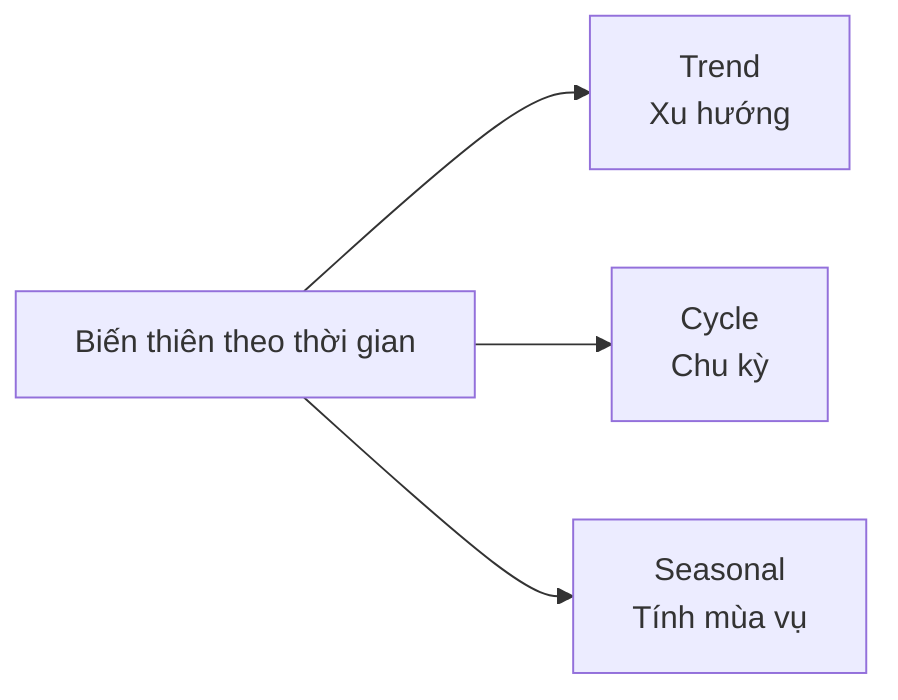
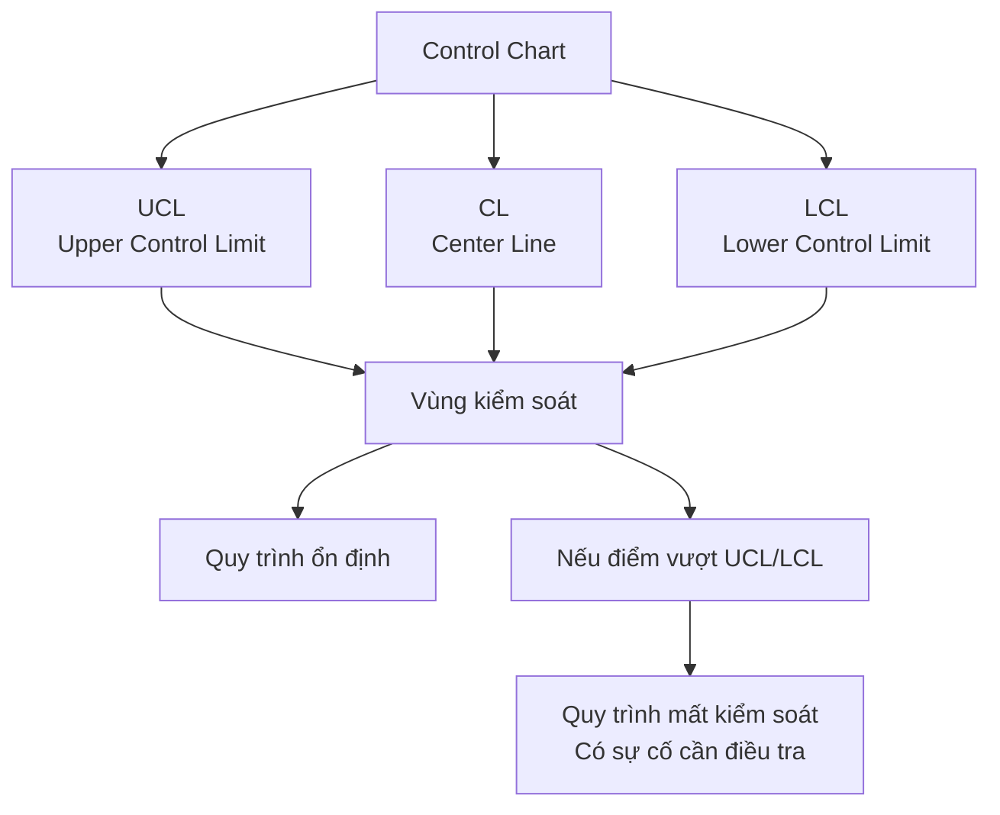

# Theo dõi Quy trình Theo Thời gian
> Chào các em. Trong bài học trước, chúng ta đã tìm hiểu cách thu thập dữ liệu bằng các phương pháp như Nghiên cứu quan sát hay Thực nghiệm được thiết kế. Tuy nhiên, có một chiều kích vĩ đại mà kỹ sư không bao giờ được phép bỏ qua: **Thời gian**.
>
> Hôm nay, thầy sẽ hướng dẫn các em một chủ đề cực kỳ quan trọng trong kỹ thuật: **"Observing Processes Over Time" (Theo dõi Quy trình Theo Thời gian)**.

---

## 1. Tại sao cần theo dõi quy trình theo thời gian?

> [!danger] **Dữ liệu tĩnh che giấu sự thật**
> Bỏ qua trục thời gian sẽ che lấp đi các vấn đề vận hành thực sự của hệ thống.

**Trực giác:** Hãy tưởng tượng em đang xem một bức ảnh chụp 100 chiếc xe trên đường cao tốc. Em chỉ thấy chúng đang đứng yên, nhưng em không thể biết xe nào đang tăng tốc, xe nào đang phanh gấp. Dữ liệu tĩnh cũng vậy, biểu đồ chấm (dot diagram) có thể cho ta thấy sự phân tán (variability) của dữ liệu, nhưng nó gộp chung mọi thứ lại và *"nén"* mất chiều thời gian.

**Chuyên môn:** Trong thực tế, dữ liệu thường được thu thập theo trình tự thời gian. Nếu chỉ gộp dữ liệu lại, chúng ta không thể biết được hiện tượng nào đã thực sự tác động lên hệ thống. Việc vẽ dữ liệu theo trục thời gian giúp các hiện tượng tiềm ẩn trở nên rõ ràng hơn, và quan trọng nhất là giúp kỹ sư đánh giá được **tính ổn định (stability)** của quy trình.

> [!warning] Hậu quả của việc không theo dõi thời gian
> Việc không theo dõi thời gian mà cứ can thiệp bừa bãi vào hệ thống dựa trên các nhiễu ngẫu nhiên sẽ dẫn đến hiện tượng **"overcontrol" (can thiệp thái quá)**, làm cho sự biến thiên của quy trình càng trở nên tồi tệ hơn.

---

## 2. Process Monitoring (Giám sát quy trình) & 3. Time Series Data (Dữ liệu chuỗi thời gian)

| Thuật ngữ | Định nghĩa | Ví dụ |
| :--- | :--- | :--- |
| **Time Series Data** | Tập hợp các dữ liệu trong đó các quan sát được ghi lại theo đúng thứ tự thời gian mà chúng xảy ra. | Nồng độ acetone đo mỗi giờ trong 3 ngày. |
| **Process Monitoring** | Việc sử dụng biểu đồ chuỗi thời gian (Time series plot) – với trục tung là giá trị đo được và trục hoành là thời gian (phút, ngày, năm...) – để theo dõi hệ thống. | Vẽ biểu đồ nhiệt độ lò nung theo thời gian để phát hiện sự bất thường. |

> [!success] **Lợi ích của Time Series Plot**
> Khi vẽ dữ liệu dưới dạng này, chúng ta sẽ bắt đầu nhìn thấy những đặc điểm vĩ mô của dữ liệu mà nếu không vẽ theo thời gian, ta sẽ hoàn toàn bị mù tịt.

---

## 4-6. Phân rã sự biến thiên: Xu hướng, Chu kỳ và Tính mùa vụ

Khi giám sát một hệ thống, các em sẽ thường xuyên bắt gặp 3 *"bóng ma"* làm thay đổi dữ liệu theo thời gian:

### 4. Xu hướng (Trend)

> [!note] **Định nghĩa**
> **Trend** là sự chuyển động hướng lên hoặc hướng xuống của dữ liệu trong một khoảng thời gian dài.

| Ví dụ | Mô tả |
| :--- | :--- |
| **Kinh doanh** | Doanh số của một công ty liên tục tăng lên trong suốt 10 năm qua dù có sự dao động nhỏ giữa các năm. |
| **Kỹ thuật Cơ khí** | Mũi khoan của máy tiện bị mòn dần theo thời gian sẽ tạo ra một xu hướng tăng đều đặn trong sai số kích thước sản phẩm. |

### 5. Chu kỳ (Cycle)

> [!note] **Định nghĩa**
> **Cycle** là những dao động lặp đi lặp lại. Nó thể hiện qua các đợt tăng và giảm đan xen nhau tạo thành hình sóng.

| Ví dụ | Mô tả |
| :--- | :--- |
| **Kỹ thuật Cơ khí** | Dao động nhiệt độ của một động cơ làm việc theo chu kỳ: nóng lên khi máy chạy và nguội đi khi máy nghỉ. |

### 6. Seasonal Effects (Tính mùa vụ / Hiệu ứng theo mùa)

> [!note] **Định nghĩa**
> Đây là một dạng đặc biệt của chu kỳ, nơi sự biến thiên gắn liền với một thời điểm cụ thể trong năm, trong tháng, hoặc trong ngày.

| Ví dụ | Mô tả |
| :--- | :--- |
| **Kinh doanh** | Doanh số thường cao hơn ở quý 1 và quý 2, nhưng lại thấp đi vào quý 3 và quý 4 hàng năm. |
| **Sản xuất** | Số lượng phế phẩm có thể luôn tăng đột biến vào ca đêm do sự mệt mỏi của công nhân (hiệu ứng theo ca). |

---

## 7. Process Stability (Tính ổn định của quy trình)

> [!important] **Thế nào là một hệ thống ổn định?**
> Một hệ thống ổn định (Stable system) là hệ thống chỉ chứa những nhiễu ngẫu nhiên tự nhiên (chance causes / background noise) và **không bị tác động bởi các nguyên nhân bất thường (assignable causes)**.

### Biểu đồ kiểm soát (Control Chart)

| Thành phần | Ý nghĩa |
| :--- | :--- |
| **Center Line (CL)** | Đường trung tâm, giá trị trung bình của quy trình khi ổn định. |
| **Upper Control Limit (UCL)** | Giới hạn kiểm soát trên. |
| **Lower Control Limit (LCL)** | Giới hạn kiểm soát dưới. |

> [!note] **Nguyên tắc của Deming**
> Chỉ khi biểu đồ kiểm soát chứng minh được quy trình đang ổn định, chúng ta mới có thể dùng dữ liệu hiện tại để dự báo chính xác cho các sản phẩm trong tương lai (Analytic study). Nếu quy trình mất kiểm soát, mọi dự báo toán học đều vô nghĩa!

---

## 8. Ví dụ minh họa trực quan trong kỹ thuật

Để các em dễ hình dung, hãy xem xét 3 ví dụ mà kỹ sư thường gặp:

### Ví dụ 1: Theo dõi chất lượng sản phẩm

> [!example] **Bối cảnh**
> Một kỹ sư đo nồng độ acetone ở đầu ra của tháp chưng cất.

| Phương pháp | Kết quả | Nhận xét |
| :--- | :--- | :--- |
| **Biểu đồ chấm (Dot diagram)** | Thấy nồng độ phân tán rất rộng. | Không hiểu vì sao. |
| **Time series plot** | Phát hiện: trong 20 giờ đầu, nồng độ luôn cao (trên 85g/l), nhưng ngay sau giờ thứ 20, dữ liệu rớt xuống một *"bậc"* thấp hơn hẳn. | **Phát hiện sự cố!** |
| **Biểu đồ kiểm soát** | Chỉ ra rõ ràng có điểm vượt ra ngoài Giới hạn dưới (LCL). | Phát tín hiệu cảnh báo có sự cố rớt nồng độ (upset). |

> [!success] **Bài học**
> Điều này giúp kỹ sư tập trung đi tìm nguyên nhân xảy ra đúng vào lúc *"giờ thứ 20"*.

---

### Ví dụ 2: Theo dõi nhiệt độ máy móc

> [!example] **Bối cảnh**
> Theo dõi nhiệt độ của lò nung thiếc bán dẫn.

> [!warning] **Cảnh báo sớm**
> Nếu các em thấy một **Xu hướng (Trend)** nhiệt độ cứ nhích dần lên 0.5 độ C mỗi ngày, dù chưa chạm ngưỡng giới hạn (LCL/UCL), đó là một cảnh báo sớm rằng bộ phận tản nhiệt có thể đang bị nghẽn bụi và cần được bảo trì trước khi máy bốc cháy.

---

### Ví dụ 3: Theo dõi lỗi phần mềm

> [!example] **Bối cảnh**
> Nhóm của em theo dõi số lượng bug được phát hiện mỗi giờ trên một hệ thống server.

> [!note] **Phát hiện Seasonality**
> - Vào thời điểm cuối tuần, server báo rất ít bug.
> - Cứ đến 9h sáng Thứ Hai, lượng bug tăng vọt.
> - Đây chính là **Seasonal Effects (Tính mùa vụ)** do lượng người dùng đăng nhập đồng loạt (traffic spike) làm hệ thống quá tải.

---

## 9. TÓM TẮT KIẾN THỨC

| Khái niệm | Nội dung cốt lõi |
| :--- | :--- |
| **Dữ liệu tĩnh** | Che giấu sự thật, bỏ qua trục thời gian sẽ che lấp đi các vấn đề vận hành thực sự của hệ thống. |
| **Time Series Data** | Mở ra khả năng nhận diện các hình mẫu (patterns) như Trend, Cycle, Seasonal. |
| **Process Stability** | Để biết hệ thống là ổn định (chỉ có nhiễu ngẫu nhiên) hay mất kiểm soát (có sự cố), ta phải dùng biểu đồ có các giới hạn kiểm soát (Control Limits). |
| **Dự báo** | Chỉ quy trình ổn định mới có thể dự báo được. |

---

## 10. BÀI TẬP PHÂN TÍCH DỮ LIỆU THEO THỜI GIAN

### Tình huống

> [!example] **Bối cảnh**
> Các em là kỹ sư hệ thống của một công ty viễn thông. Các em ghi nhận *"Thời gian phản hồi"* (Response Time) tính bằng mili-giây (ms) của máy chủ khi nhận lệnh từ người dùng. Các em thu thập dữ liệu trong 30 ngày (mỗi ngày lấy trung bình 1 lần đo).

**Dữ liệu hiển thị như sau:**
- Từ ngày 1 đến ngày 20: Dữ liệu dao động ngẫu nhiên quanh mức 100ms.
- Từ ngày 21 đến ngày 30: Dữ liệu tiếp tục dao động, nhưng lại xoay quanh mức 150ms.

---

> [!question] **Câu hỏi 1**
> Theo các em, dữ liệu đang thể hiện một Xu hướng (Trend), Chu kỳ (Cycle) hay là một Sự dịch chuyển (Shift) đột ngột?

> [!faq]- 💡 Gợi ý
> 
> - Trend là sự thay đổi từ từ, dần dần.
> - Cycle là dao động lên xuống theo sóng.
> - Shift là sự thay đổi đột ngột từ mức này sang mức khác và giữ nguyên ở mức mới.

> [!faq]- 📌 Đáp án
> 
> - Dữ liệu đang thể hiện một **Sự dịch chuyển (Shift) đột ngột**.
> - **Giải thích:** Từ ngày 1-20, dữ liệu xoay quanh 100ms. Từ ngày 21-30, dữ liệu đột ngột chuyển sang xoay quanh 150ms và giữ nguyên ở mức đó. Đây không phải xu hướng (tăng dần) hay chu kỳ (lên xuống), mà là một sự thay đổi *"bậc thang"*.

---

> [!question] **Câu hỏi 2**
> Dựa vào nguyên tắc của Deming, nếu giám đốc yêu cầu em *"Dự báo thời gian phản hồi của ngày 31 dựa trên dữ liệu của toàn bộ 30 ngày qua"*, em có đồng ý làm không? Tại sao?

> [!faq]- 💡 Gợi ý
> 
> - Quy trình có đang ổn định không?
> - Deming nói gì về dự báo khi quy trình không ổn định?

> [!faq]- 📌 Đáp án
> 
> - **Không đồng ý.**
> - **Lý do:** Theo nguyên tắc của Deming, chỉ khi quy trình ổn định (stable) – tức chỉ chứa nhiễu ngẫu nhiên – thì mới có thể dùng dữ liệu quá khứ để dự báo tương lai.
> - **Trong trường hợp này:**
>   - Quy trình đã có một sự dịch chuyển đột ngột từ 100ms lên 150ms.
>   - Nếu lấy trung bình toàn bộ 30 ngày, ta sẽ được khoảng 125ms, nhưng con số này KHÔNG đại diện cho trạng thái thực tế của hệ thống.
>   - Ngày 31 có thể vẫn ở mức 150ms (nếu shift là vĩnh viễn) hoặc quay về 100ms (nếu shift chỉ là sự cố tạm thời).
>   - Không thể dự báo chính xác khi chưa xác định nguyên nhân của shift và chưa khôi phục tính ổn định của quy trình.

---

> [!question] **Câu hỏi 3**
> Nếu một lập trình viên non kinh nghiệm thấy thời gian phản hồi đang từ 100ms (ngày 15) nhảy lên 105ms (ngày 16) và anh ta lập tức thay đổi tham số RAM để *"kéo"* nó về lại 100ms. Theo bài học về *Thí nghiệm phễu của Deming*, hành động can thiệp này gọi là gì và hậu quả sẽ ra sao?

> [!faq]- 💡 Gợi ý
> 
> - Sự tăng từ 100 lên 105 có thể là nhiễu ngẫu nhiên hay là sự cố thực sự?
> - Deming gọi hành động can thiệp vào nhiễu ngẫu nhiên là gì?

> [!faq]- 📌 Đáp án
> 
> - **Tên gọi:** Hành động này được gọi là **Overcontrol (Tampering)** – can thiệp thái quá.
> - **Giải thích:**
>   - Sự tăng từ 100ms lên 105ms (chỉ +5ms) nằm trong phạm vi dao động ngẫu nhiên tự nhiên của hệ thống.
>   - Việc thay đổi tham số RAM khi chưa có bằng chứng về sự cố là một phản ứng thái quá với nhiễu ngẫu nhiên.
> - **Hậu quả:**
>   - Theo thí nghiệm phễu của Deming, hành động này làm **tăng biến thiên của hệ thống**.
>   - Việc liên tục điều chỉnh để *"đuổi theo"* các giá trị dao động sẽ khiến quy trình ngày càng mất ổn định.
>   - Các em nên tham khảo lại ví dụ về *"phễu và viên bi"*: càng cố điều chỉnh, viên bi càng rơi xa mục tiêu.
> - **Giải pháp đúng:** Cần xây dựng Control Chart, xác định UCL/LCL, và chỉ can thiệp khi có điểm dữ liệu vượt ra ngoài giới hạn kiểm soát (hoặc có patterns bất thường như 7 điểm liên tiếp cùng hướng).

---

> [!tip] Lời kết
> Hãy luôn nhớ rằng: **Thời gian là một chiều dữ liệu không thể thiếu.** Một quyết định kỹ thuật được đưa ra mà không xem xét đến chuỗi thời gian của dữ liệu cũng giống như một người lái xe chỉ nhìn vào kính chiếu hậu mà không nhìn đường phía trước!
