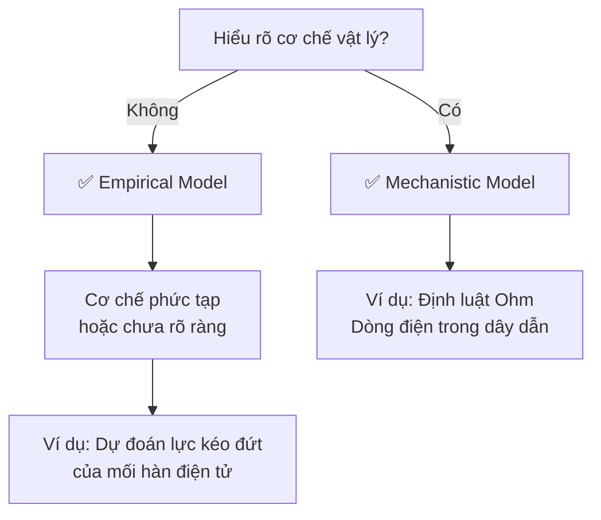
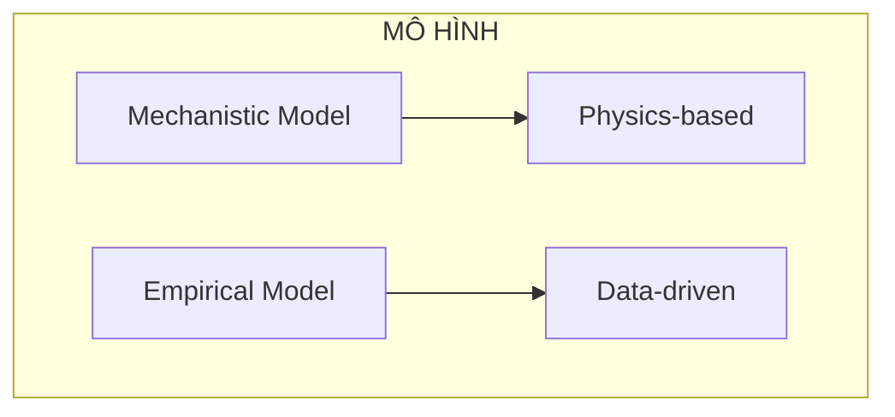

# Mô hình Cơ học và Mô hình Thực nghiệm)
> Chào các em. Trong thực tế kỹ thuật, chúng ta thường xuyên phải đối mặt với những bài toán thiết kế, tối ưu hóa hoặc dự báo. Để làm được điều này, chúng ta cần xây dựng các mô hình. Bài học hôm nay của chúng ta có chủ đề: **"Mechanistic and Empirical Models" (Mô hình cơ học và Mô hình thực nghiệm).**
>
> *Lưu ý cho các em: Bài giảng này dựa trên các nguyên lý cốt lõi từ giáo trình. Tuy nhiên, để đáp ứng yêu cầu của các em, thầy có bổ sung thêm các ví dụ về Định luật Newton, Machine Learning (Học máy), và phần so sánh (Physics-based vs. Data-driven). Đây là các kiến thức mở rộng bên ngoài tài liệu gốc nhằm giúp các em dễ hình dung hơn, các em có thể tìm hiểu thêm từ các nguồn tài liệu chuyên ngành khác nhé.*
>
> Chúng ta cùng bắt đầu!

---

## 1. Model (Mô hình) là gì?

> [!info] **Định nghĩa**
> Trong kỹ thuật, **Mô hình (Model)** đóng một vai trò cực kỳ quan trọng trong việc phân tích gần như mọi vấn đề. Về mặt trực giác, mô hình là một bản tóm tắt hoặc sự đại diện toán học của một hệ thống vật lý thực tế, giúp kỹ sư hiểu được mối quan hệ giữa các biến số và dự đoán cách hệ thống hoạt động.

---

## 2. Mechanistic Model (Mô hình Cơ học) là gì?

> [!note] **Định nghĩa**
> **Mechanistic Model** là loại mô hình được xây dựng dựa trên sự hiểu biết sâu sắc của chúng ta về **cơ chế vật lý cơ bản**, hoặc các nguyên lý cốt lõi, chi phối mối quan hệ giữa các biến số trong hệ thống. Nó đi từ lý thuyết gốc (first-principles).

> [!warning] **Lưu ý quan trọng**
> Tuy nhiên, trong thế giới thực, không có phép đo nào là hoàn hảo do các yếu tố môi trường (như dao động nhiệt độ, tạp chất) không được kiểm soát hoàn toàn. Do đó, một Mechanistic Model thực tế thường phải cộng thêm một sai số $\epsilon$ đại diện cho tất cả các nguồn biến thiên không được mô hình hóa.
>
> $$Y = f(X) + \epsilon$$

---

## 3. Empirical Model (Mô hình Thực nghiệm) là gì?

> [!note] **Định nghĩa**
> Đôi khi, kỹ sư phải làm việc với những hệ thống không có một cơ chế vật lý nào đơn giản hoặc được hiểu rõ tường tận. Trong trường hợp đó, chúng ta xây dựng một **Empirical Model (Mô hình Thực nghiệm)**.

> [!info] **Đặc điểm**
> Mô hình thực nghiệm là mô hình sử dụng kiến thức khoa học và kỹ thuật chung về hiện tượng, nhưng **không** được phát triển trực tiếp từ nền tảng lý thuyết vật lý gốc. Nó thường dùng dữ liệu quan sát được để xấp xỉ mối quan hệ giữa các biến, ví dụ như dùng khai triển chuỗi Taylor bậc một:
>
> $$Y = \beta_0 + \beta_1x_1 + \beta_2x_2 + ... + \epsilon$$

---

## 4. Ưu điểm và nhược điểm của từng loại

*(Phần này thầy mở rộng dựa trên nguyên lý cơ bản của hai mô hình).*

| Loại mô hình | Ưu điểm | Nhược điểm |
| :--- | :--- | :--- |
| **Mechanistic Model** | - Giải thích được **nguyên nhân gốc rễ** (tại sao hệ thống hoạt động như vậy). - Khả năng **ngoại suy** (áp dụng cho các điều kiện chưa từng thử nghiệm) rất tốt vì nó dựa trên định luật tự nhiên. | Rất khó và tốn thời gian để xây dựng nếu hệ thống quá phức tạp hoặc chưa được khoa học khám phá đầy đủ. |
| **Empirical Model** | - Dễ xây dựng hơn nhiều khi hệ thống quá phức tạp. - Chỉ cần có dữ liệu đầu vào - đầu ra là có thể dùng toán học (như phương pháp bình phương tối thiểu) để tìm ra các tham số $\beta$. | - Giống như một **"hộp đen" (black box)** xấp xỉ dữ liệu chứ không giải thích cơ chế vật lý. - Nếu áp dụng ra ngoài vùng dữ liệu đã thu thập (ngoại suy), kết quả có thể sai lệch hoàn toàn. |

---

## 5. Khi nào nên sử dụng mỗi loại?

> [!tip] **Nguyên tắc vàng**
> - Hãy dùng **Mechanistic Model** khi em hiểu rõ cơ chế vật lý của hiện tượng (ví dụ: dòng điện chạy trong dây dẫn đồng).
> - Hãy dùng **Empirical Model** khi cơ chế vật lý chưa rõ ràng hoặc không có phương trình lý thuyết nào dễ dàng áp dụng trực tiếp (ví dụ: dự đoán độ bền kéo đứt của mối hàn mạch điện tử dựa trên chiều dài dây và chiều cao khuôn).

---

## 6. Các ví dụ minh họa

### Ví dụ 1: Định luật Ohm (Mechanistic Model)

> [!example] **Mô tả**
> Cường độ dòng điện trong dây dẫn tỷ lệ thuận với điện áp và tỷ lệ nghịch với điện trở.
> 
> **Công thức lý thuyết:** $I = \frac{E}{R}$
> 
> **Trong thực tế đo đạc, mô hình sẽ là:**
> $$I = \frac{E}{R} + \epsilon$$
> 
> Trong đó $\epsilon$ bù đắp các nhiễu như nhiệt độ hay tạp chất trong dây.

---

### Ví dụ 2: Định luật Newton (Mechanistic Model - *Mở rộng*)

> [!example] **Mô tả**
> Lực tác dụng lên một vật bằng khối lượng nhân với gia tốc.
>
> **Công thức:** $F = ma$
>
> Chúng ta biết chính xác gia tốc và khối lượng tạo ra lực như thế nào dựa trên định luật vật lý.

---

### Ví dụ 3: Mô hình Hồi quy (Empirical Model)

> [!example] **Mô tả**
> Một ví dụ tiêu biểu của mô hình thực nghiệm là **Hồi quy (Regression Model)**.
>
> **Bối cảnh:** Khi sản xuất chất bán dẫn, không có định luật vật lý nào nối thẳng *"chiều dài dây"* và *"chiều cao khuôn"* với *"Lực kéo đứt"* của mối hàn.
>
> **Giải pháp:** Kỹ sư dùng dữ liệu thu thập để xây dựng phương trình:
>
> $$ \text{Lực kéo đứt} = 2.26 + 2.74(\text{chiều dài dây}) + 0.0125(\text{chiều cao khuôn}) $$

---

### Ví dụ 4: Machine Learning Models (Empirical Model - *Mở rộng*)

> [!example] **Mô tả**
> Các mô hình Trí tuệ nhân tạo (AI/ML) như Mạng nơ-ron (Neural Networks) hay Rừng ngẫu nhiên (Random Forest) hoàn toàn là Empirical.
>
> Chúng *"học"* mối quan hệ từ hàng triệu điểm dữ liệu mà không cần biết định luật vật lý nào đứng đằng sau hình ảnh hay ngôn ngữ đó.

---

## 7. So sánh Physics-based Models và Data-driven Models (*Mở rộng*)

Thuật ngữ trong thế giới công nghệ hiện đại tương đương hoàn toàn với bài học của chúng ta:

| Thuật ngữ hiện đại | Tương đương | Đặc điểm |
| :--- | :--- | :--- |
| **Physics-based Models** (Mô hình dựa trên Vật lý) | **Mechanistic Models** | Tuân thủ nghiêm ngặt các định luật bảo toàn (năng lượng, khối lượng, động lượng). |
| **Data-driven Models** (Mô hình dẫn dắt bởi Dữ liệu) | **Empirical Models** | Hoàn toàn đi lên từ dữ liệu thu thập được (Regression, Machine Learning). |

---

## 8. Vai trò của dữ liệu trong xây dựng mô hình

> [!important] **Cho dù là mô hình nào, dữ liệu cũng đóng vai trò quyết định!**

| Loại mô hình | Vai trò của Dữ liệu |
| :--- | :--- |
| **Mechanistic Model** | - Giúp chúng ta nhận ra rằng mô hình lý thuyết không hoàn hảo, luôn có sự biến thiên ($\epsilon$). - Giúp đánh giá xem nhiễu ($\epsilon$) có đủ nhỏ để mô hình có giá trị thực tiễn hay không. |
| **Empirical Model** | - Dữ liệu là **"nguồn sống"**. - Các tham số chưa biết (các hệ số $\beta$) bắt buộc phải được ước lượng từ dữ liệu mẫu thông qua các phương pháp toán học như phương pháp bình phương tối thiểu (method of least squares). - **Không có dữ liệu, không có mô hình thực nghiệm!** |

---

## 9. TỔNG KẾT BÀI HỌC

### Bảng so sánh: Mechanistic Model vs. Empirical Model

| Đặc điểm | Mechanistic Model (Mô hình Cơ học) | Empirical Model (Mô hình Thực nghiệm) |
| :--- | :--- | :--- |
| **Nền tảng** | Hiểu biết về cơ chế vật lý cơ bản (Lý thuyết) | Kiến thức kỹ thuật kết hợp xấp xỉ toán học |
| **Khả năng giải thích** | Rất cao (Giải thích được *tại sao*) | Thấp (Chủ yếu thấy được mối tương quan) |
| **Cách xây dựng** | Đi từ định luật tự nhiên, phương trình | Ước lượng thông số ($\beta$) từ dữ liệu thu thập |
| **Vai trò sai số ($\epsilon$)** | Mô tả các yếu tố nhiễu không kiểm soát được | Trám vào khoảng trống mà hàm xấp xỉ không đạt tới |
| **Ví dụ** | Định luật Ohm ($I = E/R + \epsilon$) | Mô hình hồi quy tuyến tính |
| **Tên gọi hiện đại** | Physics-based Model | Data-driven Model |

---

## 10. BÀI TẬP (Phân loại mô hình)

> [!question] **Yêu cầu**
> Các em hãy đọc các tình huống sau và phân loại xem chúng thuộc **Mechanistic Model** hay **Empirical Model** nhé!

---

### Tình huống 1: Cánh máy bay

> [!example] **Mô tả**
> Một kỹ sư hàng không thiết kế cánh máy bay dựa trên phương trình Navier-Stokes về động lực học chất lưu để tính toán lực nâng.

> [!faq]- 💡 Gợi ý
>
> - Phương trình Navier-Stokes có xuất phát từ các định luật vật lý cơ bản về chất lỏng không?
> - Kỹ sư có đang sử dụng dữ liệu thực nghiệm để xấp xỉ, hay đang giải phương trình lý thuyết?

> [!faq]- 📌 Đáp án
>
> **✅ Mechanistic Model**
>
> *Giải thích:* Phương trình Navier-Stokes được xây dựng trực tiếp từ các định luật bảo toàn (khối lượng, động lượng, năng lượng) của cơ học chất lưu. Đây là một mô hình từ *first-principles* (nguyên lý gốc), không dựa trên dữ liệu thực nghiệm.

---

### Tình huống 2: Trọng lượng phân tử của polymer

> [!example] **Mô tả**
> Một kỹ sư hóa học muốn dự đoán trọng lượng phân tử trung bình của polymer. Anh ta chạy thử 30 lần nghiệm với các nhiệt độ, lượng chất xúc tác khác nhau và dùng phần mềm vẽ ra một phương trình tuyến tính kết nối chúng.

> [!faq]- 💡 Gợi ý
>
> - Anh ta có đang dùng một định luật vật lý nào để suy ra phương trình không?
> - Hay đang dùng dữ liệu để tìm ra mối quan hệ?

> [!faq]- 📌 Đáp án
>
> **✅ Empirical Model**
>
> *Giải thích:* Kỹ sư không sử dụng một lý thuyết vật lý nào về polymer để suy ra phương trình. Thay vào đó, anh ta thu thập dữ liệu thực nghiệm từ 30 lần chạy thử và dùng toán học (hồi quy) để xấp xỉ mối quan hệ. Đây là một mô hình thực nghiệm điển hình.

---

### Tình huống 3: Độ võng dầm thép

> [!example] **Mô tả**
> Kỹ sư xây dựng tính toán độ võng của một dầm thép khi chịu tải trọng dựa trên mô đun đàn hồi (Young's modulus) và mô men quán tính của tiết diện dầm.

> [!faq]- 💡 Gợi ý
>
> - Công thức độ võng dầm có xuất phát từ cơ học vật rắn biến dạng không?
> - Có đang dùng các định luật vật lý về ứng suất - biến dạng?

> [!faq]- 📌 Đáp án
>
> **✅ Mechanistic Model**
>
> *Giải thích:* Công thức độ võng dầm được suy ra trực tiếp từ lý thuyết đàn hồi (sử dụng mô đun đàn hồi Young, mô men quán tính) – đây là các nguyên lý vật lý cơ bản của cơ học kết cấu.

---

### Tình huống 4: Hệ thống AI ngân hàng

> [!example] **Mô tả**
> Một hệ thống AI của ngân hàng thu thập hàng ngàn giao dịch gian lận và bình thường trong quá khứ để đưa ra hệ thống chấm điểm rủi ro cho các giao dịch mới.

> [!faq]- 💡 Gợi ý
>
> - Có một định luật vật lý hay toán học nào định nghĩa giao dịch gian lận không?
> - Hệ thống đang dùng dữ liệu gì để *"học"*?

> [!faq]- 📌 Đáp án
>
> **✅ Empirical Model**
>
> *Giải thích:* AI ngân hàng là một mô hình Machine Learning hoàn toàn dựa trên dữ liệu (data-driven). Nó *"học"* từ các giao dịch trong quá khứ mà không cần biết lý thuyết kinh tế hay tâm lý học nào đằng sau. Không có *"định luật vật lý của giao dịch gian lận"* nào cả.

---

### Tình huống 5: Thời gian phản hồi máy chủ

> [!example] **Mô tả**
> Kỹ sư phần mềm tính toán thời gian phản hồi máy chủ bằng cách thu thập log file trong 1 tháng và lập phương trình:
>
> $$Thời\_gian\_phản\_hồi = 10ms + 0.5 \times (Số\_lượng\_người\_truy\_cập)$$

> [!faq]- 💡 Gợi ý
>
> - Phương trình này đến từ đâu? Có phải từ định luật vật lý nào không?
> - Làm sao có được các con số 10ms và 0.5?

> [!faq]- 📌 Đáp án
>
> **✅ Empirical Model**
>
> *Giải thích:* Phương trình này được xây dựng từ dữ liệu log file thực tế thông qua hồi quy. Các hệ số (10ms và 0.5) được ước lượng từ dữ liệu, không xuất phát từ một lý thuyết vật lý hay khoa học máy tính nào về thời gian phản hồi. Đây là một mô hình thực nghiệm điển hình.

---

> [!tip] **Lời kết**
> Hiểu được sự khác biệt giữa Mechanistic và Empirical Models sẽ giúp các em chọn được cách tiếp cận đúng đắn cho từng bài toán kỹ thuật. Hãy nhớ:
> - **Mechanistic:** *"Tôi hiểu tại sao nó hoạt động"* → Định luật vật lý.
> - **Empirical:** *"Tôi thấy nó hoạt động như thế nào"* → Dữ liệu + Hồi quy.

