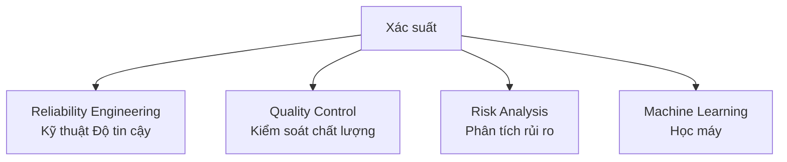
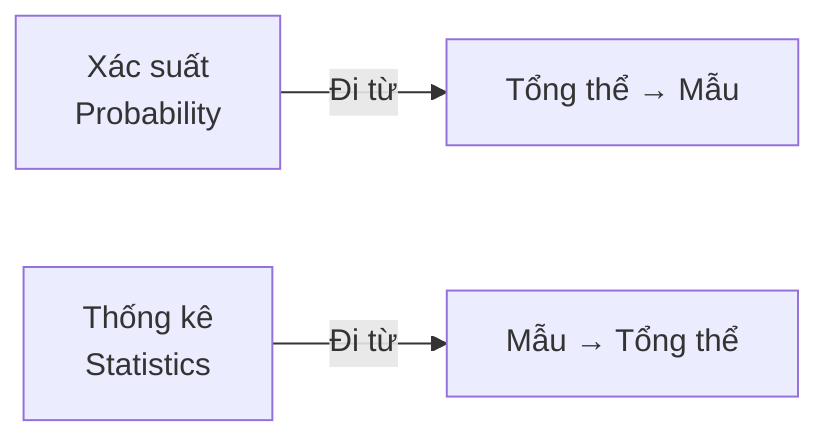
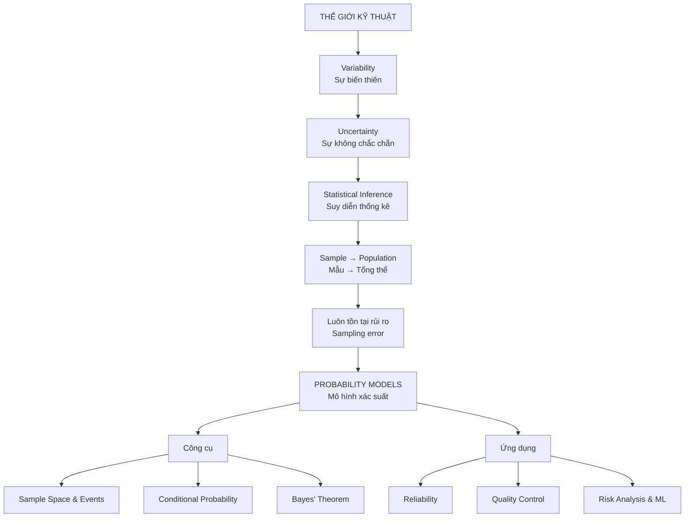

# Chương 2: Probability - Giới thiệu và Tư duy nền tảng

> Chào các em. Trong các bài học trước, chúng ta đã tìm hiểu về Phương pháp Kỹ thuật, cách thu thập dữ liệu và sự tồn tại tất yếu của sự biến thiên trong thế giới thực. Hôm nay, chúng ta sẽ bước sang một chương mới mang tính nền tảng cho toàn bộ môn học này: **Chương 2 - Xác suất (Probability)**.
>
> Thay vì bắt đầu bằng những công thức toán học khô khan, thầy muốn các em hiểu được **trực giác** đằng sau xác suất và lý do tại sao nó lại là công cụ sinh tồn của bất kỳ kỹ sư nào. Chúng ta cùng bắt đầu!

---

## 1. Probability (Xác suất) là gì?

> [!info] **Trực giác**
> Xác suất là một con số dùng để định lượng *"khả năng"* hay *"cơ hội"* xảy ra của một kết quả trong một thí nghiệm ngẫu nhiên. Xác suất luôn nằm trong khoảng từ 0 (chắc chắn không xảy ra) đến 1 (chắc chắn xảy ra).

**Hai cách hiểu phổ biến về xác suất:**

| Góc nhìn | Định nghĩa | Ví dụ |
| :--- | :--- | :--- |
| **Subjective (Chủ quan)** | Là *"niềm tin"* của chúng ta về việc một sự kiện sẽ xảy ra. | *"Tôi tin 80% là dự án này sẽ kịp tiến độ."* |
| **Relative Frequency (Tần suất tương đối)** | Nếu em lặp đi lặp lại một thí nghiệm vô hạn lần, tỷ lệ xuất hiện của một kết quả cụ thể sẽ hội tụ về một con số. Đó chính là xác suất. | Nếu xác suất một xung tín hiệu bị lỗi là 0.2, điều đó có nghĩa là nếu truyền đi rất nhiều xung, khoảng 20% trong số đó sẽ bị lỗi. |

---

## 2. Variability (Sự biến thiên) là gì?

> [!note] Như chúng ta đã học ở Chương 1
> **Sự biến thiên (Variability)** có nghĩa là các lần quan sát liên tiếp trên cùng một hệ thống sẽ không bao giờ tạo ra kết quả giống hệt nhau.

Ngay cả khi em thiết kế và tiến hành thí nghiệm cẩn thận đến đâu, sự biến thiên (hay *"nhiễu"*) vẫn luôn tồn tại do những thay đổi cực nhỏ của môi trường, độ mòn của thiết bị, hay tạp chất trong vật liệu. Một thí nghiệm luôn cho ra các kết quả khác nhau dù được lặp lại trong cùng một điều kiện được gọi là **Thí nghiệm ngẫu nhiên (Random experiment)**.

---

## 3. Uncertainty (Sự không chắc chắn) là gì?

> [!warning] Hệ quả tất yếu
> Sự biến thiên sinh ra **Sự không chắc chắn (Uncertainty)**.

Vì mọi thứ luôn dao động, các em không thể biết chính xác 100% sản phẩm tiếp theo chạy ra khỏi dây chuyền sản xuất sẽ có kích thước bao nhiêu, hay server có bị sập trong 1 giờ tới không. Sự không chắc chắn là trạng thái thiếu hụt thông tin hoàn hảo về hệ thống.

---

## 4. Tại sao Kỹ sư cần xác suất?

> [!important] **Vấn đề cốt lõi**
> Trong thực tế, kỹ sư thường phải đưa ra quyết định cho một **Tổng thể (Population)** cực lớn (hàng triệu linh kiện) nhưng lại chỉ có trong tay dữ liệu đo đạc từ một **Mẫu (Sample)** rất nhỏ. Quá trình này gọi là **Suy diễn thống kê (Statistical inference)**.

Khi em suy diễn từ Mẫu lên Tổng thể, em luôn phải đối mặt với rủi ro mắc sai lầm (sampling errors). Xác suất chính là công cụ toán học giúp kỹ sư **định lượng được những rủi ro này**. Nó cho em biết: *"Với mẫu dữ liệu nhỏ nhoi này, tôi có bao nhiêu % tự tin để ra quyết định thay đổi toàn bộ dây chuyền sản xuất?"*

---

## 5. Probability Model (Mô hình Xác suất) là gì?

> [!info] **Định nghĩa**
> **Mô hình xác suất** là một khung toán học dùng để tính toán tỷ lệ xuất hiện của các kết quả dựa trên những giả định hợp lý về hệ thống.

*Trực giác:* Nếu em có một lô hàng 25 tấm wafer silicon và biết chắc chắn có 1 tấm bị lỗi, mô hình xác suất sẽ giúp em tính toán chính xác rủi ro (xác suất) em *"bỏ lót"* tấm lỗi đó nếu em chỉ bốc ngẫu nhiên 3 tấm để kiểm tra. Bằng cách này, mô hình xác suất giúp lượng hóa rủi ro trong các quyết định hàng ngày của kỹ sư.

---

## 6. Vai trò của Xác suất trong kỹ thuật hiện đại

| Lĩnh vực | Vai trò của Xác suất |
| :--- | :--- |
| **Reliability Engineering** | Tính toán khả năng một hệ thống phức tạp (máy bay, hệ thống mạng) hoạt động bình thường dựa trên xác suất hỏng hóc của từng linh kiện cấu thành. |
| **Quality Control** | Thiết lập các *"Giới hạn kiểm soát"* (Control limits) để phân biệt đâu là dao động bình thường (chance cause), đâu là dấu hiệu hệ thống đang gặp sự cố cần dừng lại sửa chữa. |
| **Risk Analysis** | Đánh giá rủi ro thực sự của các báo động giả. Ví dụ: Xét nghiệm điện tâm đồ báo kết quả bất thường không có nghĩa là bệnh nhân chắc chắn bị nhồi máu cơ tim; kỹ sư/bác sĩ phải dùng xác suất (Bayes) để kết hợp tỷ lệ *"dương tính giả"* và đưa ra tỷ lệ rủi ro thực tế. |
| **Machine Learning** | Các thuật toán AI/ML bản chất là các bộ phân loại xác suất. Chúng thu thập dữ liệu trong quá khứ để xây dựng một mô hình xác suất, từ đó *"dự đoán"* khả năng một dữ liệu mới thuộc về nhóm nào (ví dụ: thư này có bao nhiêu % là thư rác). |

---

## 7. Ví dụ thực tế minh họa

### Ví dụ 1: Xác suất lỗi linh kiện (Quality Control)

> [!example] **Bối cảnh**
> Có một thùng chứa 50 linh kiện, trong đó có 3 linh kiện bị lỗi và 47 linh kiện tốt.

> [!question] **Vấn đề**
> Nếu lấy ngẫu nhiên 6 linh kiện để kiểm tra, xác suất để ta bốc trúng đúng 2 linh kiện lỗi là bao nhiêu?

> [!success] **Vai trò của Xác suất**
> Mô hình xác suất giúp ta tính được tỷ lệ này (khoảng 3.4%) để tối ưu hóa quy trình lấy mẫu kiểm tra.

---

### Ví dụ 2: Xác suất hệ thống bị hỏng (Reliability)

> [!example] **Bối cảnh**
> Một hệ thống lưu trữ dữ liệu dự phòng RAID 0 sử dụng 2 ổ cứng. Dữ liệu sẽ bị mất nếu **cả hai** ổ cứng cùng hỏng trong một ngày.

> [!question] **Vấn đề**
> Nếu xác suất hỏng của mỗi ổ cứng là 0.001 và chúng hoạt động độc lập, xác suất mất dữ liệu của toàn hệ thống là bao nhiêu?

> [!success] **Vai trò của Xác suất**
> Xác suất mất dữ liệu sẽ là cực kỳ thấp (0.001 × 0.001 = 0.000001). Điều này cho thấy tại sao kỹ sư hệ thống cần thiết kế dự phòng.

---

### Ví dụ 3: Xác suất spam email (Machine Learning / Bayes)

> [!example] **Bối cảnh**
> Một hệ thống lọc email biết rằng từ *"free"* xuất hiện trong 60% thư rác (spam) nhưng chỉ xuất hiện trong 4% thư hợp lệ.

> [!question] **Vấn đề**
> Hệ thống đọc được một email có chứa từ *"free"*. Xác suất email này là spam là bao nhiêu?

> [!success] **Vai trò của Xác suất**
> Hệ thống sẽ dùng Định lý Bayes để tính ngược lại **xác suất email này là spam**, từ đó tự động chuyển nó vào thùng rác.

---

## 8. Mối liên hệ giữa Xác suất và Thống kê

> [!danger] **Nhiều sinh viên thường nhầm lẫn hai khái niệm này!**

Em hãy nhớ trực giác sau: **Xác suất và Thống kê là hai bài toán ngược chiều nhau.**

| | Xác suất (Probability) | Thống kê (Statistics) |
| :--- | :--- | :--- |
| **Hướng suy luận** | **Tổng thể $\rightarrow$ Mẫu** | **Mẫu $\rightarrow$ Tổng thể** |
| **Điều kiện** | *Đã biết* mô hình/tỷ lệ của tổng thể. | *Không biết* tổng thể, chỉ có dữ liệu từ một mẫu nhỏ. |
| **Mục đích** | Dự đoán hành vi của một mẫu nhỏ. | Suy luận (Statistical inference) về bức tranh lớn. |
| **Ví dụ** | *"Biết hộp có 50% bi đỏ, tính xác suất bốc 3 viên ra được 2 viên đỏ."* | *"Bốc được 2 viên đỏ trong 3 viên, dự đoán hộp có bao nhiêu % bi đỏ?"* |

> [!important] **Mối liên hệ**
> Suy diễn thống kê luôn mang mầm mống của sự sai lầm. **Xác suất chính là phương tiện, là ngôn ngữ để chúng ta đo lường độ tin cậy của các kết luận Thống kê**. Không hiểu Xác suất, em sẽ không thể làm Thống kê kỹ thuật.

---

## 9. SƠ ĐỒ TƯ DUY TOÀN CHƯƠNG (Conceptual Mind Map)

---

## 10. TÓM TẮT CHUẨN BỊ CHO CHƯƠNG 2

> [!info] Các em vừa đi qua tư duy cốt lõi. Trong Chương 2 sắp tới, chúng ta sẽ bắt đầu *"toán học hóa"* những trực giác này bằng cách làm quen với:

1. **Sample Space (Không gian mẫu):** Tập hợp mọi kết quả có thể xảy ra.
2. **Events (Biến cố):** Một tập con các kết quả mà ta quan tâm.
3. **Venn Diagrams & Set Operations:** Giao, Hợp, Phần bù để tính xác suất các hệ thống phức tạp.
4. **Conditional Probability (Xác suất có điều kiện):** Cách cập nhật lại xác suất khi ta có thêm thông tin mới.

---

## 11. CÁC CÂU HỎI ÔN TẬP TỔNG HỢP

> [!question] **Câu hỏi 1**
> Hãy giải thích sự khác biệt giữa *"Sự biến thiên"* (Variability) và *"Sự không chắc chắn"* (Uncertainty) bằng một ví dụ trong ngành kỹ thuật của em.

> [!faq]- 💡 Gợi ý
>
> - Variability là sự khác biệt *thực tế* giữa các lần đo.
> - Uncertainty là trạng thái *thiếu thông tin* của chúng ta về kết quả tiếp theo.

> [!faq]- 📌 Đáp án
>
> **Ví dụ:** Khi sản xuất ốc vít, đường kính của chúng luôn dao động quanh giá trị mục tiêu (ví dụ: 10.00mm ± 0.02mm). Đó là **Variability**.
>
> **Uncertainty** là khi em đang cầm một con ốc vít bất kỳ, em không thể biết chính xác 100% đường kính của nó là bao nhiêu (có phải đúng 10.01mm không? Hay là 9.98mm?) cho đến khi em đo nó. Sự không biết trước kết quả đó chính là **Uncertainty**.

---

> [!question] **Câu hỏi 2**
> Tại sao nói *"Góc nhìn tần suất tương đối"* (Relative frequency interpretation) phù hợp với các hệ thống sản xuất hàng loạt hơn là *"Góc nhìn chủ quan"* (Subjective interpretation)?

> [!faq]- 💡 Gợi ý
>
> - Hệ thống sản xuất hàng loạt có thể lặp lại nhiều lần.
> - Góc nhìn chủ quan phụ thuộc vào cảm nhận của từng người.

> [!faq]- 📌 Đáp án
>
> **Trả lời:** Trong sản xuất hàng loạt, chúng ta có thể thu thập dữ liệu từ hàng ngàn sản phẩm giống hệt nhau (lặp lại thí nghiệm). Do đó, xác suất hỏng hóc có thể được ước tính trực tiếp từ tỷ lệ thực tế (relative frequency) trong quá khứ. Góc nhìn chủ quan dễ bị ảnh hưởng bởi cảm xúc, niềm tin cá nhân và thiếu cơ sở khoa học, không phù hợp để đưa ra quyết định kỹ thuật khách quan.

---

> [!question] **Câu hỏi 3**
> Khi một kỹ sư lấy 10 mẫu nước để kiểm tra nồng độ ô nhiễm của một con sông, tại sao người đó lại cần đến Xác suất để đưa ra kết luận Thống kê?

> [!faq]- 💡 Gợi ý
>
> - Nồng độ trung bình của 10 mẫu có đại diện cho toàn bộ con sông không?
> - Làm sao biết kết luận của em không phải do *"may mắn"*?

> [!faq]- 📌 Đáp án
>
> **Trả lời:**
> - **Population:** Toàn bộ nước trong con sông.
> - **Sample:** 10 mẫu nước nhỏ.
> - Người kỹ sư muốn dùng Sample để suy luận (inference) cho Population. Tuy nhiên, nếu em lấy 10 mẫu khác, kết quả trung bình sẽ khác đi. Đó là **Sampling error**.
> - Kỹ sư cần Xác suất để trả lời câu hỏi: *"Nồng độ ô nhiễm trung bình đo được là X. Liệu X có phải là giá trị thực của con sông, hay chỉ là sự dao động ngẫu nhiên do 10 mẫu tôi chọn vô tình bị ô nhiễm nhiều hơn bình thường?"* Xác suất giúp định lượng mức độ tin cậy cho kết luận đó.

---

> [!question] **Câu hỏi 4**
> Trong một hệ thống mạch điện song song, nếu một linh kiện hỏng, hệ thống vẫn hoạt động. Xác suất đóng vai trò gì trong việc thiết kế các hệ thống có tính dự phòng (redundancy) như vậy?

> [!faq]- 💡 Gợi ý
>
> - Hệ thống hỏng khi nào?
> - Xác suất hỏng của hệ thống so với từng linh kiện như thế nào?

> [!faq]- 📌 Đáp án
>
> **Trả lời:** Xác suất cho phép kỹ sư tính toán độ tin cậy tổng thể của hệ thống dựa trên xác suất hỏng của từng linh kiện.
>
> **Ví dụ:** Nếu hệ thống có 2 linh kiện song song, mỗi linh kiện có xác suất hỏng là 0.01 và độc lập với nhau, thì hệ thống chỉ hỏng khi **cả hai** linh kiện cùng hỏng. Xác suất hệ thống hỏng là 0.01 × 0.01 = 0.0001 (rất nhỏ). Kỹ sư dùng xác suất để quyết định cần bao nhiêu linh kiện dự phòng để đạt được mức độ tin cậy mong muốn với chi phí hợp lý.

---

> [!question] **Câu hỏi 5**
> Giải thích sự khác biệt giữa hai bài toán sau:
> - **(A)** Biết tỷ lệ hỏng của máy là 5%, tính khả năng gặp 2 máy hỏng trong 10 máy.
> - **(B)** Thấy 2 máy hỏng trong 10 máy, dự đoán tỷ lệ hỏng của toàn nhà máy.
>
> Bài toán nào là Xác suất, bài toán nào là Thống kê? Tại sao?

> [!faq]- 💡 Gợi ý
>
> - Bài toán A: Em đã biết tỷ lệ hỏng của *tổng thể* (5%). Em đang dự đoán hành vi của *mẫu* (10 máy).
> - Bài toán B: Em chỉ có dữ liệu từ *mẫu* (2 máy hỏng/10 máy). Em đang suy luận về *tổng thể* (toàn nhà máy).

> [!faq]- 📌 Đáp án
>
> **Trả lời:**
> - **(A) là bài toán Xác suất:** Vì em đã biết tỷ lệ hỏng của tổng thể (5%), em đi tính xác suất xảy ra trong một mẫu cụ thể (2/10 máy hỏng). Đi từ **Tổng thể → Mẫu**.
> - **(B) là bài toán Thống kê:** Vì em không biết tỷ lệ hỏng của toàn nhà máy. Em chỉ có dữ liệu từ mẫu (2/10) và dùng nó để suy diễn về tỷ lệ hỏng thực sự của toàn bộ tổng thể. Đi từ **Mẫu → Tổng thể**.
>
> **Mối liên hệ:** Khi em đưa ra dự đoán (B) là *"tỷ lệ hỏng của nhà máy khoảng 20%"*, em sẽ cần Xác suất để trả lời câu hỏi: *"Tôi tin chắc bao nhiêu phần trăm vào dự đoán này? Rủi ro sai lầm là bao nhiêu?"* Đó chính là lúc Xác suất phục vụ cho Thống kê.

---

> [!tip] **Lời kết**
> Các em đã có một cái nhìn tổng quan về vai trò của Xác suất trong kỹ thuật. Hãy nhớ rằng: **Xác suất không chỉ là công thức, mà là ngôn ngữ để kỹ sư nói về rủi ro và sự không chắc chắn trong thế giới thực**.
>
> Trong các bài học tiếp theo, chúng ta sẽ bắt đầu đi vào chi tiết các công cụ xác suất: Không gian mẫu, Biến cố, Xác suất có điều kiện và Định lý Bayes. Hãy sẵn sàng nhé!
