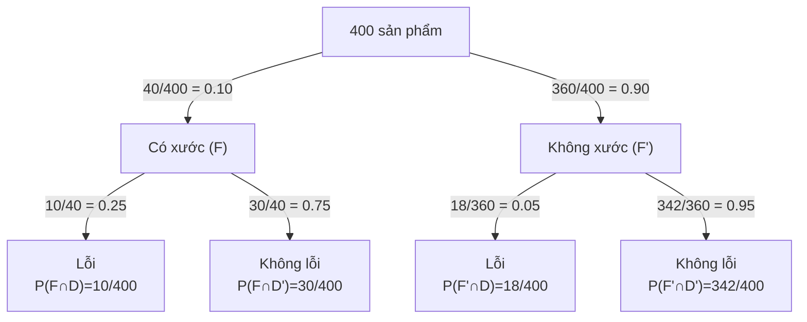

---
tags:
  - probability
  - conditional-probability
  - engineering
---
> Chào các em sinh viên! Chào mừng các em quay lại với môn Xác suất Thống kê. Ở những bài trước, chúng ta đã tính xác suất của một sự kiện trong một không gian mẫu tĩnh (tức là mọi thứ đã được bày sẵn ra trên bàn). Nhưng trong thực tế, mọi thứ luôn vận động và thay đổi. Điều gì sẽ xảy ra nếu chúng ta *"biết thêm một thông tin mới"* trong lúc đang làm thí nghiệm?
>
> Hôm nay, chúng ta sẽ học cách **"cập nhật" xác suất** bằng một khái niệm vô cùng quyền lực: **Conditional Probability (Xác suất có điều kiện)**.

---

## 1. Giải thích bằng ngôn ngữ đơn giản và Trực giác (Intuition)

**Trực giác của việc cập nhật thông tin:**

> [!example] **Đoán bài**
> Hãy tưởng tượng em đang chơi đoán bài. Thầy rút 1 lá bài từ bộ bài 52 lá úp sấp, và đố em biết xác suất đó là lá K (Già) là bao nhiêu. Em sẽ dễ dàng đáp là $4/52$.
> 
> Tuy nhiên, thầy lật nhẹ lá bài lên và hé lộ cho em một thông tin: *"Thầy gợi ý nhé, đây là một lá bài hình (Tây) gồm J, Q, K"*.
> 
> Ngay lập tức, bộ não của em sẽ tự động **cập nhật lại thông tin**. Em không còn quan tâm đến 52 lá bài nữa, mà chỉ quan tâm đến **12 lá bài hình** mà thôi. Lúc này, xác suất lá đó là K tăng vọt lên thành $4/12$.

> [!info] **Bản chất của Conditional Probability**
> Đó chính là Xác suất có điều kiện! Đôi khi các xác suất cần phải được đánh giá lại (reevaluated) khi có thêm thông tin mới. Một cách hữu ích để đưa thông tin này vào mô hình là giả định rằng kết quả chắc chắn thuộc về một biến cố nào đó đã biết trước. Việc biết trước thông tin này làm **thu hẹp Không gian mẫu** của chúng ta lại.

---

## 2. Ý nghĩa của ký hiệu $P(A|B)$

Trong toán học, xác suất để biến cố A xảy ra, **khi biết rằng (hoặc giả sử rằng)** biến cố B đã xảy ra, được ký hiệu là:

$$P(A|B)$$

| Thành phần | Ý nghĩa |
| :--- | :--- |
| **$A$** | Là biến cố mà chúng ta *đang muốn tính* xác suất. |
| **$|$** | Dấu "given that" (với điều kiện là / biết rằng). |
| **$B$** | Là phần thông tin *đã biết trước*, đóng vai trò là "Không gian mẫu mới" của chúng ta. |

---

## 3. Định nghĩa chính xác và Công thức

Theo giáo trình *Applied Statistics and Probability for Engineers*, định nghĩa học thuật được phát biểu như sau:

> [!important] **Định nghĩa**
> **Xác suất có điều kiện của một biến cố B khi biết biến cố A đã xảy ra, ký hiệu là $P(B|A)$, được tính bằng công thức:**
> $$P(B|A) = \frac{P(A \cap B)}{P(A)}$$
> với điều kiện $P(A) > 0$.

### Giải thích ý nghĩa công thức

Trường hợp không gian mẫu có các kết quả đồng khả năng (equally likely), công thức này có thể được hiểu trực quan là tỷ lệ giữa số lượng kết quả nằm trong phần giao của A và B chia cho tổng số kết quả nằm trong A:

$$P(B|A) = \frac{\text{Số lượng kết quả thuộc } (A \cap B)}{\text{Số lượng kết quả thuộc } A}$$

> [!note] **Ý nghĩa trực quan**
> Vì A đã chắc chắn xảy ra, mọi kết quả nằm ngoài A đều bị loại bỏ. Ta chỉ so sánh phần *"vừa có B vừa có A"* với *"toàn bộ A"*.

---

## 4. Giải phẫu các ví dụ thực tế

Chúng ta hãy đi qua các ví dụ từ dễ đến khó để thấy sự lợi hại của Xác suất có điều kiện nhé.

### Ví dụ 1: Rút bài (Lấy mẫu không hoàn lại)

> [!example] **Đề bài**
> Từ một hộp có 50 linh kiện (gồm 3 lỗi và 47 không lỗi). Ta chọn ngẫu nhiên 2 linh kiện liên tiếp không bỏ lại. Tính xác suất linh kiện thứ 2 bị lỗi, biết linh kiện thứ 1 đã bị lỗi.

- **Bước 1:** Khởi đầu, hộp có 50 linh kiện, 3 lỗi.
- **Bước 2:** *"Biết linh kiện 1 đã bị lỗi"*. Thông tin này thay đổi hoàn toàn hệ thống! Lúc này trong hộp chỉ còn 49 linh kiện, và số linh kiện lỗi chỉ còn 2.
- **Bước 3:** Gọi A là linh kiện 1 lỗi, B là linh kiện 2 lỗi. Ta có ngay:
  $$P(B|A) = \frac{2}{49}$$

> [!success] **Rất trực quan và không cần dùng công thức giao phức tạp!**

---

### Ví dụ 2: Chọn sản phẩm lỗi trong kỹ thuật

> [!example] **Dữ liệu**
> Xét 400 chi tiết máy được phân loại theo *"Có vết xước bề mặt"* (Surface Flaws - F) và *"Bị lỗi chức năng"* (Defective - D):

| | Có xước ($F$) | Không xước ($F'$) | Tổng |
| :--- | :---: | :---: | :---: |
| **Lỗi chức năng ($D$)** | 10 | 18 | 28 |
| **Không lỗi ($D'$)** | 30 | 342 | 372 |
| **Tổng** | **40** | **360** | **400** |

Nếu chọn ngẫu nhiên 1 chi tiết: Xác suất bị lỗi là $P(D) = 28/400 = 0.07$ (7%).

Nhưng nếu người thợ báo cho em biết: *"Chi tiết này có vết xước bề mặt"* (tức là F đã xảy ra). Hãy tính $P(D|F)$.

- **Giải bằng công thức:**
  - $P(F) = 40/400$.
  - Phần giao vừa xước vừa lỗi $P(D \cap F) = 10/400$.
  - Suy ra $P(D|F) = \frac{10/400}{40/400} = \frac{10}{40} = 0.25$.

- **Giải bằng trực giác:** Vì đã biết có xước, ta vứt bỏ 360 chi tiết kia đi, chỉ nhìn vào 40 chi tiết có xước. Trong 40 chi tiết này, có 10 cái lỗi chức năng. Vậy xác suất là $10/40 = 0.25$.

> [!note] **Nhận xét**
> Xác suất bị lỗi đã tăng vọt từ 7% lên 25% nhờ thông tin mới!

---

### Ví dụ 3: Kiểm tra y tế (Medical Diagnostic)

> [!example] **Đề bài**
> Một cô gái trẻ khỏe mạnh đến phòng cấp cứu vì chóng mặt sau khi chạy bộ dưới trời nóng. Bác sĩ cho đo điện tâm đồ (ECG) để kiểm tra nhồi máu cơ tim, và kết quả máy báo là *"Bất thường"* (Positive).
> 
> Giả sử bài test này có tỷ lệ dương tính giả (false positive) là 0.1 và âm tính giả (false negative) là 0.1. Tỷ lệ người bị nhồi máu cơ tim trong nhóm tuổi của cô ấy chỉ là 0.001 (rất hiếm).

Dù kết quả máy là Bất thường, nhưng xác suất thực sự cô ấy bị nhồi máu cơ tim *khi biết kết quả máy báo bất thường*, ký hiệu là $P(\text{Bệnh} | \text{Máy báo Bất thường})$, thực tế lại **nhỏ hơn 0.01 (chưa tới 1%)**.

> [!warning] **Lý do**
> Vì xuất phát điểm (Không gian mẫu) số người khỏe mạnh là cực kỳ khổng lồ, nên lượng 10% *"dương tính giả"* từ nhóm khổng lồ này áp đảo hoàn toàn số lượng cực ít người mắc bệnh thực sự.
> 
> Đây là một sự thật y khoa khiến rất nhiều người giật mình nếu không hiểu Xác suất có điều kiện!

---

## 5. Tree Diagram (Sơ đồ cây) minh họa

Sơ đồ cây là công cụ đắc lực để xử lý Xác suất có điều kiện. Trở lại ví dụ 2:




**Nguyên tắc đọc sơ đồ cây:**

- Xác suất trên các nhánh **cấp 1** (từ gốc ra) là xác suất **không điều kiện**.
- Xác suất trên các nhánh **cấp 2** (từ các nhánh cấp 1 trở đi) là xác suất **có điều kiện**.
- Bằng cách đi dọc theo các cành cây và **nhân** các xác suất lại, các em sẽ tính được xác suất giao:
  $$P(F) \times P(D|F) = P(F \cap D)$$

---

## 6. Các lỗi sai phổ biến của sinh viên

> [!warning] **Lỗi 1: Nhầm lẫn giữa $P(A|B)$ và $P(B|A)$**
> Đây là lỗi cực kỳ nguy hiểm. Trong ví dụ y tế ở trên, xác suất *"Máy báo bệnh | Người thực sự có bệnh"* là 90%. Nhưng xác suất *"Người thực sự có bệnh | Máy báo bệnh"* lại chưa tới 1%!
> 
> Giống như việc *"Xác suất người đó có bầu biết rằng người đó là Nữ"* rất khác với *"Xác suất người đó là Nữ biết rằng người đó có bầu (100%)"*.

> [!warning] **Lỗi 2: Nhầm lẫn $P(A|B)$ với phần giao $P(A \cap B)$**
> - Phần giao $P(A \cap B)$ là xác suất để lấy được phần tử thỏa mãn cả 2 điều kiện A và B so với *toàn bộ tổng thể không gian mẫu ban đầu*.
> - Còn $P(A|B)$ là so với *chỉ một nhóm B đã bị thu hẹp*.

> [!warning] **Lỗi 3: Áp dụng sai công thức khi các biến cố là Xung khắc**
> Nếu A và B xung khắc (không có phần giao), thì $P(A \cap B) = 0$, dẫn đến $P(A|B) = 0$. (Tức là nếu B đã xảy ra thì A chắc chắn không thể xảy ra).

---

## TỔNG KẾT VÀ BÀI TẬP

### Tóm tắt kiến thức

- **Conditional Probability (Xác suất có điều kiện)** giúp ta tính toán lại cơ hội xảy ra của một sự việc khi có một phần thông tin đã được xác nhận.
- Nó hoạt động trên nguyên tắc **thu hẹp Không gian mẫu** xuống chỉ còn những kết quả thỏa mãn điều kiện đã biết.
- **Sơ đồ cây** hiển thị các xác suất không điều kiện ở nhánh cấp 1 và các xác suất có điều kiện ở nhánh cấp 2.

### Công thức cần nhớ

> [!formula] **Công thức**
> - **Công thức gốc:** $P(B|A) = \frac{P(A \cap B)}{P(A)}$
> - **Luật nhân xác suất suy ra từ đó:** $P(A \cap B) = P(B|A) \cdot P(A)$

---

### 5 Câu hỏi lý thuyết

> [!question] **Câu hỏi 1**
> Xác suất có điều kiện khác với xác suất không điều kiện ở điểm cốt lõi nào?

> [!faq]- 💡 Gợi ý
> 
> - Xác suất không điều kiện được tính trên toàn bộ Không gian mẫu.
> - Xác suất có điều kiện được tính trên một tập con đã được thu hẹp.

> [!faq]- 📌 Đáp án
> 
> Xác suất có điều kiện được tính toán trên một **Không gian mẫu đã bị thu hẹp**, trong khi xác suất không điều kiện được tính trên toàn bộ Không gian mẫu ban đầu.

---

> [!question] **Câu hỏi 2**
> Trong công thức $P(A|B)$, mẫu số $P(B)$ đại diện cho điều gì về mặt trực giác?

> [!faq]- 💡 Gợi ý
> 
> - $P(B)$ là xác suất của điều kiện đã biết.
> - Nó đóng vai trò là *"Không gian mẫu mới"*.

> [!faq]- 📌 Đáp án
> 
> Mẫu số $P(B)$ đại diện cho xác suất của điều kiện đã biết B. Nó đóng vai trò là *"tổng thể mới"* – tức là Không gian mẫu đã bị thu hẹp lại chỉ còn những outcomes thuộc B.

---

> [!question] **Câu hỏi 3**
> Giải thích bằng một ví dụ thực tế tại sao $P(A|B)$ không nhất thiết phải bằng $P(B|A)$?

> [!faq]- 💡 Gợi ý
> 
> - Nghĩ về mối quan hệ giữa các hiện tượng có thể không đối xứng.
> - Ví dụ: *"Trời mưa"* và *"Đường ướt"*.

> [!faq]- 📌 Đáp án
> 
> **Ví dụ:** Xác suất *"Đường ướt | Trời mưa"* rất cao (gần 1). Nhưng xác suất *"Trời mưa | Đường ướt"* thấp hơn nhiều, vì đường ướt có thể do xe tưới nước hoặc bể ống nước.
> 
> Hai xác suất này không nhất thiết bằng nhau vì chúng xuất phát từ hai không gian mẫu khác nhau.

---

> [!question] **Câu hỏi 4**
> Trên một Sơ đồ cây gồm 2 bước thí nghiệm, các xác suất nằm trên các nhánh ở bước thứ 2 được gọi là loại xác suất gì?

> [!faq]- 💡 Gợi ý
> 
> - Các nhánh bước 2 xuất phát từ các nhánh bước 1.
> - Chúng phụ thuộc vào kết quả của bước 1.

> [!faq]- 📌 Đáp án
> 
> Các xác suất trên các nhánh ở bước thứ 2 là **xác suất có điều kiện**.
> 
> Ví dụ: $P(D|F)$ là xác suất có điều kiện của việc bị lỗi khi biết có vết xước.

---

> [!question] **Câu hỏi 5**
> Nếu A và B là hai biến cố xung khắc, $P(A|B)$ sẽ bằng bao nhiêu? Giải thích.

> [!faq]- 💡 Gợi ý
> 
> - Xung khắc nghĩa là không thể xảy ra cùng lúc.
> - Nếu B đã xảy ra, A có thể xảy ra không?

> [!faq]- 📌 Đáp án
> 
> $P(A|B) = 0$.
> 
> **Giải thích:** Nếu A và B xung khắc, chúng không thể xảy ra cùng lúc. Vì vậy, khi biết B đã xảy ra, A chắc chắn không thể xảy ra.
> 
> Từ công thức: $P(A|B) = \frac{P(A \cap B)}{P(B)} = \frac{0}{P(B)} = 0$.

---

### 10 Bài tập từ cơ bản đến nâng cao

> [!example] **Bài 1 (Cơ bản)**
> Các đĩa nhựa polycarbonate được phân loại theo độ chống xước (Scratch resistance: High/Low) và chống sốc (Shock resistance: High/Low). Dữ liệu 100 đĩa: (Cả hai High: 70 đĩa, Scratch High/Shock Low: 9 đĩa, Scratch Low/Shock High: 16 đĩa, Cả hai Low: 5 đĩa). Gọi A là đĩa có Shock High, B là đĩa có Scratch High. Tính $P(A|B)$ và $P(B|A)$.

> [!faq]- 💡 Gợi ý
> 
> - $P(A) = 86/100$, $P(B) = 79/100$, $P(A \cap B) = 70/100$.
> - Áp dụng công thức $P(A|B) = \frac{P(A \cap B)}{P(B)}$.

> [!faq]- 📌 **Lời giải**
> 
> - $P(A)$ (Shock High) $= (70+16)/100 = 86/100 = 0.86$.
> - $P(B)$ (Scratch High) $= (70+9)/100 = 79/100 = 0.79$.
> - $P(A \cap B) = 70/100$.
> 
> $$P(A|B) = \frac{70/100}{79/100} = \frac{70}{79} \approx 0.886$$
> (Biết đĩa có Scratch High (79 đĩa), tỷ lệ có Shock High (70 đĩa) là 70/79)
> 
> $$P(B|A) = \frac{70/100}{86/100} = \frac{70}{86} \approx 0.814$$

---

> [!example] **Bài 2 (Cơ bản)**
> Phân tích 100 mẫu da về độ ẩm (Moisture: High/Low) và lượng Melanin (High/Low). (High Moist/High Mel: 13, High Moist/Low Mel: 7, Low Moist/High Mel: 48, Low Moist/Low Mel: 32). A là biến cố Low Melanin, B là biến cố High Moisture. Tính $P(A|B)$ và $P(B|A)$.

> [!faq]- 💡 Gợi ý
> 
> - A (Low Melanin) có $7+32 = 39$ mẫu.
> - B (High Moisture) có $13+7 = 20$ mẫu.
> - $A \cap B = 7$ mẫu.

> [!faq]- 📌 **Lời giải**
> 
> - A (Low Melanin) có $7+32 = 39$ mẫu $\rightarrow P(A) = 39/100$.
> - B (High Moisture) có $13+7 = 20$ mẫu $\rightarrow P(B) = 20/100$.
> - Giao $A \cap B = 7$ mẫu.
> 
> $$P(A|B) = \frac{7}{20} = 0.35$$
> $$P(B|A) = \frac{7}{39} \approx 0.179$$

---

> [!example] **Bài 3 (Trung bình)**
> Phân tích thép mạ kẽm về Coating Weight (High/Low) và Surface Roughness (High/Low). (Rough High/Coat High: 12, Rough High/Coat Low: 16, Rough Low/Coat High: 88, Rough Low/Coat Low: 34). Tính xác suất mẫu có Surface Roughness High, biết rằng Coating Weight của nó là High.

> [!faq]- 💡 Gợi ý
> 
> - Gọi C là Coat High, R là Rough High.
> - Tổng số Coat High = $12 + 88 = 100$.
> - Số Coat High và Rough High = 12.

> [!faq]- 📌 **Lời giải**
> 
> Gọi C là Coat High (Tổng $12 + 88 = 100$ mẫu). Gọi R là Rough High. Giao của chúng là 12 mẫu.
> 
> Xác suất cần tìm: $P(R|C) = \frac{12}{100} = 0.12$.

---

> [!example] **Bài 4 (Trung bình)**
> Một lô 100 chip bán dẫn có 20 chip lỗi. Hai chip được chọn ngẫu nhiên, không bỏ lại. Tính xác suất con chip thứ 2 bị lỗi, biết rằng con chip thứ nhất đã bị lỗi.

> [!faq]- 💡 Gợi ý
> 
> - Lấy không hoàn lại → số chip giảm đi.
> - Sau khi lấy 1 chip lỗi, còn bao nhiêu chip lỗi và tổng số chip?

> [!faq]- 📌 **Lời giải**
> 
> Vì không hoàn lại, sau khi lấy chip 1 bị lỗi, lô còn 99 chip và 19 chip lỗi.
> 
> $$P(\text{Chip 2 lỗi} | \text{Chip 1 lỗi}) = \frac{19}{99} \approx 0.192$$

---

> [!example] **Bài 5 (Trung bình)**
> Một lô 500 hộp nước cam đông lạnh có 5 hộp bị hỏng. Hai hộp được lấy ngẫu nhiên không bỏ lại. Tính xác suất hộp thứ 2 bị hỏng biết hộp thứ 1 bị hỏng.

> [!faq]- 💡 Gợi ý
> 
> - Tương tự Bài 4.
> - Sau khi lấy 1 hộp hỏng, còn 499 hộp, số hộp hỏng còn lại là 4.

> [!faq]- 📌 **Lời giải**
> 
> Lấy không hoàn lại. Sau khi lấy 1 hộp hỏng, còn 499 hộp và 4 hộp hỏng.
> 
> $$P(\text{Hộp 2 hỏng} | \text{Hộp 1 hỏng}) = \frac{4}{499} \approx 0.008$$

---

> [!example] **Bài 6 (Trung bình)**
> Từ Bài 5, tính xác suất để lấy được cả hai hộp đều bị hỏng.

> [!faq]- 💡 Gợi ý
> 
> - Áp dụng luật nhân xác suất.
> - $P(\text{Hộp 1 hỏng}) = 5/500$.
> - $P(\text{Hộp 2 hỏng} | \text{Hộp 1 hỏng}) = 4/499$.

> [!faq]- 📌 **Lời giải**
> 
> Dùng luật nhân:
> $$P(\text{Cả 2 hỏng}) = P(\text{Hộp 1 hỏng}) \times P(\text{Hộp 2 hỏng} | \text{Hộp 1 hỏng})$$
> 
> $$P = \frac{5}{500} \times \frac{4}{499} = \frac{20}{249500} \approx 0.00008$$

---

> [!example] **Bài 7 (Khá)**
> Thí nghiệm biến đổi lá cây thành cánh hoa. Dữ liệu: (Color Trans=Yes, Textural Trans=Yes: 243); (Color=Yes, Textural=No: 26); (Color=No, Textural=Yes: 13); (Color=No, Textural=No: 18). Nếu một chiếc lá đã hoàn thành Color Trans, xác suất nó hoàn thành Textural Trans là bao nhiêu?

> [!faq]- 💡 Gợi ý
> 
> - Color Trans = Yes: nhóm (Yes, Yes) và (Yes, No).
> - Tổng số lá Color Yes = $243 + 26 = 269$.
> - Trong đó số lá Textural Yes = 243.

> [!faq]- 📌 **Lời giải**
> 
> Nhóm lá đã hoàn thành Color Trans (Yes) gồm: (Yes, Yes) là 243 lá, và (Yes, No) là 26 lá. Tổng = $243 + 26 = 269$ lá. Trong đó số lá hoàn thành Textural (Yes) là 243.
> 
> $$P(\text{Textural=Yes} | \text{Color=Yes}) = \frac{243}{269} \approx 0.903$$

---

> [!example] **Bài 8 (Khá)**
> Lỗi bề mặt và chiều dài của linh kiện nhôm. (Surface Exc/Length Exc: 80, Surface Exc/Length Good: 2, Surface Good/Length Exc: 10, Surface Good/Length Good: 8). Tính xác suất một linh kiện có Surface Finish là Excellent, biết rằng Length của nó là Good.

> [!faq]- 💡 Gợi ý
> 
> - Length Good: (Surface Exc/Length Good) và (Surface Good/Length Good).
> - Tổng = $2 + 8 = 10$.

> [!faq]- 📌 **Lời giải**
> 
> Nhóm linh kiện có Length Good gồm: (Surface Exc/Length Good: 2) và (Surface Good/Length Good: 8). Tổng = 10 linh kiện.
> 
> Xác suất Surface Exc biết Length Good = $\frac{2}{10} = 0.2$

---

> [!example] **Bài 9 (Nâng cao)**
> Bọ vòi voi Alfalfa phát triển qua các giai đoạn. Dữ liệu số con sống sót: Eggs (Trứng): 421, Early Larvae: 412, Late Larvae: 306, Pre-pupae: 45, Late Pupae: 35, Adults (Trưởng thành): 31. Tính xác suất một quả trứng có thể sống sót thành công đến giai đoạn trưởng thành. Tính xác suất một con Late Larvae sống sót được đến giai đoạn trưởng thành.

> [!faq]- 💡 Gợi ý
> 
> - Xác suất từ trứng đến trưởng thành: so với tổng số trứng ban đầu.
> - Xác suất từ Late Larvae đến trưởng thành: so với số Late Larvae.

> [!faq]- 📌 **Lời giải**
> 
> Dữ liệu cho thấy số lượng giảm dần do không sống sót qua từng mốc.
> 
> Không gian mẫu ban đầu là 421 quả trứng.
> 
> $$P(\text{Adult} | \text{Egg}) = \frac{31}{421} \approx 0.0736$$
> 
> Nếu xuất phát điểm đã là Late Larvae (còn 306 con), Không gian mẫu mới là 306.
> 
> $$P(\text{Adult} | \text{Late Larvae}) = \frac{31}{306} \approx 0.1013$$

---

> [!example] **Bài 10 (Nâng cao)**
> Chứng minh logic: Nếu $P(A|B) = 1$, liệu có bắt buộc biến cố $A = B$ hay không? Vẽ biểu đồ Venn để giải thích lập luận của em.

> [!faq]- 💡 Gợi ý
> 
> - $P(A|B) = 1$ nghĩa là $P(A \cap B) = P(B)$.
> - Điều này có nghĩa là gì trong tập hợp?

> [!faq]- 📌 **Lời giải**
> 
> **Không bắt buộc $A = B$.**
> 
> $P(A|B) = \frac{P(A \cap B)}{P(B)} = 1$ nghĩa là $P(A \cap B) = P(B)$.
> 
> Điều này chứng tỏ **toàn bộ tập hợp B nằm gọn bên trong tập hợp A**. Hay nói cách khác, B là tập con của A ($B \subseteq A$).
> 
> **Biểu đồ Venn:** Vẽ một vòng tròn B nhỏ nằm hoàn toàn bên trong vòng tròn A lớn.
> 
> ```mermaid
> graph TD
>     A[Vòng tròn A]
>     B[Vòng tròn B - nằm trong A]
>     A --> B
> ```

---

> [!tip] **Lời kết**
> Các em hãy xem kỹ bài giải và tập tư duy *"thu hẹp không gian mẫu"* nhé. Hãy thực hành nhiều để thuần thục công cụ siêu mạnh này! Có chỗ nào vướng mắc cứ báo thầy!
