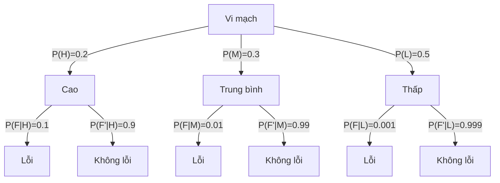

---
tags:
  - probability
  - multiplication-rule
  - total-probability
  - engineering
---
> Chào các em sinh viên! Chào mừng các em quay lại với bài giảng Xác suất Thống kê. Ở bài học trước, chúng ta đã tìm hiểu về Xác suất có điều kiện (Conditional Probability) để *"cập nhật"* xác suất khi biết thêm thông tin mới. Hôm nay, chúng ta sẽ lật ngược lại vấn đề: Nếu chúng ta đã biết xác suất của từng kịch bản con, làm sao để tính xác suất cho toàn bộ quá trình?
>
> Đó là lúc chúng ta cần đến hai quy tắc *"vàng"* của môn học này: **Quy tắc nhân (Multiplication Rule)** và **Quy tắc xác suất toàn phần (Total Probability Rule)**.

---

## 1. Giải thích bằng ngôn ngữ đơn giản

> [!example] **Trực giác: Điều tra tai nạn**
> Hãy tưởng tượng em đang điều tra một vụ tai nạn giao thông. Một chiếc xe bị mất lái có thể do đường trơn (nguyên nhân A) hoặc do lốp mòn (nguyên nhân B). Tuy nhiên, nguyên nhân này có thể dẫn đến nguyên nhân kia. Nếu em biết xác suất trời mưa làm đường trơn, và em cũng biết *"nếu đường trơn thì xác suất tai nạn là bao nhiêu"*, em hoàn toàn có thể tính được tổng xác suất xảy ra tai nạn!

Nói cách khác, khi một hệ thống kỹ thuật hoạt động qua nhiều giai đoạn (ví dụ: máy A cắt gọt $\rightarrow$ máy B đánh bóng), kết quả của bước sau phụ thuộc vào bước trước. **Quy tắc nhân** giúp ta tính xác suất để *"CẢ hai bước đều thành công"*, còn **Quy tắc xác suất toàn phần** giúp ta gom tất cả các kịch bản lại để tính xác suất cho kết quả cuối cùng.

---

## 2. Ý nghĩa của $P(A \cap B)$ và Quy tắc nhân (Multiplication Rule)

**Ý nghĩa của $P(A \cap B)$:**

Ký hiệu này đại diện cho xác suất của phần giao (Intersection) giữa hai biến cố A và B. Về mặt ngữ nghĩa, nó trả lời cho câu hỏi: *"Xác suất để biến cố A VÀ biến cố B **cùng xảy ra** là bao nhiêu?"*

**Mối liên hệ với Conditional Probability:**

Từ định nghĩa của Xác suất có điều kiện, ta biết:
$$P(B|A) = \frac{P(A \cap B)}{P(A)}$$

Nếu ta nhân chéo mẫu số $P(A)$ lên, ta sẽ có ngay công thức của Quy tắc nhân!

> [!important] **Công thức Multiplication Rule**
> Xác suất của phần giao giữa hai biến cố có thể được viết lại thành:
> $$P(A \cap B) = P(B|A) \cdot P(A) = P(A|B) \cdot P(B)$$
> *Trực giác:* Để tính xác suất CẢ A và B cùng xảy ra, ta lấy xác suất để A xảy ra, nhân với xác suất để B xảy ra *với giả định rằng A đã xảy ra*.

---

## 3. Phân hoạch không gian mẫu (Partition of Sample Space)

Để hiểu Quy tắc xác suất toàn phần, các em phải hiểu khái niệm *"Phân hoạch"* (Partition).

Hãy tưởng tượng Không gian mẫu $S$ là một chiếc bánh pizza. Việc cắt chiếc bánh này thành các miếng $E_1, E_2, \dots, E_k$ được gọi là một *"phân hoạch"* nếu nó thỏa mãn 2 điều kiện:

> [!note] **Điều kiện của một phân hoạch**
> 1. **Mutually Exclusive (Xung khắc):** Các miếng bánh không được xếp chồng lên nhau. Nghĩa là $E_i \cap E_j = \emptyset$ (không có phần tử chung).
> 2. **Exhaustive (Vét cạn):** Khi ghép tất cả các miếng lại, ta phải được trọn vẹn chiếc bánh pizza ban đầu. Nghĩa là $E_1 \cup E_2 \cup \dots \cup E_k = S$.

![[2.5 - Multiplication Rule & Total Probability Rule 2026-06-25 23.36.41.excalidraw-20260625233643550.png]]

---

## 4. Quy tắc xác suất toàn phần (Total Probability Rule)

Nếu có một sự kiện $B$ nào đó nằm rải rác trên nhiều miếng bánh $E_i$ khác nhau, thì xác suất của $B$ trên toàn bộ chiếc bánh chính bằng tổng xác suất của $B$ trên từng miếng nhỏ.

> [!important] **Công thức 2 biến cố**
> Bất kỳ sự kiện $B$ nào cũng có thể được chia thành hai phần: phần nằm trong $A$ và phần nằm ngoài $A$ ($A'$).
> $$P(B) = P(B \cap A) + P(B \cap A') = P(B|A)P(A) + P(B|A')P(A')$$

> [!important] **Công thức mở rộng (Multiple Events)**
> Nếu $E_1, E_2, \dots, E_k$ là tập hợp các biến cố xung khắc và vét cạn, ta có:
> $$P(B) = P(B \cap E_1) + P(B \cap E_2) + \dots + P(B \cap E_k)$$
> Áp dụng quy tắc nhân cho từng phần, ta thu được phương trình xác suất toàn phần:
> $$P(B) = P(B|E_1)P(E_1) + P(B|E_2)P(E_2) + \dots + P(B|E_k)P(E_k)$$

---

## 5. Probability Tree (Sơ đồ cây) và Ví dụ nhiều giai đoạn

Một cách tuyệt vời để không bao giờ tính sai Total Probability là vẽ **Sơ đồ cây**.

- Các nhánh tẻ ra từ gốc đại diện cho các kịch bản $E_1, E_2, \dots$ (mang xác suất $P(E_i)$).
- Các nhánh tẻ ra tiếp theo đại diện cho sự kiện $B$ (mang xác suất có điều kiện $P(B|E_i)$).
- **Nhân** dọc theo cành để tìm $P(B \cap E_i)$.
- **Cộng** tất cả các đầu cành mang kết quả $B$ lại để tìm $P(B)$.

---

### Ví dụ 1: Multiplication Rule - Giai đoạn gia công

> [!example] **Đề bài**
> Xác suất để giai đoạn 1 của quy trình gia công đạt tiêu chuẩn là 0.90. Biết rằng giai đoạn 1 đã đạt, xác suất để giai đoạn 2 đạt tiêu chuẩn là 0.95. Tính xác suất cả hai giai đoạn cùng đạt tiêu chuẩn?

- **Giải:**
    - Gọi A là Giai đoạn 1 đạt, B là Giai đoạn 2 đạt. Đề cho $P(A) = 0.90$ và $P(B|A) = 0.95$.
    - Dùng quy tắc nhân: $P(A \cap B) = P(B|A)P(A) = 0.95 \times 0.90 = 0.855$.

---

### Ví dụ 2: Total Probability - Sự cố vi mạch bán dẫn

> [!example] **Đề bài**
> Một lô vi mạch được sản xuất dưới 3 mức độ ô nhiễm: Cao (H), Trung bình (M), Thấp (L) với tỉ lệ lần lượt là 20%, 30%, và 50%. Tỉ lệ vi mạch bị lỗi (F) nếu gặp ô nhiễm Cao là 10%, Trung bình là 1%, Thấp là 0.1%. Lấy ngẫu nhiên 1 vi mạch, xác suất nó bị lỗi là bao nhiêu?

**Sơ đồ cây minh họa:**

- **Phân tích (Partition):** Không gian mẫu được phân hoạch thành $H, M, L$ với $P(H)=0.20, P(M)=0.30, P(L)=0.50$.
- **Điều kiện:** $P(F|H)=0.10$, $P(F|M)=0.01$, $P(F|L)=0.001$.
- **Áp dụng công thức:**
  $$P(F) = P(F|H)P(H) + P(F|M)P(M) + P(F|L)P(L)$$
  $$P(F) = (0.10 \times 0.20) + (0.01 \times 0.30) + (0.001 \times 0.50)$$
  $$P(F) = 0.02 + 0.003 + 0.0005 = 0.0235$$

---

## 6. Các lỗi sai phổ biến của sinh viên

> [!warning] **Lỗi 1: Cho rằng $P(A \cap B) = P(A) \times P(B)$ trong mọi trường hợp**
> Đây là sai lầm nguy hiểm nhất! Công thức này CHỈ ĐÚNG khi A và B là hai biến cố ĐỘC LẬP. Nếu chúng phụ thuộc nhau, các em bắt buộc phải dùng Quy tắc nhân $P(A \cap B) = P(B|A)P(A)$.

> [!warning] **Lỗi 2: Sử dụng Total Probability Rule khi các tập hợp không *"Vét cạn"* (Exhaustive)**
> Tổng xác suất của các nhánh khởi nguồn từ gốc trong Sơ đồ cây bắt buộc phải bằng 1. Nếu tổng các $P(E_i) \neq 1$, kết quả sẽ bị sai lệch.

---

## TÓM TẮT KIẾN THỨC VÀ CÔNG THỨC CẦN NHỚ

- **Multiplication Rule:** Tính xác suất của chuỗi sự kiện bằng cách nhân xác suất gốc với xác suất có điều kiện của các bước tiếp theo.
- **Partition:** Tách hệ thống thành các trường hợp nhỏ không trùng lặp và bao quát 100% khả năng.
- **Total Probability Rule:** Xác suất của một sự kiện tổng thể bằng tổng các xác suất của sự kiện đó xét trên từng phân hoạch.
- **Sơ đồ cây (Tree Diagram):** Là phương pháp trực quan tốt nhất: Dọc cành thì NHÂN, gom cành thì CỘNG.

## Công thức cần nhớ

| Công thức                                 | Ý nghĩa                   |
| :---------------------------------------- | :------------------------ |
| $P(A \cap B) = P(B \mid A)P(A)$           | Công thức nhân xác suất   |
| $P(B) = \sum_{i=1}^k P(B \mid E_i)P(E_i)$ | Công thức xác suất đầy đủ |

---

## 5 CÂU HỎI LÝ THUYẾT

> [!question] **Câu hỏi 1**
> Giải thích ý nghĩa của $P(A \cap B)$ và điểm khác biệt của nó so với $P(A|B)$.

> [!faq]- 💡 Gợi ý
> 
> - $P(A \cap B)$: xác suất CẢ hai cùng xảy ra, so với toàn bộ Không gian mẫu.
> - $P(A|B)$: xác suất A xảy ra khi đã biết B xảy ra, so với Không gian mẫu đã thu hẹp là B.

> [!faq]- 📌 Đáp án
> 
> - **$P(A \cap B)$:** Xác suất để **cả hai** biến cố A và B cùng xảy ra, được tính trên toàn bộ Không gian mẫu $S$.
> - **$P(A|B)$:** Xác suất để A xảy ra với **điều kiện** B đã xảy ra, được tính trên Không gian mẫu đã thu hẹp là $B$.

---

> [!question] **Câu hỏi 2**
> Hai điều kiện bắt buộc để một nhóm các biến cố được coi là một Phân hoạch (Partition) của không gian mẫu là gì?

> [!faq]- 💡 Gợi ý
> 
> - Không được có phần chung giữa các biến cố.
> - Phải bao phủ toàn bộ Không gian mẫu.

> [!faq]- 📌 Đáp án
> 
> 1. **Mutually Exclusive (Xung khắc):** $E_i \cap E_j = \emptyset$ với mọi $i \neq j$.
> 2. **Exhaustive (Vét cạn):** $E_1 \cup E_2 \cup \dots \cup E_k = S$.

---

> [!question] **Câu hỏi 3**
> Tại sao công thức $P(A \cap B) = P(A) \times P(B)$ không được coi là công thức tổng quát của Quy tắc nhân?

> [!faq]- 💡 Gợi ý
> 
> - Công thức này chỉ đúng khi A và B độc lập.
> - Nếu A và B phụ thuộc, cần dùng xác suất có điều kiện.

> [!faq]- 📌 Đáp án
> 
> Công thức $P(A \cap B) = P(A) \times P(B)$ **chỉ đúng** khi A và B là hai biến cố **độc lập**. Trong trường hợp tổng quát (A và B có thể phụ thuộc), ta phải dùng công thức $P(A \cap B) = P(B|A)P(A)$.

---

> [!question] **Câu hỏi 4**
> Trình bày các bước lập một Sơ đồ cây (Tree diagram) để giải bài toán xác suất toàn phần.

> [!faq]- 💡 Gợi ý
> 
> - Vẽ các nhánh cấp 1 cho các phân hoạch.
> - Vẽ các nhánh cấp 2 cho sự kiện cần tính.
> - Nhân dọc cành, cộng các cành cùng kết quả.

> [!faq]- 📌 Đáp án
> 
> 1. Vẽ các nhánh cấp 1 từ gốc, đại diện cho các biến cố trong phân hoạch $E_i$, ghi xác suất $P(E_i)$.
> 2. Từ mỗi nhánh $E_i$, vẽ các nhánh cấp 2 cho sự kiện $B$, ghi xác suất có điều kiện $P(B|E_i)$.
> 3. **Nhân** dọc theo cành để tính $P(B \cap E_i) = P(B|E_i)P(E_i)$.
> 4. **Cộng** tất cả các giá trị $P(B \cap E_i)$ để tìm $P(B)$.

---

> [!question] **Câu hỏi 5**
> Sự kiện *"Sản phẩm lỗi"* và *"Sản phẩm không lỗi"* có tạo thành một phân hoạch của không gian mẫu không? Tại sao?

> [!faq]- 💡 Gợi ý
> 
> - Một sản phẩm có thể vừa lỗi vừa không lỗi cùng lúc không?
> - Có sản phẩm nào không thuộc hai nhóm này không?

> [!faq]- 📌 Đáp án
> 
> **Có**, chúng tạo thành một phân hoạch.
> 
> - **Xung khắc:** Một sản phẩm không thể vừa lỗi vừa không lỗi cùng lúc.
> - **Vét cạn:** Mọi sản phẩm đều thuộc một trong hai nhóm: lỗi hoặc không lỗi.

---

## 10 BÀI TẬP TỪ CƠ BẢN ĐẾN NÂNG CAO

> [!example] **Bài 1 (Cơ bản)**
> Biết $P(A|B) = 0.4$ và $P(B) = 0.5$. Hãy tính xác suất phần giao $P(A \cap B)$ và $P(A' \cap B)$.

> [!faq]- 💡 Gợi ý
> 
> - $P(A \cap B) = P(A|B) \times P(B)$.
> - $P(A' \cap B) = P(B) - P(A \cap B)$.

> [!faq]- 📌 **Lời giải**
> 
> - Áp dụng Multiplication Rule:
>   $$P(A \cap B) = P(A|B)P(B) = 0.4 \times 0.5 = 0.2$$
> - Ta có $P(A' \cap B) = P(B) - P(A \cap B) = 0.5 - 0.2 = 0.3$.

---

> [!example] **Bài 2 (Cơ bản)**
> Một đầu nối điện của máy tính xách tay có xác suất bị hỏng trong thời gian bảo hành là 1% nếu nó được giữ khô ráo. Nhưng nếu nó bị ướt, xác suất hỏng tăng lên 5%. Biết rằng 90% đầu nối được giữ khô ráo và 10% bị ướt. Tỉ lệ đầu nối bị hỏng trong thời gian bảo hành là bao nhiêu?

> [!faq]- 💡 Gợi ý
> 
> - Phân hoạch: Khô ($D$) và Ướt ($W$).
> - $P(D)=0.9$, $P(W)=0.1$.
> - $P(F|D)=0.01$, $P(F|W)=0.05$.

> [!faq]- 📌 **Lời giải**
> 
> Phân hoạch: Khô ($D$) với $P(D)=0.9$, Ướt ($W$) với $P(W)=0.1$.
> Lỗi ($F$): $P(F|D)=0.01$, $P(F|W)=0.05$.
> 
> Total Probability:
> $$P(F) = P(F|D)P(D) + P(F|W)P(W) = (0.01 \times 0.9) + (0.05 \times 0.1) = 0.009 + 0.005 = 0.014$$
> 
> Tỉ lệ lỗi là **1.4%**.

---

> [!example] **Bài 3 (Trung bình)**
> Cuộn vải được sản xuất từ bông (chiếm 70%) và nylon (chiếm 30%). Tỉ lệ cuộn vải có lỗi bề mặt đối với bông là 2%, đối với nylon là 3%. Lấy ngẫu nhiên 1 cuộn vải, xác suất nó có lỗi bề mặt là bao nhiêu?

> [!faq]- 💡 Gợi ý
> 
> - Phân hoạch: Cotton ($C$) và Nylon ($N$).
> - $P(C)=0.7$, $P(N)=0.3$.
> - $P(F|C)=0.02$, $P(F|N)=0.03$.

> [!faq]- 📌 **Lời giải**
> 
> Phân hoạch: Cotton ($C$) có $P(C)=0.7$, Nylon ($N$) có $P(N)=0.3$.
> Lỗi ($F$): $P(F|C)=0.02$, $P(F|N)=0.03$.
> 
> $$P(F) = (0.02 \times 0.7) + (0.03 \times 0.3) = 0.014 + 0.009 = 0.023$$
> 
> Tỉ lệ cuộn lỗi là **2.3%**.

---

> [!example] **Bài 4 (Trung bình)**
> Một lưỡi dao cắt giấy có thể gặp 3 trạng thái: Mới (25%), Trung bình (60%), Mòn (15%). Độ nhám của mép giấy cắt ra phụ thuộc vào lưỡi dao với tỉ lệ nhám lần lượt là 1%, 3%, và 5%. Tính xác suất một sản phẩm bất kỳ bị nhám mép?

> [!faq]- 💡 Gợi ý
> 
> - Phân hoạch: New ($N$), Avg ($A$), Worn ($W$).
> - $P(N)=0.25$, $P(A)=0.60$, $P(W)=0.15$.
> - $P(R|N)=0.01$, $P(R|A)=0.03$, $P(R|W)=0.05$.

> [!faq]- 📌 **Lời giải**
> 
> Phân hoạch: New ($N, 0.25$), Avg ($A, 0.60$), Worn ($W, 0.15$).
> Tỉ lệ nhám ($R$): $P(R|N)=0.01$, $P(R|A)=0.03$, $P(R|W)=0.05$.
> 
> $$P(R) = (0.01 \times 0.25) + (0.03 \times 0.60) + (0.05 \times 0.15) = 0.0025 + 0.018 + 0.0075 = 0.028$$
> 
> Tỉ lệ cắt thô là **2.8%**.

---

> [!example] **Bài 5 (Trung bình)**
> Sự cố suy tim được ghi nhận đến từ nguyên nhân Tự nhiên (87%) hoặc Yếu tố bên ngoài (13%). Sự cố tự nhiên lại do tắc nghẽn động mạch (56%), bệnh lý (27%) và nhiễm trùng (17%). Tính xác suất một bệnh nhân bị suy tim do nguyên nhân tự nhiên VÀ cụ thể là do tắc nghẽn động mạch.

> [!faq]- 💡 Gợi ý
> 
> - $P(N) = 0.87$.
> - $P(B|N) = 0.56$.
> - Áp dụng Multiplication Rule.

> [!faq]- 📌 **Lời giải**
> 
> Dữ kiện cho biết Xác suất Tự nhiên $P(N) = 0.87$.
> Xác suất có Tắc nghẽn ($B$) biết rằng đó là sự cố tự nhiên $P(B|N) = 0.56$.
> 
> Áp dụng Multiplication Rule:
> $$P(N \cap B) = P(B|N) \times P(N) = 0.56 \times 0.87 = 0.4872$$

---

> [!example] **Bài 6 (Khá - Rút không hoàn lại)**
> Một lô gồm 25 chi tiết nhựa, trong đó có 5 chi tiết bị co ngót quá mức quy định. Lấy ngẫu nhiên không hoàn lại 2 chi tiết. Hãy dùng quy tắc xác suất toàn phần để tính xác suất chi tiết thứ hai lấy ra bị co ngót quá mức.

> [!faq]- 💡 Gợi ý
> 
> - Gọi $S_1$: lần 1 lấy trúng, $S_1'$: lần 1 lấy trượt.
> - $P(S_1) = 5/25$, $P(S_1') = 20/25$.
> - $P(S_2|S_1) = 4/24$, $P(S_2|S_1') = 5/24$.

> [!faq]- 📌 **Lời giải**
> 
> Gọi $S_1, S_2$ lần lượt là sự kiện lấy được chi tiết bị co ngót ở lần 1 và lần 2.
> 
> Phân hoạch trạng thái của lần 1: Lấy trúng ($S_1$) với $P(S_1) = 5/25$, Lấy trượt ($S_1'$) với $P(S_1') = 20/25$.
> 
> Do lấy không hoàn lại, lô hàng còn 24 sản phẩm.
> $$P(S_2|S_1) = \frac{4}{24}, \quad P(S_2|S_1') = \frac{5}{24}$$
> 
> Total Probability:
> $$P(S_2) = P(S_2|S_1)P(S_1) + P(S_2|S_1')P(S_1')$$
> $$P(S_2) = \left(\frac{4}{24} \times \frac{5}{25}\right) + \left(\frac{5}{24} \times \frac{20}{25}\right) = \frac{1}{30} + \frac{1}{6} = \frac{6}{30} = \frac{1}{5} = 0.2$$

---

> [!example] **Bài 7 (Khá)**
> Trong thao tác máy rót tự động, tỉ lệ rót sai khi chạy tốc độ chậm là 0.001, và khi chạy tốc độ cao là 0.01. Do yêu cầu dây chuyền, 30% số chai được rót ở tốc độ cao, phần còn lại ở tốc độ chậm. Tính xác suất một chai bị rót sai dung tích.

> [!faq]- 💡 Gợi ý
> 
> - Phân hoạch: Cao ($H$) và Thấp ($L$).
> - $P(H)=0.3$, $P(L)=0.7$.
> - $P(E|H)=0.01$, $P(E|L)=0.001$.

> [!faq]- 📌 **Lời giải**
> 
> Phân hoạch: Tốc độ Cao ($H, 0.3$), Tốc độ Thấp ($L, 0.7$).
> Lỗi (E): $P(E|H)=0.01$, $P(E|L)=0.001$.
> 
> $$P(E) = (0.01 \times 0.3) + (0.001 \times 0.7) = 0.003 + 0.0007 = 0.0037$$

---

> [!example] **Bài 8 (Khá)**
> Một hệ thống mã hóa tin nhắn gồm 3 bước thực hiện độc lập: encode (mã hóa), transmit (truyền tải), decode (giải mã). Lỗi của mỗi bước lần lượt là 0.5%, 1%, và 0.1%. Tính xác suất một tin nhắn được xử lý thành công 100% không dính bất kỳ lỗi nào.

> [!faq]- 💡 Gợi ý
> 
> - Xác suất thành công của mỗi bước = $1 - P(\text{lỗi})$.
> - Các bước độc lập → nhân các xác suất thành công.

> [!faq]- 📌 **Lời giải**
> 
> Sự kiện thành công (Không lỗi - Good):
> - Mã hóa đạt $P(G_1) = 1 - 0.005 = 0.995$.
> - Truyền đạt $P(G_2) = 1 - 0.01 = 0.99$.
> - Giải mã đạt $P(G_3) = 1 - 0.001 = 0.999$.
> 
> Vì các bước xử lý độc lập, xác suất thành công hoàn toàn:
> $$P(Good) = P(G_1) \times P(G_2) \times P(G_3) = 0.995 \times 0.99 \times 0.999 \approx 0.9841$$
> 
> Tương đương **98.41%**.

---

> [!example] **Bài 9 (Nâng cao)**
> Đầu từ của hệ thống lưu trữ đĩa từ tính có thể bị: Lệch góc (10%), Lệch tâm (5%), hoặc Căn chỉnh chuẩn (85%). Xác suất gây ra lỗi đọc đĩa tương ứng cho từng trạng thái là: 0.01, 0.02, và 0.001. Nếu hệ thống báo có một lỗi đọc đĩa, trước tiên hãy tính tổng xác suất xảy ra lỗi đọc đĩa.

> [!faq]- 💡 Gợi ý
> 
> - Phân hoạch: Lệch góc ($A$), Lệch tâm ($C$), Chuẩn ($P$).
> - $P(A)=0.10$, $P(C)=0.05$, $P(P)=0.85$.
> - $P(E|A)=0.01$, $P(E|C)=0.02$, $P(E|P)=0.001$.

> [!faq]- 📌 **Lời giải**
> 
> Phân hoạch đĩa từ: Lệch góc ($A, 0.10$), Lệch tâm ($C, 0.05$), Chuẩn ($P, 0.85$).
> Lỗi đọc đĩa ($E$): $P(E|A)=0.01$, $P(E|C)=0.02$, $P(E|P)=0.001$.
> 
> $$P(E) = (0.01 \times 0.10) + (0.02 \times 0.05) + (0.001 \times 0.85) = 0.001 + 0.001 + 0.00085 = 0.00285$$

---

> [!example] **Bài 10 (Nâng cao)**
> Một máy chủ nhận email đi qua 2 đường truyền: Route 1 (chiếm 30% lưu lượng) và Route 2 (chiếm 70% lưu lượng). Route 1 gửi email đi qua lần lượt Server 1 và Server 2 với xác suất truyền lỗi của mỗi server là 0.01 và 0.015. Route 2 gửi qua Server 3 và Server 4 với xác suất lỗi là 0.02 và 0.003. Giả sử các server hoạt động độc lập, hãy tính xác suất một email đến đích mà KHÔNG gặp bất kỳ lỗi truyền tải nào.

> [!faq]- 💡 Gợi ý
> 
> - Tính $P(G|R_1)$: xác suất không lỗi trên Route 1 (cả 2 server đều không lỗi).
> - Tính $P(G|R_2)$: xác suất không lỗi trên Route 2.
> - Áp dụng Total Probability.

> [!faq]- 📌 **Lời giải**
> 
> Đây là bài toán kết hợp! Đầu tiên ta phải tính xác suất *"Không lỗi"* (Good - $G$) ở từng Route (dùng Multiplication rule cho sự kiện độc lập).
> 
> **Route 1:** Phải qua Server 1 VÀ 2.
> $$P(G|R_1) = (1 - 0.01) \times (1 - 0.015) = 0.99 \times 0.985 = 0.97515$$
> 
> **Route 2:** Phải qua Server 3 VÀ 4.
> $$P(G|R_2) = (1 - 0.02) \times (1 - 0.003) = 0.98 \times 0.997 = 0.97706$$
> 
> Cuối cùng dùng Total Probability Rule để ghép lại:
> $$P(G) = P(G|R_1)P(R_1) + P(G|R_2)P(R_2)$$
> $$P(G) = (0.97515 \times 0.30) + (0.97706 \times 0.70)$$
> $$P(G) = 0.292545 + 0.683942 = 0.976487$$
> 
> Tỉ lệ truyền tải thành công là hơn **97.6%**.

---

> [!tip] **Lời kết**
> Thầy tin rằng với bài giảng này và việc tự tay vẽ sơ đồ cây cho các bài toán nhiều giai đoạn, các em sẽ nắm rất vững các quy tắc đếm và xác suất nền tảng. Có bài nào làm các em lấn cấn thì hãy hỏi lại thầy ngay nhé!
