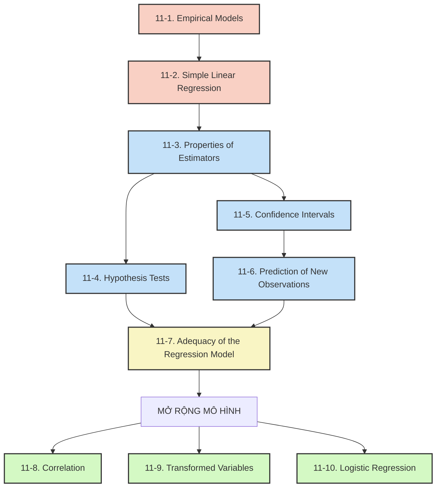

> [!tip] **Lời mở đầu**
> Chào bạn, rất tuyệt vời khi bạn có tư duy học tập theo hệ thống và muốn nắm bắt bức tranh toàn cảnh (big picture) trước khi đi sâu vào chi tiết. Với tư cách là giảng viên hướng dẫn bạn phần **Regression Analysis** (Phân tích Hồi quy), tôi sẽ giúp bạn tháo gỡ từng yêu cầu một cách rõ ràng nhất.
> 
> Chúng ta hãy cất hết bút nháp và máy tính đi, khoan bàn về công thức. Hãy cùng nhìn Chapter 11 từ trên cao xuống nhé!

---
### 🎯 1. Mục tiêu của chương là gì?

Mục tiêu tối thượng của Chapter 11 là hướng dẫn bạn cách xây dựng, đánh giá và sử dụng một **Empirical Model** (mô hình thực nghiệm) dạng tuyến tính (đường thẳng) để mô tả mối quan hệ giữa hai biến số. Sau khi học xong, bạn không chỉ biết cách "kẻ một đường thẳng" đi qua các điểm dữ liệu, mà còn biết cách chứng minh bằng thống kê xem đường thẳng đó có đáng tin cậy để dùng cho dự đoán hay không.

---

### ❓ 2. Regression giải quyết bài toán gì?

Trong thực tế kỹ thuật, nhiều khi chúng ta không có một phương trình vật lý hay hóa học hoàn hảo (tức là **Mechanistic Model**) để tính toán chính xác đầu ra từ đầu vào. Thay vào đó, dữ liệu luôn có nhiễu (noise) hoặc sai số tự nhiên.

**Regression** giải quyết bài toán: Khi biết một biến độc lập (gọi là **Regressor** hoặc **Predictor variable**), làm sao để dự đoán hoặc giải thích sự biến thiên của một biến phụ thuộc (gọi là **Response variable**), bất chấp việc dữ liệu có chứa các sai số ngẫu nhiên.

---

### 💡 3. Ý tưởng xuyên suốt của cả chương

Ý tưởng cốt lõi của chương này là: **"Đi từ Ước lượng (Estimation) đến Kiểm định (Inference) và cuối cùng là Đánh giá sự phù hợp (Adequacy)."**

Bạn sẽ dùng một mẫu dữ liệu (sample) để phác họa ra một đường thẳng. Nhưng vì nó chỉ là một mẫu, bạn phải dùng các công cụ thống kê (Hypothesis Tests, Confidence Intervals) để kiểm tra xem đường thẳng này có đại diện đúng cho toàn bộ tổng thể (population) hay không, và liệu các giả định toán học đằng sau nó có bị vi phạm hay không.

---

### 📚 4. Giải thích các khái niệm lớn (Không cần chứng minh)

> [!abstract] **Simple Linear Regression**
> "Simple" nghĩa là chỉ có MỘT biến $x$ để dự đoán MỘT biến $Y$. "Linear" nghĩa là mối quan hệ này được mô phỏng bằng một đường thẳng.

> [!abstract] **Method of Least Squares (Phương pháp bình phương tối thiểu)**
> Nguyên tắc toán học để tìm ra đường thẳng "vừa vặn nhất" (best fit). Cách nó hoạt động là chọn đường thẳng sao cho tổng các bình phương khoảng cách từ các điểm dữ liệu thực tế đến đường thẳng đó là nhỏ nhất.

> [!abstract] **Residual (Phần dư)**
> Chính là độ lệch (khoảng cách) giữa giá trị thực tế quan sát được và giá trị mà mô hình của bạn dự đoán ra. Nó đại diện cho những gì mô hình *không thể giải thích được*.

> [!abstract] **Correlation (Tương quan)**
> Đo lường mức độ "gắn kết tuyến tính" giữa hai biến khi cả hai đều là biến ngẫu nhiên. Nó không nói lên cái nào sinh ra cái nào (như Regression), mà chỉ nói chúng đi lên hay đi xuống cùng nhau chặt chẽ đến mức nào.

---

### 🗺️ 5. Roadmap: Trình tự logic và câu hỏi của từng Section

> [!success] **Tại sao bạn phải học đúng thứ tự?**
> Vì Regression Analysis là một dây chuyền sản xuất: Bạn thu thập vật liệu $\rightarrow$ Lắp ráp mô hình $\rightarrow$ Kiểm định chất lượng $\rightarrow$ Đóng dấu bảo hành $\rightarrow$ Đem đi dự đoán.

Dưới đây là sơ đồ tư duy (Mermaid) thể hiện sự phụ thuộc và dòng chảy kiến thức:

---

### 🔗 6. Mối liên hệ, vai trò và câu hỏi mỗi Section trả lời

#### Nhóm 1: Xây dựng nền tảng (Foundation)

> [!example] **11-1: Empirical Models**
> - **Câu hỏi:** Tại sao chúng ta cần mô hình thực nghiệm?
> - **Vai trò:** Đặt vấn đề và định nghĩa mô hình **Simple Linear Regression** bao gồm phần đường thẳng cộng với một sai số ngẫu nhiên (**error term**).

> [!example] **11-2: Simple Linear Regression**
> - **Câu hỏi:** Làm sao để vẽ được đường thẳng "best fit" từ tập dữ liệu mẫu?
> - **Vai trò:** Giới thiệu **Method of Least Squares** để tìm ra hệ số góc (slope) và điểm cắt (intercept). *Đây là nền tảng cốt lõi của toàn chương.*

#### Nhóm 2: Suy diễn thống kê (Statistical Inference)

> [!info] **Bạn cần mô hình ở 11-2 trước khi có thể kiểm định nó ở đây.**

> [!example] **11-3: Properties of the Least Squares Estimators**
> - **Câu hỏi:** Các hệ số vừa tìm được ở 11-2 có đáng tin không? Sai số của chúng là bao nhiêu?
> - **Vai trò:** Khảo sát tính không chệch (unbiased) và phương sai của các hệ số, tạo tiền đề toán học cho các bước kiểm định.

> [!example] **11-4: Hypothesis Tests**
> - **Câu hỏi:** Mối quan hệ tuyến tính này là CÓ THẬT hay chỉ là sự trùng hợp ngẫu nhiên của dữ liệu mẫu?
> - **Vai trò:** Sử dụng **t-Tests** và **Analysis of Variance (ANOVA)** để kiểm định xem hệ số góc có thực sự khác $0$ hay không (**Significance of Regression**).

> [!example] **11-5: Confidence Intervals**
> - **Câu hỏi:** Điểm cắt, hệ số góc và giá trị trung bình của $Y$ thực sự nằm trong khoảng nào với độ tin cậy 95%?
> - **Vai trò:** Tính toán khoảng tin cậy thay vì chỉ dùng một giá trị điểm (point estimate).

#### Nhóm 3: Ứng dụng & Đánh giá (Application & Evaluation)

> [!warning] **Bạn phải chắc chắn mô hình có ý nghĩa ở 11-4 và 11-5 thì mới đi dự đoán và đánh giá.**

> [!example] **11-6: Prediction of New Observations**
> - **Câu hỏi:** Nếu tôi có một giá trị $x$ hoàn toàn mới trong tương lai, giá trị $Y$ dự đoán sẽ nằm trong khoảng nào?
> - **Vai trò:** Phân biệt sự khác nhau giữa ước lượng một mức trung bình (**Confidence Interval** ở 11-5) và dự đoán một cá thể mới (**Prediction Interval** - luôn rộng hơn vì chứa nhiều sai số hơn).

> [!example] **11-7: Adequacy of the Regression Model**
> - **Câu hỏi:** Dù qua được các bước kiểm định trên, liệu mô hình này có vi phạm các giả định ẩn nào không? Nó giải thích được bao nhiêu % dữ liệu?
> - **Vai trò:** Hướng dẫn **Residual Analysis** (phân tích phần dư để tìm điểm bất thường) và tính toán **Coefficient of Determination ($R^2$)**. Đây là chốt chặn an toàn cuối cùng.

#### Nhóm 4: Mở rộng (Extensions)

> [!abstract] **Xử lý các tình huống thực tế "ngang trái" hơn.**

> [!example] **11-8: Correlation**
> - **Câu hỏi:** Chuyện gì xảy ra nếu tôi không chủ động điều khiển được $x$, mà cả $X$ và $Y$ đều rơi ra ngẫu nhiên?
> - **Vai trò:** Dạy về **Correlation coefficient** để đo mức độ tương quan tuyến tính của 2 biến ngẫu nhiên (Bivariate Normal Distribution).

> [!example] **11-9: Regression on Transformed Variables**
> - **Câu hỏi:** Nhìn lên biểu đồ thấy dữ liệu cong (không phải đường thẳng), tôi phải làm sao?
> - **Vai trò:** Kỹ thuật biến đổi toán học (vd: log, nghịch đảo) để biến một đường cong thành đường thẳng (**Intrinsically linear model**), sau đó lại dùng kiến thức từ 11-2 để giải.

> [!example] **11-10: Logistic Regression**
> - **Câu hỏi:** Nếu kết quả $Y$ không phải là một con số liên tục (như trọng lượng, áp suất) mà chỉ là "Thành công / Thất bại" (1 hoặc 0) thì mô hình trông như thế nào?
> - **Vai trò:** Giới thiệu mô hình hồi quy dùng **Logit function**, ứng dụng cực lớn trong dự báo phân loại (classification).

---

> [!summary] **Tóm lại**
> - Bạn **KHÔNG THỂ** học Section 11-4 (Kiểm định) nếu chưa biết hệ số ở 11-2 tính ra sao và có tính chất gì ở 11-3.
> - Bạn cũng **KHÔNG NÊN** dùng mô hình ở 11-6 để dự đoán cho sếp xem nếu chưa kiểm tra **Adequacy** ở 11-7.
> 
> Mọi thứ trong chương này là một sự sắp xếp hoàn hảo của tác giả để dẫn dắt tư duy của một kỹ sư.

> [!question] **Bạn đã sẵn sàng để "vén bức màn" đi vào công thức của 11-1 và 11-2 chưa? Hãy cho tôi biết nhé!**

