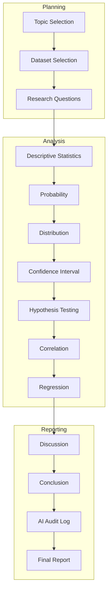

---
tags:
  - rbl
  - workflow
  - project-management
  - research
  - minitab
---
# RBL Project Workflow (Cập nhật theo cấu trúc môn học)

## 1. Workflow mới

Thay vì:

```text
Research Planning
↓
Data Cleaning
↓
Analysis
↓
Writing
```

chúng ta sẽ đi theo đúng cấu trúc báo cáo mà giảng viên đã đưa, vì đó cũng gần như là rubric chấm điểm.

### Sơ đồ workflow



> [!note] **Đây gần như là khung báo cáo của giảng viên**
> Chỉ thêm hai bước đầu là **chọn chủ đề** và **làm quen với dữ liệu**.

---

## 2. Các Milestone

### Milestone 0 – Project Setup

| Công việc | Output |
| :--- | :--- |
| Chọn chủ đề | Dataset sẵn sàng |
| Tải dataset | |
| Cài Minitab 16 | |
| Hiểu các biến | |

---

### Milestone 1 – Introduction

Viết:

- Background
- Research Objectives
- Research Questions
- Research Model
- Hypotheses

> [!success] **Output:** Chương 1–3 của báo cáo.

---

### Milestone 2 – Descriptive Statistics

Minitab sẽ giúp chúng ta tạo:

- Descriptive Statistics
- Histogram
- Boxplot

Sau đó mới viết phần giải thích.

---

### Milestone 3 – Probability

Làm các câu hỏi như:

- $P(X > 6)$
- Z-score
- Normal Distribution

---

### Milestone 4 – Confidence Interval & Hypothesis Testing

Minitab:

- One-Sample t-Test
- Confidence Interval

> [!info] Hai phần này liên quan chặt chẽ nên làm cùng nhau.

---

### Milestone 5 – Correlation & Regression

Minitab:

- Scatter Plot
- Pearson Correlation
- Linear Regression
- ANOVA
- Residual

---

### Milestone 6 – Discussion & Conclusion

Đây là lúc trả lời toàn bộ Research Questions đã đặt ở đầu bài.

---

### Milestone 7 – AI Audit Log

Viết lại toàn bộ quá trình sử dụng AI.

---

### Milestone 8 – Final Polish

- Kiểm tra format
- Kiểm tra tài liệu tham khảo
- Chuẩn bị slide

---

## 3. Còn "tinh thần nghiên cứu" thì để ở đâu?

Đây mới là điểm mình muốn giữ.

> [!important] **Nguyên tắc**
> Mình **không muốn thay đổi cấu trúc báo cáo của giảng viên**.

Thay vào đó, mình sẽ giúp bạn đưa tư duy nghiên cứu vào **bên trong từng chương**.

| Chương | Cách đưa tư duy nghiên cứu vào |
| :--- | :--- |
| **Introduction** | Không chỉ giới thiệu chủ đề mà còn giải thích *vì sao nghiên cứu này đáng thực hiện*. |
| **Hypothesis Testing** | Không chỉ kết luận *"bác bỏ H₀"*, mà giải thích điều đó có ý nghĩa gì trong bối cảnh nghiên cứu. |
| **Discussion** | Không chỉ nhắc lại kết quả, mà liên hệ với thực tế và nêu hạn chế của nghiên cứu. |

> [!success] **Kết quả**
> Hình thức vẫn **100% theo mẫu của giảng viên**, nhưng chất lượng nội dung sẽ cao hơn.

---

## 4. Ý tưởng: Hai tài liệu song song

Mình nghĩ chúng ta nên tạo **hai tài liệu song song**:

### 📓 Research Notebook (Sổ tay nghiên cứu)

> Chỉ mình và bạn dùng.

Ghi lại:

- Ý tưởng
- Các lệnh Minitab
- Kết quả trung gian
- Những điều cần kiểm tra
- Prompt AI

### 📄 Final Report (Báo cáo cuối cùng)

> Đúng **100% cấu trúc mẫu của giảng viên**.

### Lợi ích

| Lợi ích | Mô tả |
| :--- | :--- |
| ✅ **Bám sát rubric** | Báo cáo cuối cùng luôn đúng yêu cầu chấm điểm. |
| ✅ **Có hệ thống** | Quá trình làm việc vẫn rất có tổ chức. |
| ✅ **Dễ viết AI Audit Log** | Đến cuối kỳ việc viết AI Audit Log sẽ cực kỳ dễ vì toàn bộ quá trình đã được ghi lại. |

---

> [!tip] **Tổng kết**
> Đây là cách cân bằng tốt nhất giữa **làm đúng yêu cầu môn học** và **rèn luyện tư duy nghiên cứu**.
